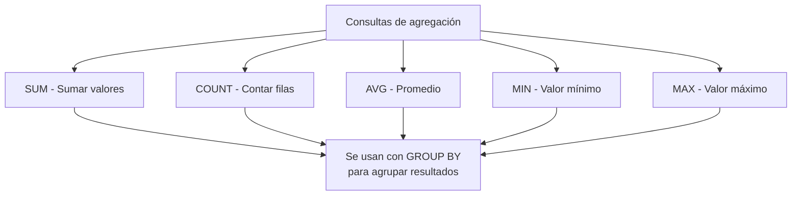
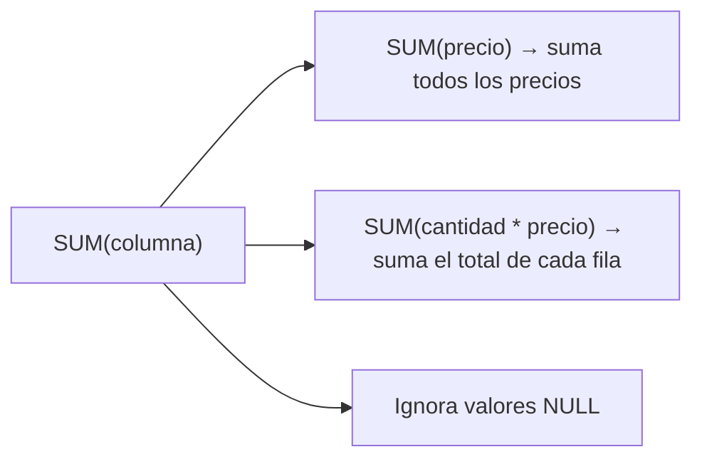
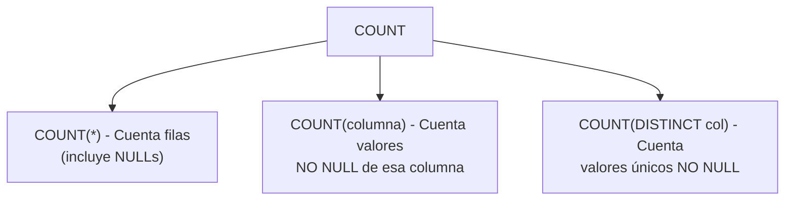
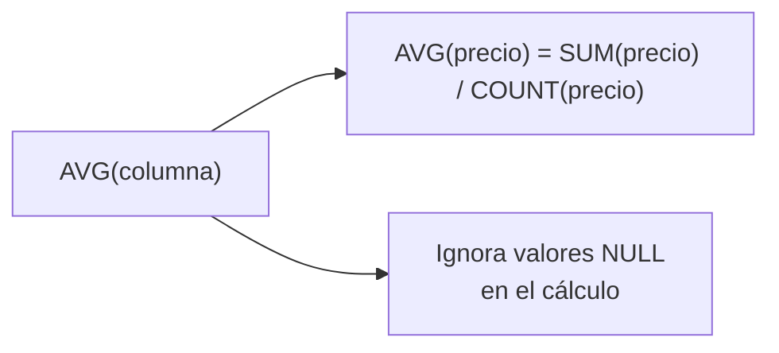
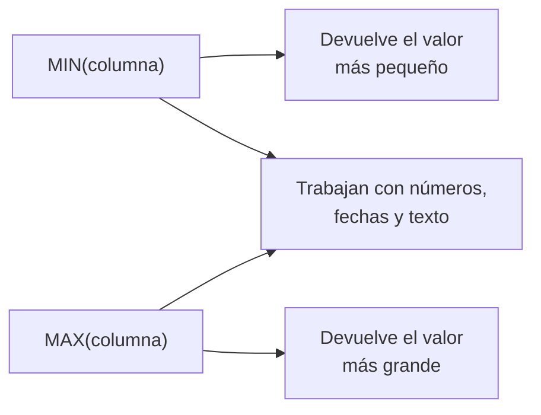
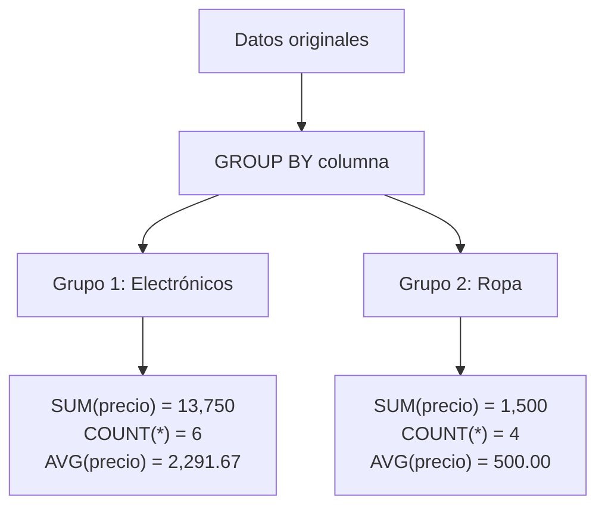
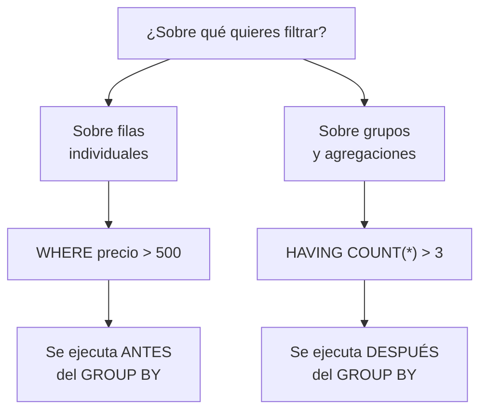
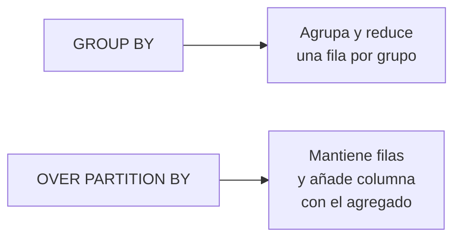
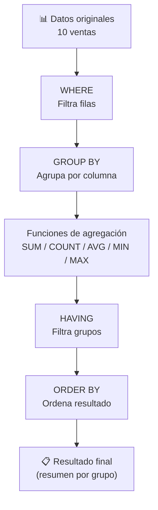

# Consultas de agregación

Las **funciones de agregación** procesan un conjunto de filas y devuelven **un solo valor** resumido. Son el corazón del análisis de datos en SQL.



---

## Preparación: tabla de ejemplo

```sql
CREATE TABLE ventas (
    id INT PRIMARY KEY AUTO_INCREMENT,
    producto VARCHAR(100),
    categoria VARCHAR(50),
    cantidad INT,
    precio DECIMAL(10, 2),
    vendedor VARCHAR(100),
    fecha DATE
);

INSERT INTO ventas (producto, categoria, cantidad, precio, vendedor, fecha) VALUES
('Laptop',    'Electrónicos', 2, 15000.00, 'Ana',   '2024-01-15'),
('Mouse',     'Electrónicos', 5,   250.00, 'Ana',   '2024-01-15'),
('Laptop',    'Electrónicos', 1, 15000.00, 'Carlos','2024-02-10'),
('Teclado',   'Electrónicos', 3,   450.00, 'Ana',   '2024-02-10'),
('Mouse',     'Electrónicos', 2,   250.00, 'Carlos','2024-02-10'),
('Camiseta',  'Ropa',        10,   350.00, 'María', '2024-02-15'),
('Pantalón',  'Ropa',         4,   800.00, 'María', '2024-03-01'),
('Camiseta',  'Ropa',         5,   350.00, 'Ana',   '2024-03-01'),
('Laptop',    'Electrónicos', 1, 15000.00, 'María', '2024-03-15'),
('Audífonos', 'Electrónicos', 3,   800.00, 'Carlos','2024-03-20');
```

Usaremos estos datos en todos los ejemplos.

---

## SUM

Suma los valores de una columna numérica.



### Sintaxis

```sql
SELECT SUM(columna) FROM tabla;
SELECT SUM(columna1 * columna2) FROM tabla;  -- expresión
```

### Ejemplos

```sql
-- ¿Cuánto dinero se ha vendido en total?
SELECT SUM(cantidad * precio) AS ingresos_totales
FROM ventas;
-- Resultado: 100,100.00

-- Suma simple de una columna
SELECT SUM(cantidad) AS total_unidades_vendidas
FROM ventas;
-- Resultado: 36

-- SUM con filtro
SELECT SUM(cantidad * precio) AS ingresos_electronicos
FROM ventas
WHERE categoria = 'Electrónicos';
-- Resultado: 60,250.00

-- SUM con GROUP BY
SELECT vendedor, SUM(cantidad * precio) AS ingresos_por_vendedor
FROM ventas
GROUP BY vendedor;
-- Resultado:
-- Ana:    40,550.00
-- Carlos: 16,450.00
-- María:  43,100.00
```

> ⚡ **SUM ignora NULLs.** Si todos los valores de un grupo son NULL, SUM devuelve NULL.

---

## COUNT

Cuenta filas o valores no nulos.



### Sintaxis

```sql
COUNT(*)            -- filas totales
COUNT(columna)      -- valores NO NULL
COUNT(DISTINCT col) -- valores únicos NO NULL
```

### Ejemplos

```sql
-- ¿Cuántas ventas hay en total?
SELECT COUNT(*) AS total_ventas FROM ventas;
-- Resultado: 10

-- ¿Cuántas ventas de Electrónicos?
SELECT COUNT(*) AS ventas_electronicos
FROM ventas
WHERE categoria = 'Electrónicos';
-- Resultado: 6

-- ¿Cuántos vendedores diferentes hay?
SELECT COUNT(DISTINCT vendedor) AS total_vendedores
FROM ventas;
-- Resultado: 3

-- COUNT con GROUP BY
SELECT categoria, COUNT(*) AS cantidad_ventas
FROM ventas
GROUP BY categoria;
-- Electrónicos: 6
-- Ropa:         4
```

### COUNT(*) vs COUNT(columna)

```sql
-- Diferencia clave:
CREATE TABLE ejemplo (id INT, nombre VARCHAR(10));
INSERT INTO ejemplo VALUES (1, 'Ana'), (2, NULL), (3, 'Luis');

SELECT
    COUNT(*) AS total_filas,      -- 3
    COUNT(nombre) AS no_nulos,    -- 2 (ignora NULL)
    COUNT(DISTINCT nombre) AS uni -- 2 (Ana, Luis)
FROM ejemplo;
```

---

## AVG

Calcula el promedio de una columna numérica.



### Sintaxis

```sql
SELECT AVG(columna) FROM tabla;
```

### Ejemplos

```sql
-- ¿Cuál es el precio promedio de todos los productos vendidos?
SELECT AVG(precio) AS precio_promedio
FROM ventas;
-- Resultado: 1,760.00 (promedio simple de la columna precio)

-- ¿Cuál es el ticket promedio por venta?
SELECT AVG(cantidad * precio) AS ticket_promedio
FROM ventas;
-- Resultado: 10,010.00

-- Precio promedio por categoría
SELECT categoria, AVG(precio) AS precio_promedio
FROM ventas
GROUP BY categoria;
-- Electrónicos: 2,291.67
-- Ropa:           500.00

-- Productos con precio mayor al promedio
SELECT DISTINCT producto, precio
FROM ventas
WHERE precio > (SELECT AVG(precio) FROM ventas);
-- Laptop: 15000.00 (es la única por encima del promedio de 1760)
```

> ⚡ **AVG es sensible a outliers.** Un valor extremo puede distorsionar el promedio. Considera usar mediana (no nativa en SQL básico) como complemento.

---

## MIN / MAX

Encuentran el valor mínimo y máximo de una columna.



### Sintaxis

```sql
SELECT MIN(columna), MAX(columna) FROM tabla;
```

### Ejemplos

```sql
-- Fecha de primera y última venta
SELECT
    MIN(fecha) AS primera_venta,
    MAX(fecha) AS ultima_venta
FROM ventas;
-- primera: 2024-01-15
-- última:  2024-03-20

-- Producto más caro y más barato
SELECT
    MIN(precio) AS producto_mas_barato,
    MAX(precio) AS producto_mas_caro
FROM ventas;
-- más_barato: 250.00
-- más_caro:   15,000.00

-- MIN/MAX con GROUP BY
SELECT
    vendedor,
    MIN(fecha) AS primera_venta,
    MAX(fecha) AS ultima_venta,
    COUNT(*) AS total_ventas
FROM ventas
GROUP BY vendedor;
-- Ana:     2024-01-15 → 2024-03-01 (4 ventas)
-- Carlos:  2024-02-10 → 2024-03-20 (3 ventas)
-- María:   2024-02-15 → 2024-03-15 (3 ventas)

-- MIN/MAX con texto (orden alfabético)
SELECT
    MIN(producto) AS primero_alfabetico,
    MAX(producto) AS ultimo_alfabetico
FROM ventas;
-- primero: Audífonos
-- último:  Teclado
```

---

## GROUP BY

Agrupa filas que comparten un valor y permite aplicar funciones de agregación a cada grupo.



### Regla fundamental

> Toda columna en el `SELECT` que **no esté dentro de una función de agregación** debe aparecer en el `GROUP BY`.

```sql
-- ✅ Correcto
SELECT categoria, COUNT(*), AVG(precio)
FROM ventas
GROUP BY categoria;

-- ❌ Error: 'producto' no está en GROUP BY ni es agregación
SELECT producto, categoria, COUNT(*)
FROM ventas
GROUP BY categoria;
```

### Ejemplos de agrupación

```sql
-- Agrupación simple
SELECT categoria, SUM(cantidad) AS total_unidades
FROM ventas
GROUP BY categoria;

-- Agrupación por múltiples columnas
SELECT
    categoria,
    vendedor,
    COUNT(*) AS ventas,
    SUM(cantidad * precio) AS ingresos
FROM ventas
GROUP BY categoria, vendedor
ORDER BY categoria, ingresos DESC;

-- Agrupación con expresión
SELECT
    YEAR(fecha) AS anio,
    MONTH(fecha) AS mes,
    COUNT(*) AS ventas,
    SUM(cantidad * precio) AS ingresos
FROM ventas
GROUP BY YEAR(fecha), MONTH(fecha)
ORDER BY anio, mes;
```

### Ejemplo completo: reporte por vendedor y categoría

```sql
SELECT
    vendedor,
    categoria,
    COUNT(*) AS ventas,
    SUM(cantidad) AS unidades,
    SUM(cantidad * precio) AS ingresos,
    AVG(cantidad * precio) AS ticket_promedio
FROM ventas
GROUP BY vendedor, categoria
ORDER BY vendedor, ingresos DESC;
```

Resultado:

| vendedor | categoria | ventas | unidades | ingresos | ticket_promedio |
|---|---|---|---|---|---|
| Ana | Electrónicos | 3 | 10 | 39,800.00 | 13,266.67 |
| Ana | Ropa | 1 | 5 | 750.00 | 750.00 |
| Carlos | Electrónicos | 3 | 6 | 16,450.00 | 5,483.33 |
| María | Electrónicos | 1 | 1 | 15,000.00 | 15,000.00 |
| María | Ropa | 2 | 14 | 28,100.00 | 14,050.00 |

---

## HAVING

Filtra los grupos **después** de la agregación. Es como un `WHERE` para grupos.


### Sintaxis

```sql
SELECT columna, FUNCION_AGREGACION(columna)
FROM tabla
[WHERE condición_fila]
GROUP BY columna
HAVING condición_grupo;
```

### Ejemplos

```sql
-- Vendedores con ingresos totales > 20,000
SELECT vendedor, SUM(cantidad * precio) AS ingresos
FROM ventas
GROUP BY vendedor
HAVING SUM(cantidad * precio) > 20000;

-- Categorías con más de 2 ventas
SELECT categoria, COUNT(*) AS ventas
FROM ventas
GROUP BY categoria
HAVING COUNT(*) > 2;

-- HAVING con múltiples condiciones
SELECT
    vendedor,
    categoria,
    COUNT(*) AS ventas,
    SUM(cantidad * precio) AS ingresos
FROM ventas
GROUP BY vendedor, categoria
HAVING COUNT(*) >= 2 AND SUM(cantidad * precio) > 5000;

-- WHERE + GROUP BY + HAVING combinados
SELECT
    vendedor,
    COUNT(*) AS ventas,
    SUM(cantidad * precio) AS ingresos
FROM ventas
WHERE fecha >= '2024-02-01'       -- Filtra filas ANTES de agrupar
GROUP BY vendedor
HAVING SUM(cantidad * precio) > 1000;  -- Filtra grupos DESPUÉS
```

### WHERE vs HAVING



| Aspecto | WHERE | HAVING |
|---|---|---|
| ¿Cuándo se ejecuta? | Antes de GROUP BY | Después de GROUP BY |
| ¿Filtra? | Filas individuales | Grupos |
| ¿Usa agregaciones? | ❌ No (`WHERE SUM(...)` es error) | ✅ Sí (`HAVING SUM(...) > 100`) |
| ¿Usa alias? | ❌ No | ❌ No (en la mayoría de motores) |

---

## Funciones de agregación avanzadas

### Variaciones útiles

```sql
-- Porcentaje sobre el total
SELECT
    categoria,
    SUM(cantidad * precio) AS ingresos,
    SUM(cantidad * precio) * 100 / SUM(SUM(cantidad * precio)) OVER() AS porcentaje
FROM ventas
GROUP BY categoria;

-- Con filtro dentro de la agregación (MySQL, PostgreSQL)
SELECT
    COUNT(*) AS total,
    COUNT(CASE WHEN categoria = 'Electrónicos' THEN 1 END) AS electronicos,
    COUNT(CASE WHEN categoria = 'Ropa' THEN 1 END) AS ropa
FROM ventas;

-- Múltiples agregaciones en una consulta
SELECT
    vendedor,
    COUNT(*) AS total_ventas,
    SUM(cantidad) AS total_unidades,
    SUM(cantidad * precio) AS ingresos,
    AVG(cantidad * precio) AS ticket_promedio,
    MIN(precio) AS producto_mas_barato,
    MAX(precio) AS producto_mas_caro
FROM ventas
GROUP BY vendedor;
```

### Funciones de ventana (window functions)

Permiten hacer agregaciones **sin perder el detalle de cada fila**:

```sql
SELECT
    producto,
    categoria,
    precio,
    AVG(precio) OVER (PARTITION BY categoria) AS promedio_categoria,
    precio - AVG(precio) OVER (PARTITION BY categoria) AS diferencia_promedio
FROM ventas;
```



---

## Errores comunes

```sql
-- ❌ ERROR 1: Usar alias en HAVING
SELECT categoria, AVG(precio) AS promedio
FROM ventas
GROUP BY categoria
HAVING promedio > 1000;  -- ERROR: HAVING no reconoce alias

-- ✅ Correcto: repetir la expresión
HAVING AVG(precio) > 1000;

-- ❌ ERROR 2: Columna no agregada ni en GROUP BY
SELECT producto, categoria, COUNT(*)
FROM ventas
GROUP BY categoria;  -- 'producto' causa error

-- ❌ ERROR 3: Función de agregación en WHERE
SELECT *
FROM ventas
WHERE precio > AVG(precio);  -- ERROR

-- ✅ Correcto: usar subconsulta
SELECT *
FROM ventas
WHERE precio > (SELECT AVG(precio) FROM ventas);
```

---

## Resumen visual



## Guía rápida

| Función | ¿Qué hace? | ¿Tipo de dato? | ¿Ignora NULLs? |
|---|---|---|---|
| `SUM(col)` | Suma valores | Numérico | ✅ Sí |
| `COUNT(*)` | Cuenta filas | Cualquiera | ❌ No (cuenta todo) |
| `COUNT(col)` | Cuenta no NULLs | Cualquiera | ✅ Sí |
| `COUNT(DISTINCT col)` | Cuenta únicos no NULL | Cualquiera | ✅ Sí |
| `AVG(col)` | Promedio | Numérico | ✅ Sí |
| `MIN(col)` | Valor mínimo | Numérico, fecha, texto | ✅ Sí |
| `MAX(col)` | Valor máximo | Numérico, fecha, texto | ✅ Sí |

## Ejercicios para practicar

```sql
-- 1. ¿Cuánto vendió cada vendedor en total?
SELECT vendedor, SUM(cantidad * precio) AS ingresos
FROM ventas
GROUP BY vendedor;

-- 2. ¿Cuál es el producto más vendido (por cantidad)?
SELECT producto, SUM(cantidad) AS total_vendido
FROM ventas
GROUP BY producto
ORDER BY total_vendido DESC;

-- 3. ¿Qué categorías generan más de $20,000?
SELECT categoria, SUM(cantidad * precio) AS ingresos
FROM ventas
GROUP BY categoria
HAVING SUM(cantidad * precio) > 20000;

-- 4. ¿Cuántas ventas hizo cada vendedor por mes?
SELECT
    vendedor,
    YEAR(fecha) AS anio,
    MONTH(fecha) AS mes,
    COUNT(*) AS ventas
FROM ventas
GROUP BY vendedor, YEAR(fecha), MONTH(fecha)
ORDER BY vendedor, anio, mes;

-- 5. ¿Qué vendedores tienen un ticket promedio mayor a $5,000?
SELECT vendedor, AVG(cantidad * precio) AS ticket_promedio
FROM ventas
GROUP BY vendedor
HAVING AVG(cantidad * precio) > 5000;
```

## Relacionados:
- [[lenguaje-de-manipulacion-de-datos-sql]] #anterior 
- [[restricciones-de-datos-sql]] #siguiente 