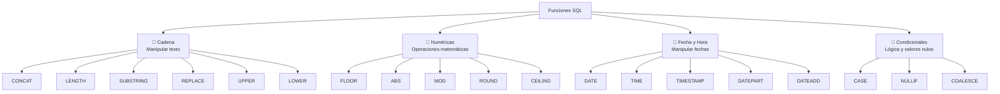
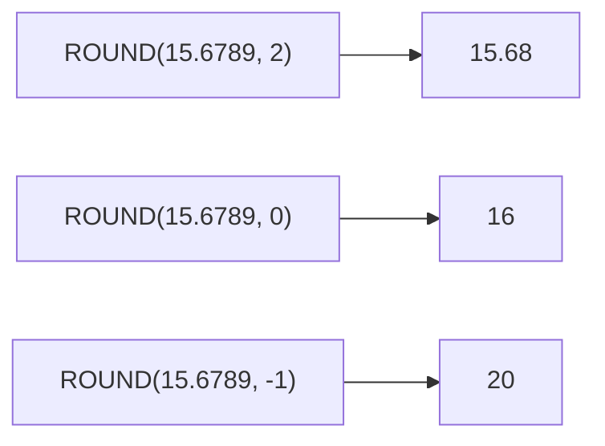
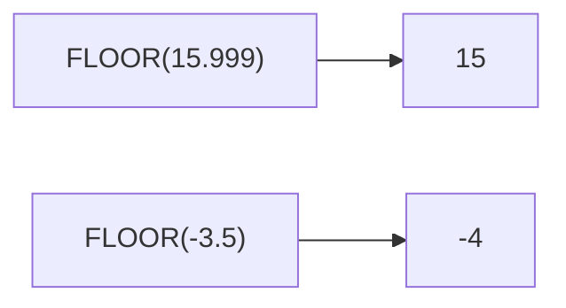
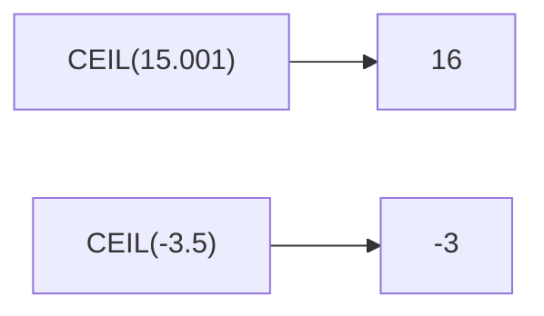
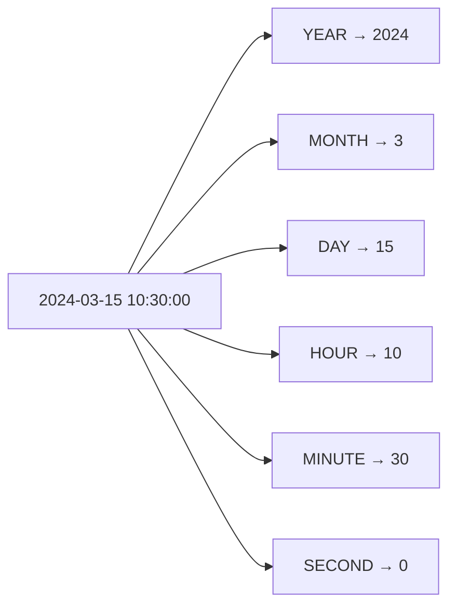
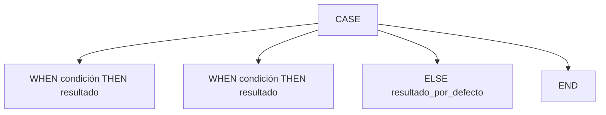
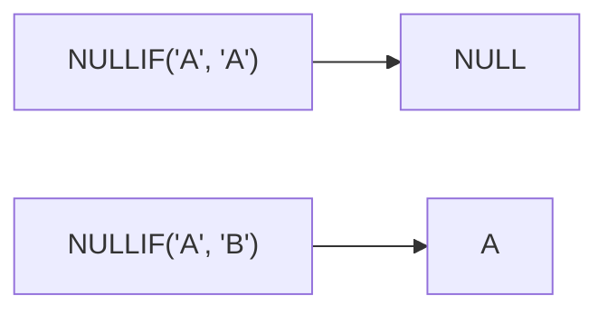

# Funciones avanzadas

Las funciones integradas de SQL permiten **transformar, calcular y manipular** datos directamente en la consulta, sin necesidad de procesarlos en la aplicación.



> ⚠️ La sintaxis exacta puede variar ligeramente entre motores (MySQL, PostgreSQL, SQL Server). Se indicarán diferencias cuando sea relevante.

---

## Funciones de cadena

Manipulan y transforman texto.

```sql
-- Datos de ejemplo
CREATE TABLE productos (
    id INT PRIMARY KEY,
    nombre VARCHAR(100),
    codigo VARCHAR(20),
    descripcion TEXT
);

INSERT INTO productos VALUES
    (1, 'Laptop Gamer', 'LAP-001', 'Laptop con RTX 4060 y 16GB RAM'),
    (2, ' mouse  ', 'MOU-001', 'mouse ergonómico inalámbrico'),
    (3, 'TECLADO MECÁNICO', 'TEC-001', NULL);
```

### CONCAT

Une dos o más cadenas de texto.


```sql
-- Unir columnas
SELECT CONCAT(nombre, ' - ', codigo) AS nombre_codigo
FROM productos;

-- Con separador (MySQL: CONCAT_WS)
SELECT CONCAT_WS(' | ', nombre, codigo, descripcion) AS info
FROM productos;

-- En PostgreSQL: usa || (operador de concatenación)
SELECT nombre || ' - ' || codigo AS nombre_codigo
FROM productos;

-- Manejo de NULLs: CONCAT ignora NULLs
SELECT CONCAT('Código: ', codigo, ' - ', descripcion) AS info
FROM productos;
-- Resultado: 'Código: TEC-001 - '  (descripción NULL se ignora)
```

### LENGTH / LEN

Devuelve la longitud de una cadena.

```sql
-- Longitud en caracteres
SELECT nombre, LENGTH(nombre) AS longitud
FROM productos;
-- 'Laptop Gamer' → 12
-- ' mouse  '     → 9  (incluye espacios)

-- Longitud sin espacios (LENGTH + TRIM)
SELECT TRIM(nombre) AS nombre_limpio, LENGTH(TRIM(nombre)) AS longitud
FROM productos;

-- PostgreSQL: LENGTH() devuelve caracteres, OCTET_LENGTH() devuelve bytes
-- MySQL: LENGTH() devuelve bytes, CHAR_LENGTH() devuelve caracteres
```

### SUBSTRING / SUBSTR

Extrae una parte de una cadena.

```sql
-- SUBSTRING(cadena, inicio, longitud)
SELECT
    nombre,
    SUBSTRING(nombre, 1, 6) AS primeros_6,
    SUBSTRING(nombre, 8, 3) AS desde_pos_8
FROM productos;
-- 'Laptop Gamer' → 'Laptop', ' Ga'

-- SIN longitud: extrae hasta el final
SELECT SUBSTRING('Hola Mundo', 6) AS resultado;  -- 'Mundo'

-- Extraer los últimos N caracteres
SELECT
    codigo,
    SUBSTRING(codigo, LENGTH(codigo) - 2, 3) AS ultimos_3
FROM productos;
-- 'LAP-001' → '001'

-- PostgreSQL: SUBSTRING(cadena FROM 1 FOR 6)
-- SQL Server: SUBSTRING(cadena, 1, 6) (igual que MySQL)
```

### REPLACE

Reemplaza todas las ocurrencias de un patrón en una cadena.

```sql
SELECT
    nombre,
    REPLACE(nombre, 'Gamer', 'Profesional') AS nuevo_nombre
FROM productos;

-- Limpiar datos: eliminar espacios
SELECT
    REPLACE(nombre, ' ', '') AS sin_espacios
FROM productos;

-- Reemplazar múltiples patrones (anidado)
SELECT
    REPLACE(REPLACE(nombre, 'á', 'a'), 'é', 'e') AS normalizado
FROM productos;
```

### UPPER / LOWER

Convierte texto a mayúsculas o minúsculas.

```sql
SELECT
    nombre,
    UPPER(nombre) AS mayusculas,
    LOWER(nombre) AS minusculas,
    INITCAP(nombre) AS capitalizado  -- PostgreSQL: primera letra mayúscula
FROM productos;
```

| nombre | mayusculas | minusculas |
|---|---|---|
| Laptop Gamer | LAPTOP GAMER | laptop gamer |
| mouse | MOUSE | mouse |
| TECLADO MECÁNICO | TECLADO MECÁNICO | teclado mecánico |

### Funciones de cadena adicionales

```sql
-- TRIM: elimina espacios al inicio y final
SELECT TRIM('  texto con espacios  ');           -- 'texto con espacios'
SELECT LTRIM('  izquierda');                      -- 'izquierda'
SELECT RTRIM('derecha  ');                        -- 'derecha'

-- LEFT / RIGHT: primeros/últimos N caracteres
SELECT LEFT('ABCDEF', 3);   -- 'ABC'
SELECT RIGHT('ABCDEF', 3);  -- 'DEF'

-- LPAD / RPAD: rellena con caracteres hasta N longitud
SELECT LPAD('123', 5, '0');  -- '00123'
SELECT RPAD('SQL', 10, '*'); -- 'SQL*******'

-- POSITION / LOCATE: posición de un substring
SELECT POSITION('Gamer' IN 'Laptop Gamer');  -- 8 (en MySQL: LOCATE)

-- REVERSE: invierte la cadena
SELECT REVERSE('SQL');  -- 'LQS'
```

---

## Funciones numéricas

Realizan operaciones matemáticas sobre valores numéricos.

```sql
-- Datos de ejemplo
CREATE TABLE ventas (
    id INT PRIMARY KEY,
    producto VARCHAR(50),
    precio DECIMAL(10,3),
    cantidad INT
);

INSERT INTO ventas VALUES
    (1, 'Laptop',   15000.456,  2),
    (2, 'Mouse',      250.789,  5),
    (3, 'Teclado',    450.123, -3),  -- cantidad negativa (devolución)
    (4, 'Monitor',   3200.500,  1);
```

### ROUND

Redondea un número a una cantidad específica de decimales.



```sql
SELECT
    precio,
    ROUND(precio, 0) AS sin_decimales,      -- 15000, 251, 450, 3201
    ROUND(precio, 1) AS un_decimal,         -- 15000.5, 250.8, 450.1, 3200.5
    ROUND(precio, 2) AS dos_decimales,      -- 15000.46, 250.79, 450.12, 3200.50
    ROUND(precio, -2) AS centenas           -- 15000, 300, 500, 3200
FROM ventas;

-- Redondear siempre hacia arriba (con ROUND + truco)
SELECT CEIL(precio * 100) / 100 AS redondeado_arriba
FROM ventas;
```

### FLOOR

Redondea **hacia abajo** al entero más cercano.



```sql
SELECT
    precio,
    FLOOR(precio) AS piso,
    FLOOR(precio * 100) / 100 AS truncado_2_decimales
FROM ventas;
```

### CEILING / CEIL

Redondea **hacia arriba** al entero más cercano.



```sql
SELECT
    precio,
    CEILING(precio) AS techo
FROM ventas;
-- 15000.456 → 15001
-- 250.789   → 251
```

### ABS

Valor **absoluto** (elimina el signo negativo).

```sql
SELECT
    cantidad,
    ABS(cantidad) AS valor_absoluto
FROM ventas;
-- 2  → 2
-- 5  → 5
-- -3 → 3  (el negativo se vuelve positivo)
-- 1  → 1

-- Útil para: diferencias, distancias, devoluciones
SELECT
    producto,
    ABS(cantidad) AS unidades_afectadas,
    CASE WHEN cantidad < 0 THEN 'devolución' ELSE 'venta' END AS tipo
FROM ventas;
```

### MOD

Devuelve el **residuo** de una división.

```sql
-- MOD(dividendo, divisor)
SELECT
    id,
    MOD(id, 2) AS es_par,        -- 0 = par, 1 = impar
    MOD(id, 3) AS residuo_3
FROM ventas;

-- Usos prácticos
SELECT MOD(10, 3);  -- 1 (10 ÷ 3 = 3, residuo 1)
SELECT MOD(10, 2);  -- 0 (10 es par)

-- PostgreSQL: usa el operador %
SELECT id % 2 AS es_par FROM ventas;

-- Ejemplo: etiquetar filas como pares/impares
SELECT
    producto,
    CASE WHEN MOD(id, 2) = 0 THEN 'par' ELSE 'impar' END AS tipo_fila
FROM ventas;
```

### Funciones numéricas adicionales

```sql
-- POWER / POW: potencia
SELECT POWER(2, 10);  -- 1024 (2^10)
SELECT POW(5, 3);     -- 125 (5^3)

-- SQRT: raíz cuadrada
SELECT SQRT(144);  -- 12

-- RAND: número aleatorio entre 0 y 1
SELECT RAND();  -- 0.7342...
SELECT FLOOR(RAND() * 100) + 1;  -- número aleatorio entre 1 y 100

-- SIGN: signo del número (-1, 0, 1)
SELECT SIGN(-15);  -- -1
SELECT SIGN(0);    -- 0
SELECT SIGN(42);   -- 1

-- TRUNCATE: trunca sin redondear (MySQL)
SELECT TRUNCATE(15.6789, 2);  -- 15.67 (no redondea)
```

---

## Fecha y Hora

Manipulan valores de fecha, hora y timestamp.

```sql
-- Datos de ejemplo
CREATE TABLE pedidos (
    id INT PRIMARY KEY,
    cliente VARCHAR(50),
    fecha_pedido DATETIME,
    fecha_entrega DATE,
    hora_creacion TIME
);

INSERT INTO pedidos VALUES
    (1, 'Ana',    '2024-03-15 10:30:00', '2024-03-20', '10:30:00'),
    (2, 'Carlos', '2024-03-20 14:00:00', '2024-03-25', '14:00:00'),
    (3, 'María',  '2024-04-01 09:15:00', NULL,         '09:15:00'),
    (4, 'Luis',   '2024-04-10 16:45:00', '2024-04-12', '16:45:00');
```

### NOW / CURRENT_DATE / CURRENT_TIME

Obtienen la fecha/hora actual del sistema.

```sql
SELECT
    NOW() AS ahora,               -- 2024-04-15 14:30:00
    CURRENT_DATE AS hoy,           -- 2024-04-15
    CURRENT_TIME AS hora_actual,   -- 14:30:00
    CURDATE() AS solo_fecha,       -- 2024-04-15 (MySQL)
    CURTIME() AS solo_hora;        -- 14:30:00 (MySQL)
```

### DATE / TIME / TIMESTAMP

Extraen la parte de fecha o hora de un valor datetime.

```sql
SELECT
    fecha_pedido,
    DATE(fecha_pedido) AS solo_fecha,     -- 2024-03-15
    TIME(fecha_pedido) AS solo_hora,      -- 10:30:00
    YEAR(fecha_pedido) AS anio,           -- 2024
    MONTH(fecha_pedido) AS mes,           -- 3
    DAY(fecha_pedido) AS dia,             -- 15
    HOUR(fecha_pedido) AS hora,           -- 10
    MINUTE(fecha_pedido) AS minuto,       -- 30
    SECOND(fecha_pedido) AS segundo       -- 0
FROM pedidos;
```



### DATEPART / EXTRACT

Extrae una parte específica de una fecha.

```sql
-- MySQL: EXTRACT
SELECT
    fecha_pedido,
    EXTRACT(YEAR FROM fecha_pedido) AS anio,
    EXTRACT(MONTH FROM fecha_pedido) AS mes,
    EXTRACT(DAY FROM fecha_pedido) AS dia,
    EXTRACT(HOUR FROM fecha_pedido) AS hora,
    EXTRACT(DAYOFWEEK FROM fecha_pedido) AS dia_semana,  -- 1=domingo
    EXTRACT(WEEK FROM fecha_pedido) AS semana_anio,
    EXTRACT(QUARTER FROM fecha_pedido) AS trimestre
FROM pedidos;

-- PostgreSQL: EXTRACT (similar)
SELECT EXTRACT(YEAR FROM fecha_pedido) FROM pedidos;

-- SQL Server: DATEPART
SELECT DATEPART(year, fecha_pedido) FROM pedidos;
```

### DATEDIFF

Diferencia entre dos fechas.

```sql
-- DATEDIFF(fecha_final, fecha_inicial)
SELECT
    cliente,
    fecha_pedido,
    fecha_entrega,
    DATEDIFF(fecha_entrega, fecha_pedido) AS dias_para_entregar
FROM pedidos;
```

| cliente | fecha_pedido | fecha_entrega | dias_para_entregar |
|---|---|---|---|
| Ana | 2024-03-15 | 2024-03-20 | 5 |
| Carlos | 2024-03-20 | 2024-03-25 | 5 |
| María | 2024-04-01 | NULL | NULL |
| Luis | 2024-04-10 | 2024-04-12 | 2 |

```sql
-- Pedidos que tardaron más de 3 días en entregarse
SELECT cliente, DATEDIFF(fecha_entrega, fecha_pedido) AS dias
FROM pedidos
WHERE DATEDIFF(fecha_entrega, fecha_pedido) > 3;

-- Días desde el pedido hasta hoy
SELECT
    cliente,
    fecha_pedido,
    DATEDIFF(CURRENT_DATE, DATE(fecha_pedido)) AS dias_desde_pedido
FROM pedidos;

-- PostgreSQL: DATE_PART('day', fecha_entrega - fecha_pedido)
-- SQL Server: DATEDIFF(day, fecha_pedido, fecha_entrega)
```

### DATEADD / DATE_ADD

Añade o resta intervalos a una fecha.

```sql
-- MySQL: DATE_ADD
SELECT
    fecha_pedido,
    DATE_ADD(fecha_pedido, INTERVAL 7 DAY) AS mas_7_dias,
    DATE_ADD(fecha_pedido, INTERVAL 1 MONTH) AS mas_1_mes,
    DATE_ADD(fecha_pedido, INTERVAL -3 DAY) AS menos_3_dias,
    DATE_ADD(fecha_pedido, INTERVAL 2 HOUR) AS mas_2_horas
FROM pedidos;

-- PostgreSQL: fecha + INTERVAL '7 days'
SELECT fecha_pedido + INTERVAL '7 days' FROM pedidos;

-- SQL Server: DATEADD(day, 7, fecha_pedido)
```

### Funciones adicionales de fecha

```sql
-- Último día del mes
SELECT LAST_DAY('2024-02-15');  -- 2024-02-29 (bisiesto)

-- Formatear fecha (MySQL: DATE_FORMAT, PostgreSQL: TO_CHAR)
SELECT
    fecha_pedido,
    DATE_FORMAT(fecha_pedido, '%d/%m/%Y') AS formato_latino,     -- 15/03/2024
    DATE_FORMAT(fecha_pedido, '%W, %d de %M de %Y') AS formato_largo, -- Friday, 15 de March de 2024
    DATE_FORMAT(fecha_pedido, '%H:%i') AS solo_hora_minuto       -- 10:30
FROM pedidos;

-- Día de la semana (MySQL)
SELECT
    DAYNAME('2024-03-15') AS dia_semana,     -- Friday
    MONTHNAME('2024-03-15') AS nombre_mes;   -- March
```

---

## Condicionales

Permiten tomar decisiones lógicas dentro de las consultas.

```sql
-- Datos de ejemplo
CREATE TABLE empleados (
    id INT PRIMARY KEY,
    nombre VARCHAR(50),
    salario DECIMAL(10,2),
    comision DECIMAL(10,2),
    departamento VARCHAR(20)
);

INSERT INTO empleados VALUES
    (1, 'Ana',    50000,  5000, 'Ventas'),
    (2, 'Carlos', 45000,  NULL, 'Ventas'),
    (3, 'María',  80000,  NULL, 'TI'),
    (4, 'Luis',   75000,  3000, 'TI'),
    (5, 'Sofía',  40000,  NULL, 'RH');
```

### CASE

Expresión condicional similar a `if-else if-else`.



```sql
-- CASE simple: comparar contra valores fijos
SELECT
    nombre,
    salario,
    CASE departamento
        WHEN 'Ventas' THEN 'Comercial'
        WHEN 'TI' THEN 'Tecnología'
        WHEN 'RH' THEN 'Personas'
        ELSE 'Otro'
    END AS area_descripcion
FROM empleados;

-- CASE buscado: condiciones complejas
SELECT
    nombre,
    salario,
    CASE
        WHEN salario >= 80000 THEN 'Alto'
        WHEN salario >= 50000 THEN 'Medio'
        ELSE 'Bajo'
    END AS nivel_salarial
FROM empleados;
```

| nombre | salario | nivel_salarial |
|---|---|---|
| Ana | 50000 | Medio |
| Carlos | 45000 | Bajo |
| María | 80000 | Alto |
| Luis | 75000 | Medio |
| Sofía | 40000 | Bajo |

```sql
-- CASE con múltiples condiciones y operadores lógicos
SELECT
    nombre,
    salario,
    CASE
        WHEN salario >= 70000 AND departamento = 'TI' THEN 'TI Senior'
        WHEN salario >= 50000 AND departamento = 'TI' THEN 'TI Junior'
        WHEN salario >= 50000 THEN 'Senior otros deptos'
        WHEN comision IS NOT NULL THEN 'Con comisión'
        WHEN comision IS NULL AND salario < 50000 THEN 'Junior sin comisión'
        ELSE 'Otro'
    END AS categoria
FROM empleados;

-- CASE en ORDER BY (orden personalizado)
SELECT nombre, departamento
FROM empleados
ORDER BY
    CASE departamento
        WHEN 'TI' THEN 1
        WHEN 'Ventas' THEN 2
        WHEN 'RH' THEN 3
        ELSE 99
    END;

-- CASE en GROUP BY (agrupación personalizada)
SELECT
    CASE
        WHEN salario < 50000 THEN 'Bajo'
        WHEN salario < 75000 THEN 'Medio'
        ELSE 'Alto'
    END AS rango_salarial,
    COUNT(*) AS total_empleados,
    AVG(salario) AS salario_promedio
FROM empleados
GROUP BY
    CASE
        WHEN salario < 50000 THEN 'Bajo'
        WHEN salario < 75000 THEN 'Medio'
        ELSE 'Alto'
    END
ORDER BY MIN(salario);
```

### COALESCE

Devuelve el **primer valor no NULL** de la lista.


```sql
-- Reemplazar NULLs con un valor por defecto
SELECT
    nombre,
    salario,
    COALESCE(comision, 0) AS comision_real,          -- NULL → 0
    salario + COALESCE(comision, 0) AS compensacion_total
FROM empleados;

-- COALESCE con múltiples columnas (primer valor disponible)
SELECT
    nombre,
    COALESCE(comision, salario * 0.1, 1000) AS bono
FROM empleados;
-- Si tiene comision → comision
-- Si no tiene comision → 10% del salario
-- Si el salario es NULL → 1000
```

| nombre | comision | bono |
|---|---|---|
| Ana | 5000 | 5000 |
| Carlos | NULL | 4500 (10% de 45000) |
| María | NULL | 8000 (10% de 80000) |
| Luis | 3000 | 3000 |
| Sofía | NULL | 4000 (10% de 40000) |

### NULLIF

Devuelve `NULL` si los dos argumentos son iguales; si no, devuelve el primer argumento.



```sql
-- Evitar división por cero
SELECT
    producto,
    ingresos,
    unidades,
    ingresos / NULLIF(unidades, 0) AS precio_promedio
FROM ventas;
-- Si unidades = 0, NULLIF devuelve NULL → el resultado es NULL (no error)

-- Comparar dos columnas: si son iguales, trata como NULL
SELECT
    nombre,
    NULLIF(salario, salario_anterior) AS cambio_salario
FROM empleados_historial;

-- Marcar valores conocidos como NULL para tratarlos después
SELECT
    nombre,
    COALESCE(NULLIF(comision, 0), salario * 0.05) AS bono_calculado
FROM empleados;
-- Si comision = 0, la trata como NULL y calcula 5% del salario
```

---

## Resumen visual

```mermaid
flowchart TD
    CADENA["📝 Cadena"] --> C1["CONCAT: unir textos"]
    CADENA --> C2["LENGTH: contar caracteres"]
    CADENA --> C3["SUBSTRING: extraer parte"]
    CADENA --> C4["REPLACE: reemplazar patrón"]
    CADENA --> C5["UPPER/LOWER: mayúsc/minús"]

    NUMERICAS["🔢 Numéricas"] --> N1["FLOOR: redondear abajo"]
    NUMERICAS --> N2["CEILING: redondear arriba"]
    NUMERICAS --> N3["ROUND: redondear decimales"]
    NUMERICAS --> N4["ABS: valor absoluto"]
    NUMERICAS --> N5["MOD: residuo división"]

    FECHA["📅 Fecha/Hora"] --> F1["YEAR/MONTH/DAY: extraer"]
    FECHA --> F2["DATEDIFF: diferencia días"]
    FECHA --> F3["DATE_ADD: sumar intervalos"]
    FECHA --> F4["DATE_FORMAT: formatear"]

    COND["🔀 Condicionales"] --> CND1["CASE: if-else SQL"]
    COND --> CND2["COALESCE: primer no NULL"]
    COND --> CND3["NULLIF: igual → NULL"]
```



### Guía rápida

| Función | ¿Qué hace? | Ejemplo | Resultado |
|---|---|---|---|
| `CONCAT(a, b)` | Une cadenas | `CONCAT('Hola', 'Mundo')` | `HolaMundo` |
| `LENGTH(s)` | Longitud en caracteres | `LENGTH('Hola')` | `4` |
| `SUBSTRING(s, p, n)` | Extrae desde p, n chars | `SUBSTR('Hola', 2, 2)` | `ol` |
| `REPLACE(s, a, b)` | Reemplaza a por b | `REPLACE('Hola', 'o', 'x')` | `Hxla` |
| `UPPER(s)` | A mayúsculas | `UPPER('hola')` | `HOLA` |
| `LOWER(s)` | A minúsculas | `LOWER('HOLA')` | `hola` |
| `ROUND(n, d)` | Redondea a d decimales | `ROUND(15.678, 2)` | `15.68` |
| `FLOOR(n)` | Redondea hacia abajo | `FLOOR(15.999)` | `15` |
| `CEILING(n)` | Redondea hacia arriba | `CEIL(15.001)` | `16` |
| `ABS(n)` | Valor absoluto | `ABS(-5)` | `5` |
| `MOD(a, b)` | Residuo | `MOD(10, 3)` | `1` |
| `YEAR(f)` | Año de una fecha | `YEAR('2024-03-15')` | `2024` |
| `DATEDIFF(f1, f2)` | Días entre fechas | `DATEDIFF('2024-03-20', '2024-03-15')` | `5` |
| `DATE_ADD(f, INTERVAL n DAY)` | Suma días | `DATE_ADD('2024-03-15', INTERVAL 7 DAY)` | `2024-03-22` |
| `COALESCE(a, b, c)` | Primer no NULL | `COALESCE(NULL, 'Hola', NULL)` | `Hola` |
| `NULLIF(a, b)` | NULL si iguales | `NULLIF(5, 5)` | `NULL` |

### Ejemplo final combinando funciones

```sql
-- Reporte completo de empleados con todas las funciones
SELECT
    UPPER(nombre) AS nombre_mayusculas,
    CONCAT('EMP-', LPAD(id, 4, '0')) AS codigo_empleado,
    salario,
    ROUND(salario / 12, 2) AS salario_mensual,
    COALESCE(comision, 0) AS comision_real,
    CASE
        WHEN salario + COALESCE(comision, 0) >= 100000 THEN 'Alto'
        WHEN salario + COALESCE(comision, 0) >= 60000 THEN 'Medio'
        ELSE 'Bajo'
    END AS nivel_compensacion,
    CASE
        WHEN comision IS NULL THEN 'Sin comisión'
        ELSE CONCAT('Comisión: $', FORMAT(comision, 2))
    END AS info_comision,
    DATEDIFF(CURRENT_DATE, '2024-01-01') AS dias_desde_inicio_anio,
    EXTRACT(MONTH FROM CURRENT_DATE) AS mes_actual
FROM empleados;
```

## Relacionados:
- [[subqueries-sql]] #anterior 
- [[views-sql]] #siguiente 