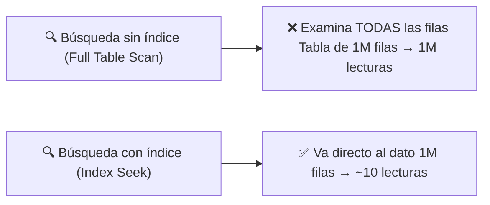
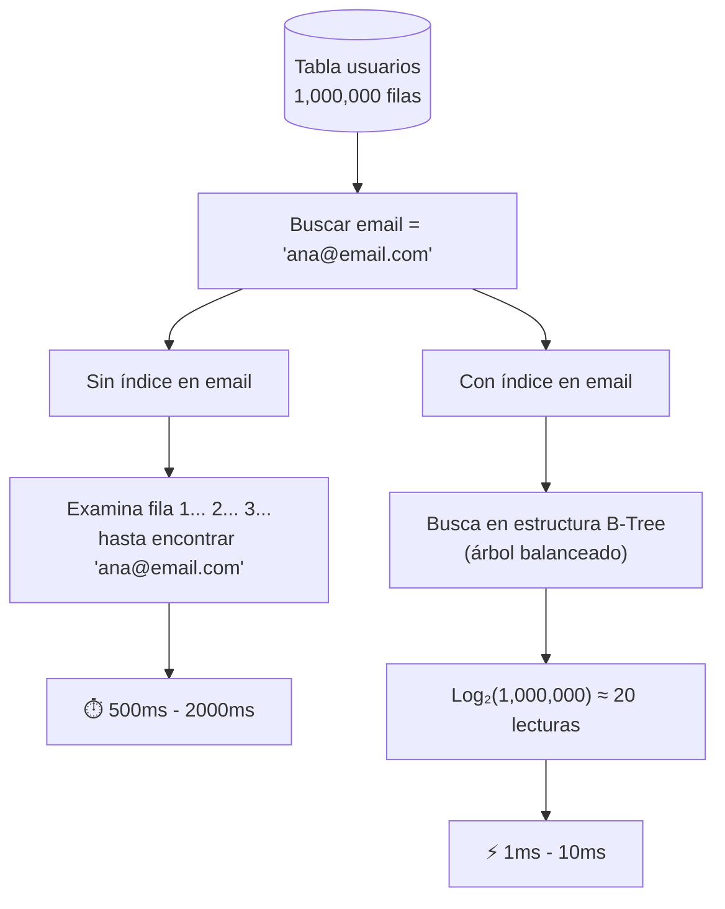
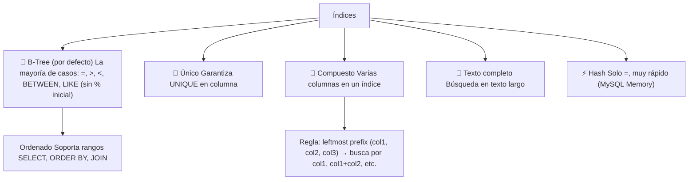
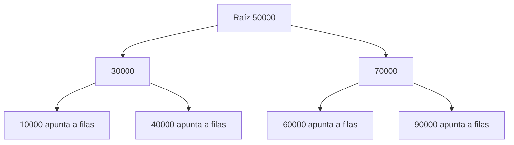
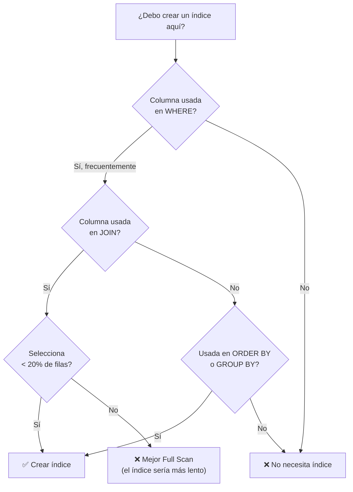
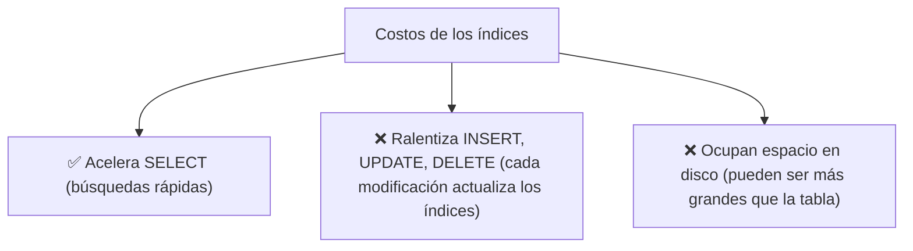
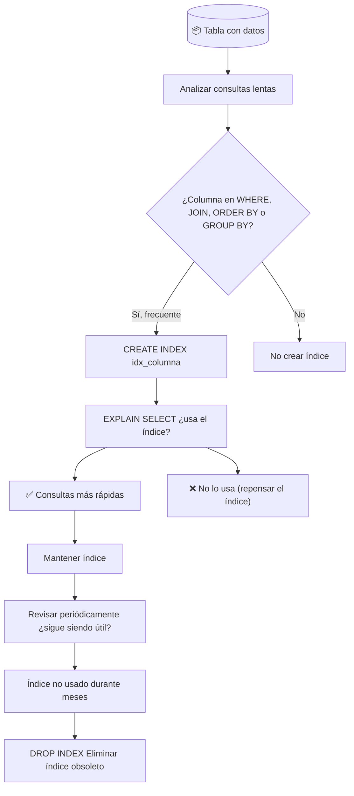
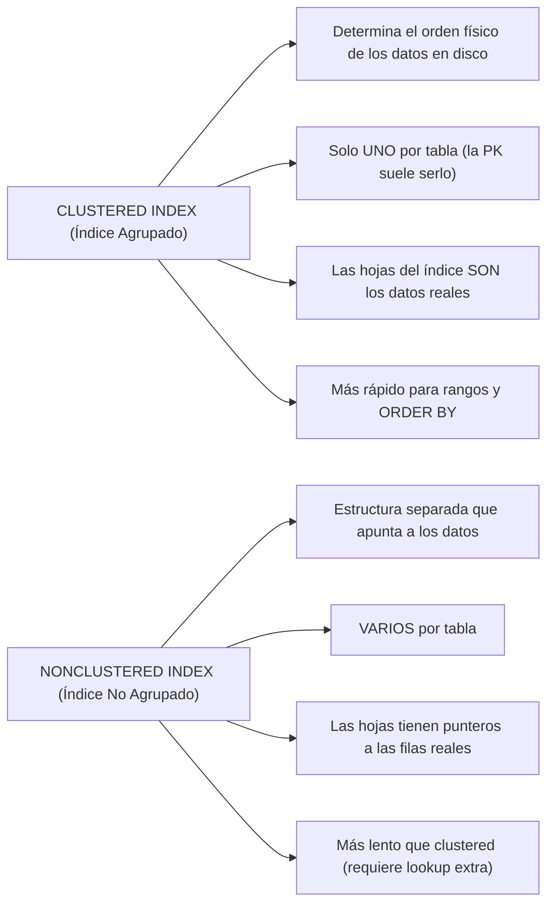

# Índices

Un **índice (INDEX)** es una estructura auxiliar que acelera la búsqueda de datos en una tabla, similar al índice de un libro: en lugar de hojear página por página, vas directo a la página que te interesa.



### ¿Cómo funciona?



---

## Tipos de índices



### B-Tree (el más común)

El índice **B-Tree** (árbol balanceado) es el predeterminado en casi todos los motores. Almacena los valores ordenados jerárquicamente.



Cada hoja contiene punteros a las filas reales de la tabla. Con 1,000,000 de registros, solo necesitas ~20 niveles para llegar a cualquier valor.

---

## Creando índices

```sql
-- Datos de ejemplo
CREATE TABLE usuarios (
    id INT PRIMARY KEY,           -- Crea índice automáticamente
    nombre VARCHAR(100),
    email VARCHAR(200),
    pais VARCHAR(50),
    fecha_registro DATE,
    activo BOOLEAN
);

CREATE TABLE pedidos (
    id INT PRIMARY KEY,
    usuario_id INT,
    total DECIMAL(10,2),
    fecha DATE
);
```

### Creación en CREATE TABLE

```sql
CREATE TABLE usuarios (
    id INT PRIMARY KEY,                     -- PK = índice único automático
    email VARCHAR(200) UNIQUE,              -- UNIQUE = índice automático
    nombre VARCHAR(100),
    INDEX idx_nombre (nombre),              -- Índice explícito en MySQL
    INDEX idx_pais_activo (pais, activo),   -- Índice compuesto
    FULLTEXT INDEX idx_busqueda (nombre)    -- Índice de texto completo
);
```

### Creación con CREATE INDEX

```sql
-- Índice simple
CREATE INDEX idx_usuarios_email ON usuarios(email);

-- Índice único (garantiza valores no repetidos)
CREATE UNIQUE INDEX idx_usuarios_email_unique ON usuarios(email);

-- Índice compuesto (varias columnas)
CREATE INDEX idx_usuarios_pais_activo ON usuarios(pais, activo);

-- Índice de texto completo (búsqueda en texto)
CREATE FULLTEXT INDEX idx_busqueda ON usuarios(nombre, email);

-- Solo si la columna no tiene ya UNIQUE
```

### Después de crear la tabla

```sql
-- MySQL / MariaDB
ALTER TABLE usuarios ADD INDEX idx_email (email);
ALTER TABLE usuarios ADD UNIQUE INDEX idx_email_unique (email);
ALTER TABLE usuarios ADD FULLTEXT INDEX idx_busqueda (nombre);

-- PostgreSQL
CREATE INDEX idx_email ON usuarios(email);

-- SQL Server
CREATE INDEX idx_email ON usuarios(email);
```

### Índice compuesto: regla del prefijo izquierdo

```sql
CREATE INDEX idx_compuesto ON usuarios(pais, activo, fecha_registro);
```

| Consulta | ¿Usa el índice? |
|---|---|
| `WHERE pais = 'MX'` | ✅ Sí (primer columna) |
| `WHERE pais = 'MX' AND activo = TRUE` | ✅ Sí (primeras 2) |
| `WHERE pais = 'MX' AND activo = TRUE AND fecha > '2024-01-01'` | ✅ Sí (las 3) |
| `WHERE activo = TRUE` | ❌ No (salta la primera columna) |
| `WHERE fecha > '2024-01-01'` | ❌ No (salta las primeras) |

> 💡 **Regla:** En un índice compuesto `(col1, col2, col3)`, la búsqueda debe empezar por `col1`. Puedes usar `col1`, `col1+col2`, o `col1+col2+col3`, pero no puedes saltarte `col1`.

---

## ¿Cuándo crear índices?



### Buen candidato para índice

```sql
-- ✅ Columnas en WHERE con alta selectividad
CREATE INDEX idx_email ON usuarios(email);
-- 'WHERE email = 'x'' → 1 fila de 1M (alta selectividad)

-- ✅ Columnas en JOIN
CREATE INDEX idx_pedidos_usuario ON pedidos(usuario_id);
-- 'JOIN pedidos ON usuario_id = usuarios.id'

-- ✅ Columnas en ORDER BY
CREATE INDEX idx_fecha ON pedidos(fecha);
-- 'ORDER BY fecha DESC'

-- ✅ Columnas con GROUP BY
CREATE INDEX idx_pais ON usuarios(pais);
-- 'GROUP BY pais'
```

### Mal candidato para índice

```sql
-- ❌ Columnas con pocos valores distintos (baja selectividad)
CREATE INDEX idx_activo ON usuarios(activo);
-- activo solo tiene TRUE/FALSE → 50% de filas cada valor
-- Es más rápido hacer Full Scan

-- ❌ Tablas pequeñas (< 1000 filas)
-- El índice añade overhead sin beneficio

-- ❌ Columnas que rara vez se usan en WHERE
CREATE INDEX idx_ultimo_acceso ON usuarios(ultimo_acceso);
-- Si nunca buscas por esta columna, el índice sobra

-- ❌ Columnas que se actualizan frecuentemente
-- Cada UPDATE/INSERT debe actualizar el índice también
```

---

## ¿Cuándo los índices son contraproducentes?



### Ejemplo de overhead

```sql
-- Tabla con 10 índices
CREATE TABLE logs (
    id INT PRIMARY KEY,
    mensaje TEXT,
    nivel VARCHAR(10),
    fecha DATETIME,
    usuario_id INT,
    INDEX idx_nivel (nivel),
    INDEX idx_fecha (fecha),
    INDEX idx_usuario (usuario_id),
    INDEX idx_nivel_fecha (nivel, fecha),
    -- ... más índices
);

-- Cada INSERT en logs debe:
-- 1. Insertar en la tabla (1 operación)
-- 2. Actualizar el índice de la PK (1 operación)
-- 3. Actualizar idx_nivel (1 operación)
-- 4. Actualizar idx_fecha (1 operación)
-- 5. Actualizar idx_usuario (1 operación)
-- 6. Actualizar idx_nivel_fecha (1 operación)
-- → **6 operaciones en lugar de 1**
```

> ⚡ **Regla de oro:** No más de 5-6 índices por tabla en producción. Cada índice extra ralentiza las escrituras.

---

## Visualizando y analizando índices

```sql
-- MySQL: ver índices de una tabla
SHOW INDEX FROM usuarios;
SHOW KEYS FROM usuarios;

-- PostgreSQL: listar índices
SELECT * FROM pg_indexes WHERE tablename = 'usuarios';

-- SQL Server
EXEC sp_helpindex 'usuarios';
```

### Explicar plan de ejecución

```sql
-- MySQL / PostgreSQL
EXPLAIN SELECT * FROM usuarios WHERE email = 'ana@email.com';

-- Ver si usa índice o Full Scan
```

| id | select_type | table | type | possible_keys | key | rows |
|---|---|---|---|---|---|---|
| 1 | SIMPLE | usuarios | **ref** | idx_email | idx_email | 1 |

- `type = ref` → está usando el índice
- `type = ALL` → Full Table Scan (sin índice)
- `rows = 1` → solo examinó 1 fila

---

## Eliminando índices

```sql
-- MySQL
DROP INDEX idx_email ON usuarios;
ALTER TABLE usuarios DROP INDEX idx_email;

-- PostgreSQL
DROP INDEX idx_email;

-- SQL Server
DROP INDEX idx_email ON usuarios;
```

---

## Resumen visual: ciclo de vida



### ¿Cuál es la diferencia entre CLUSTERED y NONCLUSTERED?



```sql
-- SQL Server (clustered vs nonclustered)
CREATE CLUSTERED INDEX idx_id ON usuarios(id);
CREATE NONCLUSTERED INDEX idx_email ON usuarios(email);

-- MySQL: InnoDB siempre usa clustered index en la PK
-- PostgreSQL: no tiene clustered index (usa heap)
```

### Resumen rápido

| Situación | ¿Índice? | Tipo recomendado |
|---|---|---|
| `WHERE columna = valor` | ✅ Sí | B-Tree simple |
| `WHERE col1 = ? AND col2 = ?` | ✅ Sí | Compuesto (col1, col2) |
| `ORDER BY columna` | ✅ Sí | B-Tree |
| `JOIN ... ON columna` | ✅ Sí | B-Tree |
| `WHERE texto LIKE '%algo%'` | ⚠️ Parcial | FullText (no B-Tree) |
| Columna con 2-3 valores distintos | ❌ No | — |
| Tabla < 1000 filas | ❌ No | — |
| Muchos INSERT/UPDATE | ⚠️ Moderar índice | Pocos índices |
## Relacionados:
- [[views-sql]] #anterior 
- [[transacciones-sql]] #siguiente 