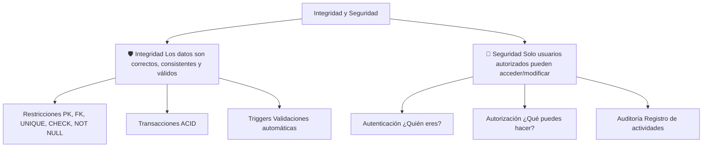
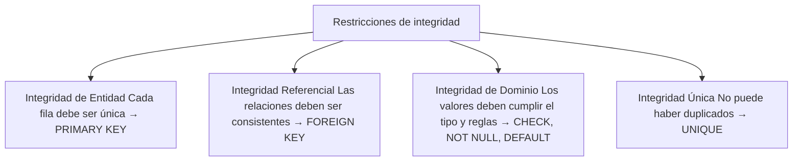
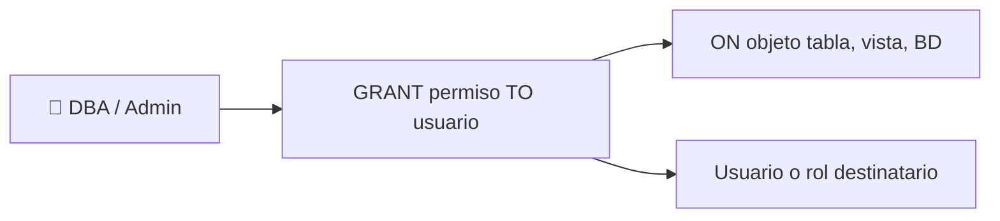
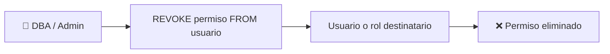
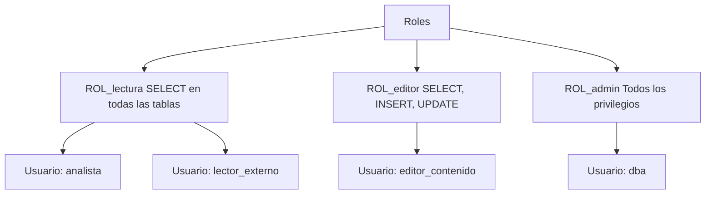
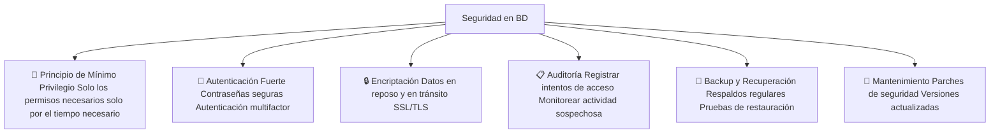
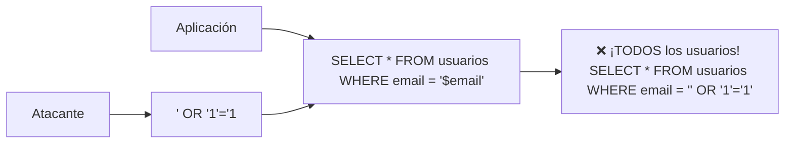
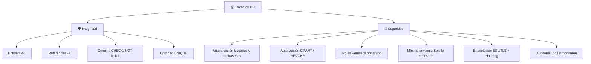
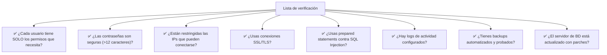

# Integridad y seguridad de los datos

La **integridad** garantiza que los datos sean correctos y consistentes. La **seguridad** controla quién puede acceder a ellos y qué puede hacer.



---

## Restricciones de integridad de datos

Son reglas que la base de datos aplica automáticamente para garantizar que los datos sean válidos.



### Integridad de entidad (PRIMARY KEY)

Cada fila debe tener un identificador único. Garantiza que no hay filas duplicadas.

```sql
-- ✅ Cada empleado tiene un ID único
CREATE TABLE empleados (
    id INT PRIMARY KEY,  -- No puede haber dos empleados con el mismo ID
    nombre VARCHAR(100)
);

-- ❌ Error: no se puede insertar duplicado
INSERT INTO empleados VALUES (1, 'Ana');
INSERT INTO empleados VALUES (1, 'Carlos');  -- Error: duplicate entry '1'
```

### Integridad referencial (FOREIGN KEY)

Las relaciones entre tablas deben ser consistentes. No puede haber un hijo sin padre.

```sql
-- ✅ Todo pedido debe pertenecer a un cliente existente
CREATE TABLE clientes (
    id INT PRIMARY KEY,
    nombre VARCHAR(100)
);

CREATE TABLE pedidos (
    id INT PRIMARY KEY,
    cliente_id INT,
    FOREIGN KEY (cliente_id) REFERENCES clientes(id)
);

-- ❌ Error: no se puede crear un pedido para un cliente que no existe
INSERT INTO pedidos VALUES (1, 999);  -- Error: foreign key constraint fails
```

### Integridad de dominio (CHECK, NOT NULL, DEFAULT)

Los valores deben cumplir las reglas definidas para cada columna.

```sql
CREATE TABLE productos (
    id INT PRIMARY KEY,
    nombre VARCHAR(100) NOT NULL,        -- No puede ser NULL
    precio DECIMAL(10,2) CHECK (precio > 0),  -- Debe ser positivo
    stock INT DEFAULT 0,                 -- Valor por defecto
    categoria VARCHAR(20) CHECK (categoria IN ('A', 'B', 'C'))  -- Valores permitidos
);

-- ✅ Válido
INSERT INTO productos VALUES (1, 'Laptop', 15000.00, 10, 'A');

-- ❌ Error: precio negativo
INSERT INTO productos VALUES (2, 'Mouse', -100.00, 5, 'A');  -- CHECK failed

-- ❌ Error: categoría inválida
INSERT INTO productos VALUES (3, 'Teclado', 500.00, 3, 'Z');  -- CHECK failed

-- ❌ Error: nombre NULL
INSERT INTO productos VALUES (4, NULL, 100.00, 2, 'B');  -- NOT NULL failed
```

### Integridad única (UNIQUE)

Garantiza que no haya valores duplicados en una columna o combinación de columnas.

```sql
-- ✅ No puede haber dos usuarios con el mismo email
CREATE TABLE usuarios (
    id INT PRIMARY KEY,
    email VARCHAR(200) UNIQUE,
    curp VARCHAR(18) UNIQUE
);

-- ❌ Error: email duplicado
INSERT INTO usuarios VALUES (1, 'ana@mail.com', 'CURP123');
INSERT INTO usuarios VALUES (2, 'ana@mail.com', 'CURP456');  -- Error: duplicate
```

---

## GRANT y REVOKE

Controlan los **permisos** de usuarios en la base de datos (DCL - Data Control Language).

### GRANT: otorgar permisos



```sql
-- Sintaxis básica
GRANT privilegio ON objeto TO usuario;

-- Otorgar SELECT en una tabla
GRANT SELECT ON empleados TO usuario_lectura;

-- Otorgar múltiples permisos
GRANT SELECT, INSERT, UPDATE ON empleados TO usuario_editor;

-- Otorgar todos los permisos
GRANT ALL PRIVILEGES ON empleados TO usuario_admin;

-- Otorgar a nivel de base de datos
GRANT SELECT ON mi_base_de_datos.* TO usuario_lectura;

-- Otorgar con opción de transferir permisos
GRANT SELECT ON empleados TO usuario_admin WITH GRANT OPTION;
-- usuario_admin puede dar permiso SELECT a otros usuarios
```

### Tipos de privilegios

| Nivel | Privilegios comunes |
|---|---|
| **Tabla** | `SELECT`, `INSERT`, `UPDATE`, `DELETE`, `ALTER`, `REFERENCES`, `ALL` |
| **Base de datos** | `CREATE`, `DROP`, `ALTER`, `CREATE VIEW`, `CREATE ROUTINE` |
| **Global** | `SUPER`, `RELOAD`, `SHUTDOWN`, `PROCESS`, `FILE`, `ALL` |

```sql
-- Privilegios a nivel de columna (MySQL, PostgreSQL)
GRANT SELECT (nombre, email) ON empleados TO usuario_lectura_parcial;
-- Solo puede ver nombre y email, no puede ver salario

-- Privilegios a nivel de tabla
GRANT SELECT ON empleados TO 'analista'@'localhost';

-- PostgreSQL: crear privilegios específicos
GRANT SELECT, INSERT ON empleados TO analista;
GRANT USAGE ON SCHEMA public TO analista;
GRANT USAGE, SELECT ON ALL SEQUENCES IN SCHEMA public TO analista;
```

### REVOKE: revocar permisos



```sql
-- Sintaxis básica
REVOKE privilegio ON objeto FROM usuario;

-- Revocar SELECT
REVOKE SELECT ON empleados FROM usuario_lectura;

-- Revocar múltiples permisos
REVOKE INSERT, UPDATE, DELETE ON empleados FROM usuario_editor;

-- Revocar todos los permisos
REVOKE ALL PRIVILEGES ON empleados FROM usuario_admin;

-- Revocar con CASCADE (también revoca permisos que dio este usuario)
REVOKE SELECT ON empleados FROM usuario_admin CASCADE;
```

### Roles: gestionar permisos por grupos



```sql
-- PostgreSQL: crear roles
CREATE ROLE rol_lectura;
CREATE ROLE rol_editor;

-- Asignar permisos al rol
GRANT SELECT ON ALL TABLES IN SCHEMA public TO rol_lectura;
GRANT SELECT, INSERT, UPDATE ON ALL TABLES IN SCHEMA public TO rol_editor;

-- Asignar rol a usuarios
GRANT rol_lectura TO analista;
GRANT rol_editor TO editor_contenido;

-- MySQL: roles (desde MySQL 8)
CREATE ROLE 'rol_lectura', 'rol_editor';
GRANT SELECT ON mi_bd.* TO 'rol_lectura';
GRANT SELECT, INSERT, UPDATE ON mi_bd.* TO 'rol_editor';
GRANT 'rol_lectura' TO 'analista'@'localhost';
```

### Verificar permisos

```sql
-- MySQL: ver permisos de un usuario
SHOW GRANTS FOR 'usuario'@'localhost';
SHOW GRANTS FOR CURRENT_USER;

-- PostgreSQL
SELECT * FROM information_schema.table_privileges
WHERE grantee = 'usuario';

-- Listar usuarios (MySQL)
SELECT user, host FROM mysql.user;
```

### Ejemplo completo: crear usuario con permisos

```sql
-- 1. Crear usuario (MySQL)
CREATE USER 'lector'@'localhost' IDENTIFIED BY 'contraseña_segura';

-- 2. Otorgar permisos específicos
GRANT SELECT ON empleados TO 'lector'@'localhost';
GRANT SELECT ON departamentos TO 'lector'@'localhost';

-- 3. Verificar
SHOW GRANTS FOR 'lector'@'localhost';

-- 4. Revocar si es necesario
REVOKE SELECT ON empleados FROM 'lector'@'localhost';

-- 5. Eliminar usuario
DROP USER 'lector'@'localhost';
```

---

## Mejores prácticas para la seguridad de BD



### 1. Principio de mínimo privilegio

```sql
-- ❌ MAL: otorgar todos los permisos a todos
GRANT ALL PRIVILEGES ON *.* TO 'app'@'%';

-- ✅ BIEN: solo los permisos necesarios
CREATE USER 'app_web'@'localhost' IDENTIFIED BY 'contraseña_segura';
GRANT SELECT, INSERT, UPDATE ON mi_bd.pedidos TO 'app_web'@'localhost';
GRANT SELECT ON mi_bd.productos TO 'app_web'@'localhost';
-- No necesita DELETE ni ALTER ni DROP
```

### 2. Gestión de contraseñas

```sql
-- ✅ Contraseñas fuertes (mínimo 12 caracteres, combinación)
CREATE USER 'admin'@'localhost' IDENTIFIED BY 'Kd9#mP2$xL7@qR5';

-- ✅ Cambiar contraseña regularmente
ALTER USER 'usuario'@'localhost' IDENTIFIED BY 'nueva_contraseña';

-- ✅ Expirar contraseñas (MySQL)
ALTER USER 'usuario'@'localhost' PASSWORD EXPIRE INTERVAL 90 DAY;

-- ❌ Contraseñas débiles
CREATE USER 'admin'@'localhost' IDENTIFIED BY 'admin123';  -- ❌
CREATE USER 'admin'@'localhost' IDENTIFIED BY 'password';   -- ❌
```

### 3. Restringir acceso por host

```sql
-- ✅ Solo desde localhost (aplicación en mismo servidor)
CREATE USER 'app'@'localhost' IDENTIFIED BY 'segura';

-- ✅ Solo desde IP específica del servidor de aplicaciones
CREATE USER 'app'@'192.168.1.100' IDENTIFIED BY 'segura';

-- ✅ Desde cualquier IP de la red interna
CREATE USER 'app'@'192.168.1.%' IDENTIFIED BY 'segura';

-- ❌ Desde cualquier lugar (riesgo de seguridad)
CREATE USER 'app'@'%' IDENTIFIED BY 'segura';  -- ❌ Evitar si es posible
```

### 4. Encriptación

```sql
-- ✅ Encriptar datos sensibles a nivel de aplicación (nunca texto plano)
-- (MySQL / PostgreSQL: funciones de hash)
INSERT INTO usuarios (nombre, password_hash)
VALUES ('Ana', SHA2('contraseña', 256));  -- Hash, no texto plano

-- ✅ Conexiones SSL/TLS (MySQL)
ALTER USER 'usuario'@'localhost' REQUIRE SSL;

-- ✅ Encriptación a nivel de columna (PostgreSQL: pgcrypto)
CREATE EXTENSION pgcrypto;
UPDATE tarjetas SET numero_criptado = encrypt(numero, 'clave', 'aes');
```

### 5. Auditoría

```sql
-- MySQL: habilitar log general
SET GLOBAL general_log = 'ON';

-- MySQL Enterprise: auditoría
SELECT * FROM mysql.audit_log;

-- PostgreSQL: configuración de auditoría
-- En postgresql.conf:
-- logging_collector = on
-- log_statement = 'all'  (o 'ddl', 'mod')

-- PostgreSQL: pgaudit extension
CREATE EXTENSION pgaudit;

-- Ver conexiones activas (útil para detectar actividad sospechosa)
-- MySQL
SHOW PROCESSLIST;
SELECT * FROM information_schema.PROCESSLIST;

-- PostgreSQL
SELECT * FROM pg_stat_activity;
```

### 6. Respaldo y recuperación

```sql
-- MySQL: mysqldump
-- mysqldump -u root -p mi_bd > backup_$(date +%Y%m%d).sql

-- PostgreSQL: pg_dump
-- pg_dump -U postgres mi_bd > backup_$(date +%Y%m%d).sql

-- Restaurar
-- mysql -u root -p mi_bd < backup_20240101.sql
-- psql -U postgres mi_bd < backup_20240101.sql
```

### 7. Otras buenas prácticas

```sql
-- ❌ NO USAR: cuentas compartidas
-- Cada persona debe tener su propio usuario

-- ❌ NO USAR: contraseñas en código fuente
-- Usar variables de entorno o secretos

-- ✅ Deshabilitar comandos peligrosos para usuarios no admin
REVOKE FILE ON *.* FROM 'app_web'@'localhost';  -- No puede leer archivos
REVOKE SUPER ON *.* FROM 'app_web'@'localhost';  -- No puede hacer operaciones de admin
REVOKE DROP ON mi_bd.* FROM 'app_web'@'localhost';  -- No puede eliminar tablas

-- ✅ Revocar acceso a mysql.user (no puede ver contraseñas)
REVOKE SELECT ON mysql.* FROM 'app_web'@'localhost';

-- ✅ Configurar límites de recursos (MySQL)
ALTER USER 'app_web'@'localhost'
    WITH MAX_QUERIES_PER_HOUR 1000
    MAX_CONNECTIONS_PER_HOUR 100
    MAX_USER_CONNECTIONS 10;
```

### 8. SQL Injection: la amenaza #1

```sql
-- ❌ VULNERABLE: concatenar strings directamente
-- Código en la app:
-- query = "SELECT * FROM usuarios WHERE email = '" + email + "'";
-- Si email = "' OR '1'='1" → ¡lee TODOS los usuarios!

-- ✅ SEGURO: usar parámetros / prepared statements
-- En la app (PHP):
-- $stmt = $pdo->prepare("SELECT * FROM usuarios WHERE email = ?");
-- $stmt->execute([$email]);

-- ✅ En SQL mismo: escapar inputs (MySQL)
SELECT * FROM usuarios WHERE email = QUOTE('usuario@email.com');
```



---

## Resumen visual



### Checklist de seguridad



## Relacionados:
- [[transacciones-sql]] #anterior 
- [[stored-procedures-and-functions-sql]] #siguiente 