# Consultas de unión (JOIN Queries)

Los **JOINs** permiten combinar filas de dos o más tablas basándose en una **condición de relación** entre ellas. Son la herramienta más poderosa de SQL para trabajar con datos normalizados.

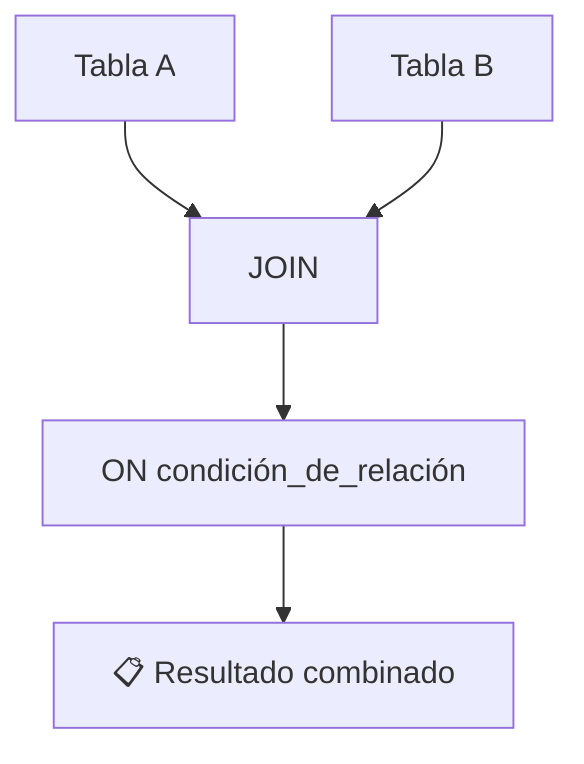

---

## Preparación: datos de ejemplo

Usaremos estas tablas en todos los ejemplos:

```sql
CREATE TABLE clientes (
    id INT PRIMARY KEY,
    nombre VARCHAR(50)
);

CREATE TABLE pedidos (
    id INT PRIMARY KEY,
    cliente_id INT,
    total DECIMAL(10,2)
);

INSERT INTO clientes VALUES
    (1, 'Ana'),
    (2, 'Carlos'),
    (3, 'María'),
    (4, 'Luis');       -- Luis no tiene pedidos

INSERT INTO pedidos VALUES
    (101, 1, 500.00),
    (102, 1, 300.00),
    (103, 2, 800.00),
    (104, 3, 150.00),
    (105, 5, 200.00);  -- pedido sin cliente (cliente_id=5 no existe)
```

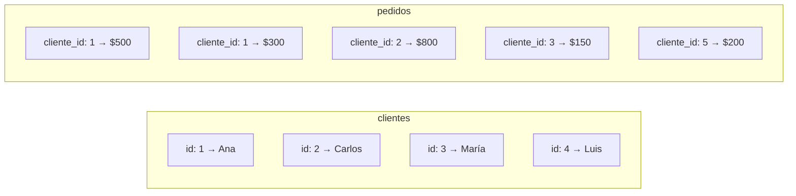

---

## INNER JOIN

Devuelve solo las filas que tienen **coincidencia en ambas tablas**.

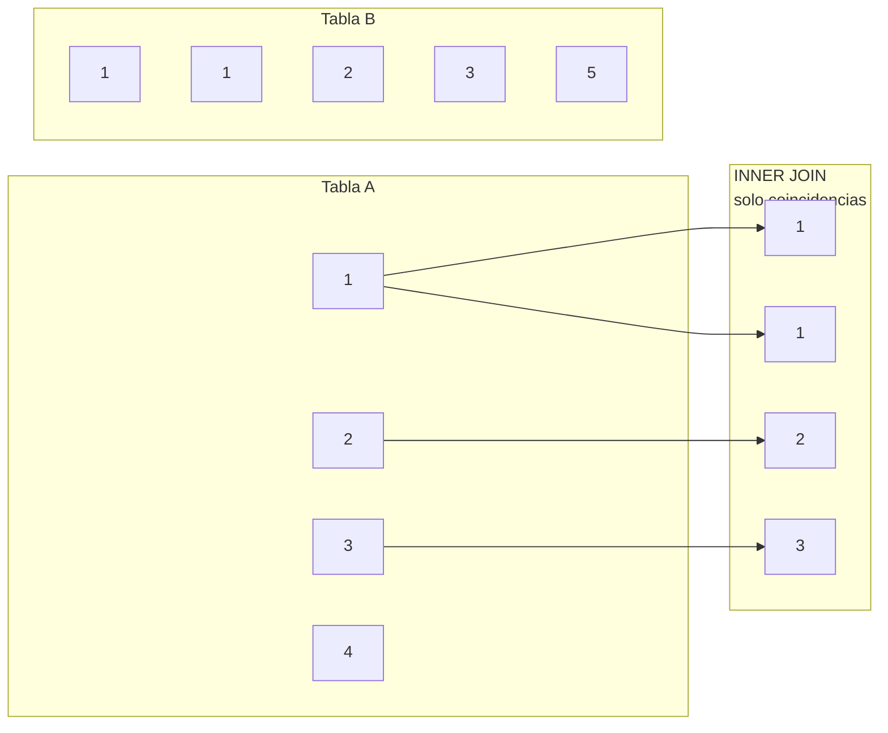

### Sintaxis

```sql
SELECT columnas
FROM tabla_a
INNER JOIN tabla_b ON tabla_a.columna = tabla_b.columna;
```

### Ejemplo

```sql
SELECT c.nombre, p.id AS pedido_id, p.total
FROM clientes c
INNER JOIN pedidos p ON c.id = p.cliente_id;
```

**Resultado:**

| nombre | pedido_id | total |
|---|---|---|
| Ana | 101 | 500.00 |
| Ana | 102 | 300.00 |
| Carlos | 103 | 800.00 |
| María | 104 | 150.00 |

> ❌ Luis (id: 4) no aparece → no tiene pedidos.
> ❌ Pedido 105 (cliente_id: 5) no aparece → no hay cliente con id 5.

### INNER JOIN con múltiples tablas

```sql
SELECT
    c.nombre AS cliente,
    p.id AS pedido,
    pr.nombre AS producto,
    dp.cantidad
FROM clientes c
INNER JOIN pedidos p ON c.id = p.cliente_id
INNER JOIN detalle_pedido dp ON p.id = dp.pedido_id
INNER JOIN productos pr ON dp.producto_id = pr.id;
```

### ¿INNER JOIN o solo FROM con coma?

```sql
-- ✅ Equivalente: ambos hacen INNER JOIN
SELECT * FROM clientes c, pedidos p WHERE c.id = p.cliente_id;
SELECT * FROM clientes c INNER JOIN pedidos p ON c.id = p.cliente_id;

-- La sintaxis explícita (JOIN) es más clara y recomendada
```

---

## LEFT JOIN

Devuelve **todas las filas de la tabla izquierda** y las coincidencias de la derecha. Las filas izquierdas sin coincidencia muestran `NULL` en las columnas de la derecha.

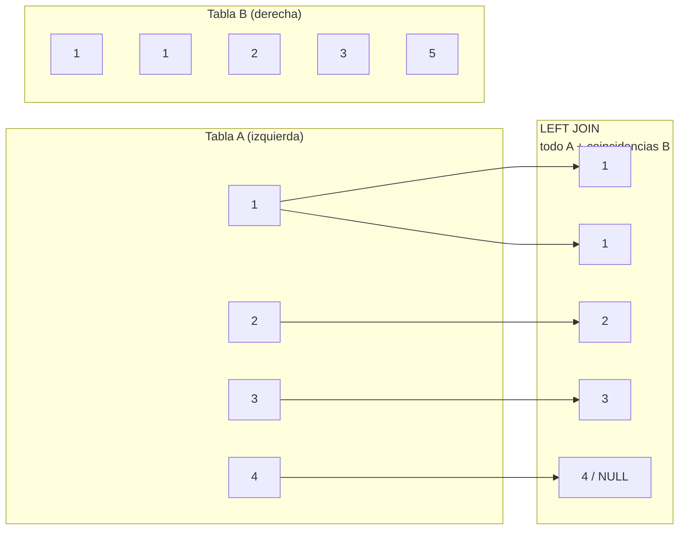

### Sintaxis

```sql
SELECT columnas
FROM tabla_izquierda
LEFT JOIN tabla_derecha ON condicion;
```

### Ejemplo

```sql
SELECT c.nombre, p.id AS pedido_id, p.total
FROM clientes c
LEFT JOIN pedidos p ON c.id = p.cliente_id;
```

**Resultado:**

| nombre | pedido_id | total |
|---|---|---|
| Ana | 101 | 500.00 |
| Ana | 102 | 300.00 |
| Carlos | 103 | 800.00 |
| María | 104 | 150.00 |
| **Luis** | **NULL** | **NULL** |

> ✅ Luis **sí aparece**, aunque no tenga pedidos. Sus columnas de pedidos son `NULL`.

### Caso de uso: encontrar filas sin coincidencia

```sql
-- Clientes que NUNCA han hecho un pedido
SELECT c.nombre
FROM clientes c
LEFT JOIN pedidos p ON c.id = p.cliente_id
WHERE p.id IS NULL;
```

**Resultado:** Luis

> 💡 Este patrón (`LEFT JOIN ... WHERE derecha IS NULL`) es muy útil para encontrar registros huérfanos o faltantes.

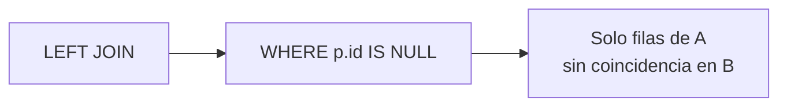

---

## RIGHT JOIN

Es el inverso de LEFT JOIN: devuelve **todas las filas de la tabla derecha** y las coincidencias de la izquierda.

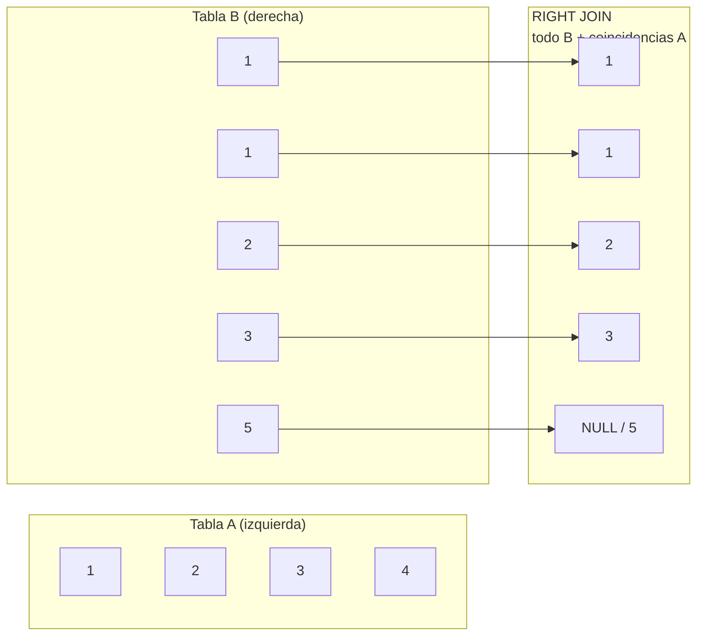

### Sintaxis

```sql
SELECT columnas
FROM tabla_izquierda
RIGHT JOIN tabla_derecha ON condicion;
```

### Ejemplo

```sql
SELECT c.nombre, p.id AS pedido_id, p.total
FROM clientes c
RIGHT JOIN pedidos p ON c.id = p.cliente_id;
```

**Resultado:**

| nombre | pedido_id | total |
|---|---|---|
| Ana | 101 | 500.00 |
| Ana | 102 | 300.00 |
| Carlos | 103 | 800.00 |
| María | 104 | 150.00 |
| **NULL** | **105** | **200.00** |

> ✅ El pedido 105 (sin cliente) **sí aparece**. La columna `nombre` es `NULL`.

### RIGHT JOIN vs LEFT JOIN

```sql
-- Estos dos son equivalentes:
SELECT * FROM clientes c RIGHT JOIN pedidos p ON c.id = p.cliente_id;
SELECT * FROM pedidos p LEFT JOIN clientes c ON p.cliente_id = c.id;
```

> 💡 La mayoría de desarrolladores prefieren **siempre LEFT JOIN** y reordenan las tablas. RIGHT JOIN se usa poco y es menos intuitivo.

---

## FULL OUTER JOIN

Devuelve **todas las filas de ambas tablas**. Las filas sin coincidencia tienen `NULL` en la tabla opuesta.

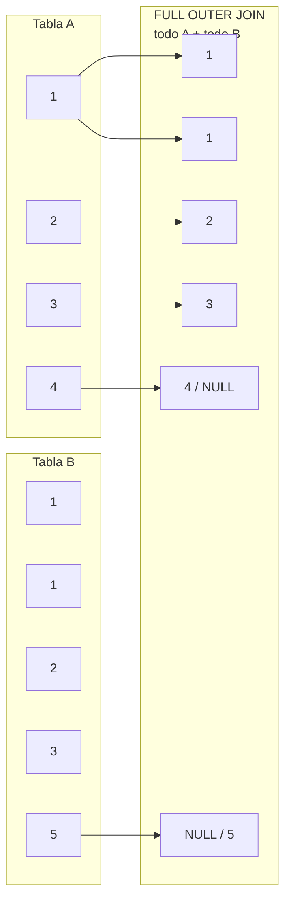

### Sintaxis

```sql
-- PostgreSQL, SQL Server, Oracle
SELECT columnas
FROM tabla_a
FULL OUTER JOIN tabla_b ON condicion;

-- MySQL no soporta FULL JOIN → se simula con UNION
SELECT columnas
FROM tabla_a
LEFT JOIN tabla_b ON condicion
UNION
SELECT columnas
FROM tabla_a
RIGHT JOIN tabla_b ON condicion;
```

### Ejemplo en MySQL

```sql
-- Simular FULL JOIN en MySQL/ MariaDB
SELECT c.nombre, p.id AS pedido_id, p.total
FROM clientes c
LEFT JOIN pedidos p ON c.id = p.cliente_id
UNION
SELECT c.nombre, p.id, p.total
FROM clientes c
RIGHT JOIN pedidos p ON c.id = p.cliente_id;
```

**Resultado:**

| nombre | pedido_id | total |
|---|---|---|
| Ana | 101 | 500.00 |
| Ana | 102 | 300.00 |
| Carlos | 103 | 800.00 |
| María | 104 | 150.00 |
| **Luis** | **NULL** | **NULL** |
| **NULL** | **105** | **200.00** |

> ✅ Aparecen **todos**: Luis (sin pedidos) y el pedido 105 (sin cliente).

### Caso de uso: detectar datos huérfanos de ambos lados

```sql
-- Encuentra clientes sin pedidos Y pedidos sin clientes
SELECT c.id AS cliente_id, c.nombre, p.id AS pedido_id
FROM clientes c
FULL OUTER JOIN pedidos p ON c.id = p.cliente_id
WHERE c.id IS NULL OR p.id IS NULL;
```

---

## Self Join

Una tabla se une **consigo misma**. Se usa cuando una tabla tiene una relación jerárquica o referencial dentro de sí misma.

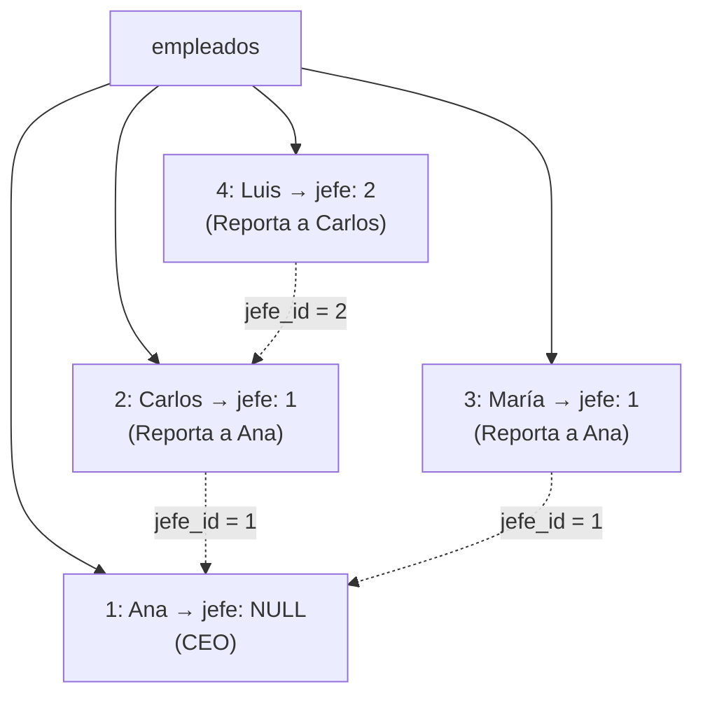

### Sintaxis

```sql
SELECT alias_a.columna, alias_b.columna
FROM tabla alias_a
JOIN tabla alias_b ON condicion;
```

> ⚠️ **Los alias son obligatorios** en Self Join para distinguir las dos instancias de la misma tabla.

### Ejemplo: jerarquía de empleados

```sql
CREATE TABLE empleados (
    id INT PRIMARY KEY,
    nombre VARCHAR(50),
    jefe_id INT       -- FK a la misma tabla: el jefe de esta persona
);

INSERT INTO empleados VALUES
    (1, 'Ana',    NULL),  -- Ana es la CEO (no tiene jefe)
    (2, 'Carlos', 1),     -- Carlos reporta a Ana
    (3, 'María',  1),     -- María reporta a Ana
    (4, 'Luis',   2);     -- Luis reporta a Carlos

-- ¿Quién es el jefe de cada empleado?
SELECT
    e.nombre AS empleado,
    j.nombre AS jefe
FROM empleados e
LEFT JOIN empleados j ON e.jefe_id = j.id;
```

**Resultado:**

| empleado | jefe |
|---|---|
| Ana | NULL |
| Carlos | Ana |
| María | Ana |
| Luis | Carlos |

### Ejemplo: pares de productos comprados juntos

```sql
-- ¿Qué pares de productos se han comprado en el mismo pedido?
SELECT DISTINCT
    a.producto_id AS producto_a,
    b.producto_id AS producto_b
FROM detalle_pedido a
JOIN detalle_pedido b ON a.pedido_id = b.pedido_id
WHERE a.producto_id < b.producto_id;  -- evita pares duplicados
```

### Ejemplo: clientes referidos

```sql
CREATE TABLE clientes (
    id INT PRIMARY KEY,
    nombre VARCHAR(50),
    referido_por_id INT  -- id del cliente que lo recomendó
);

SELECT
    c.nombre AS cliente,
    r.nombre AS referido_por
FROM clientes c
LEFT JOIN clientes r ON c.referido_por_id = r.id;
```

---

## Cross Join

Producto **cartesiano**: cada fila de la tabla A se combina con **todas** las filas de la tabla B.

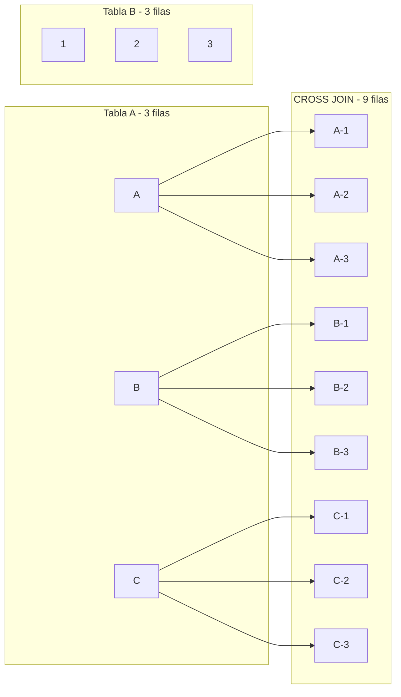

### Sintaxis

```sql
-- Explícita
SELECT * FROM tabla_a CROSS JOIN tabla_b;

-- Implícita (producto cartesiano)
SELECT * FROM tabla_a, tabla_b;
```

### Ejemplos

```sql
-- Combinar todas las tallas con todos los colores
CREATE TABLE tallas (talla VARCHAR(5));
CREATE TABLE colores (color VARCHAR(20));

INSERT INTO tallas VALUES ('S'), ('M'), ('L'), ('XL');
INSERT INTO colores VALUES ('Rojo'), ('Azul'), ('Negro');

SELECT t.talla, c.color
FROM tallas t
CROSS JOIN colores c;
```

**Resultado: 12 combinaciones** (4 tallas × 3 colores):

| talla | color |
|---|---|
| S | Rojo |
| S | Azul |
| S | Negro |
| M | Rojo |
| ... | ... |
| XL | Negro |

### Casos de uso reales

```sql
-- 1. Generar calendario de fechas
SELECT DATE_ADD('2024-01-01', INTERVAL n DAY) AS fecha
FROM (
    SELECT 0 AS n UNION SELECT 1 UNION SELECT 2 ... UNION SELECT 365
) AS numeros;

-- 2. Combinación de todas las sucursales con todos los productos (para stock)
SELECT s.nombre AS sucursal, p.nombre AS producto
FROM sucursales s
CROSS JOIN productos p;

-- 3. Generar todas las combinaciones posibles para análisis
SELECT c.nombre AS cliente, pr.nombre AS producto
FROM clientes c
CROSS JOIN productos pr
WHERE NOT EXISTS (
    SELECT 1 FROM pedidos p
    JOIN detalle_pedido dp ON p.id = dp.pedido_id
    WHERE p.cliente_id = c.id AND dp.producto_id = pr.id
);
-- Clientes y productos que NUNCA han comprado
```

> ⚠️ **CROSS JOIN puede ser peligroso:** Si las dos tablas son grandes, el resultado puede ser enorme (1,000 × 10,000 = 10 millones de filas).

---

## Resumen visual de todos los JOINs

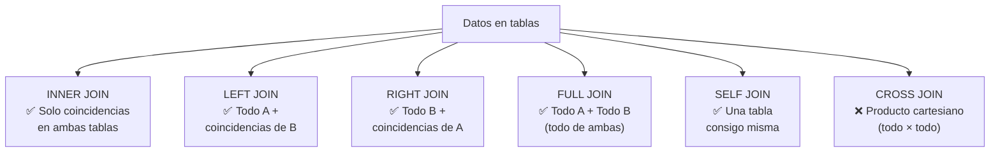

### Tabla comparativa

| JOIN | Filas de A sin coincidencia | Filas de B sin coincidencia | ¿Cuándo usarlo? |
|---|---|---|---|
| **INNER JOIN** | ❌ Excluidas | ❌ Excluidas | Cuando solo importan las coincidencias |
| **LEFT JOIN** | ✅ Incluidas (con NULLs) | ❌ Excluidas | Cuando quieres TODO de A, con o sin relación |
| **RIGHT JOIN** | ❌ Excluidas | ✅ Incluidas (con NULLs) | Cuando quieres TODO de B (poco usado) |
| **FULL JOIN** | ✅ Incluidas (con NULLs) | ✅ Incluidas (con NULLs) | Cuando quieres todo de ambas tablas |
| **SELF JOIN** | Depende del tipo de JOIN usado | Depende | Relaciones jerárquicas en misma tabla |
| **CROSS JOIN** | N/A (no hay condición) | N/A (no hay condición) | Generar combinaciones, calendarios |

### Guía para elegir el JOIN correcto

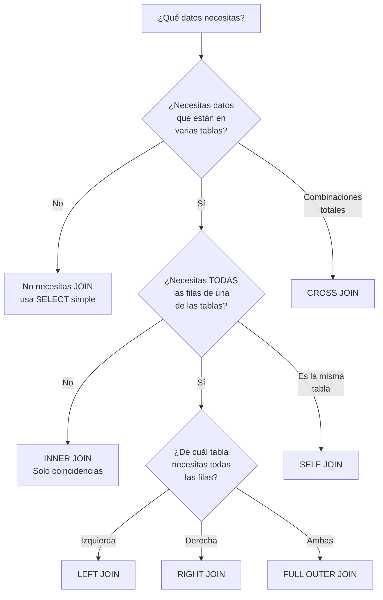

### Ejemplo: reporte real con múltiples JOINs

```sql
-- Reporte completo de pedidos con cliente y detalle
SELECT
    p.id AS pedido,
    c.nombre AS cliente,
    pr.nombre AS producto,
    dp.cantidad,
    dp.precio_unitario,
    (dp.cantidad * dp.precio_unitario) AS subtotal
FROM pedidos p
INNER JOIN clientes c ON p.cliente_id = c.id
INNER JOIN detalle_pedido dp ON p.id = dp.pedido_id
INNER JOIN productos pr ON dp.producto_id = pr.id
WHERE p.fecha >= '2024-01-01'
ORDER BY p.id, pr.nombre;
```

### Rendimiento: consejos prácticos

```sql
-- ✅ Indexa las columnas usadas en JOIN
CREATE INDEX idx_pedidos_cliente ON pedidos(cliente_id);

-- ✅ Prefiere INNER JOIN sobre LEFT JOIN cuando sea posible
-- LEFT JOIN es más costoso porque debe procesar filas sin coincidencia

-- ✅ Filtra lo antes posible (con WHERE) para reducir filas antes del JOIN
SELECT *
FROM clientes c
INNER JOIN pedidos p ON c.id = p.cliente_id
WHERE c.activo = TRUE;  -- Filtra clientes antes de unir
```

> 💡 El orden de ejecución real: `FROM / JOIN` → `WHERE` → `SELECT`. Por eso filtrar en `WHERE` reduce las filas antes de cualquier operación costosa.

## Relacionados:
- [[restricciones-de-datos-sql]] #anterior 
- [[subqueries-sql]] #siguiente 