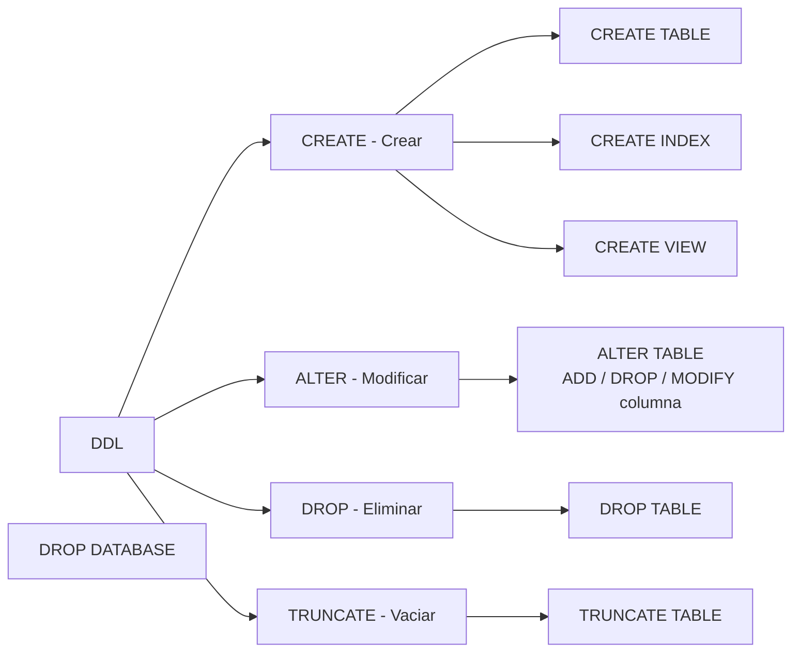
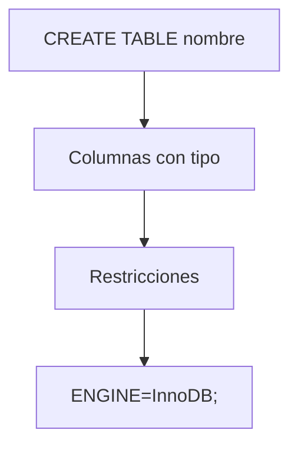
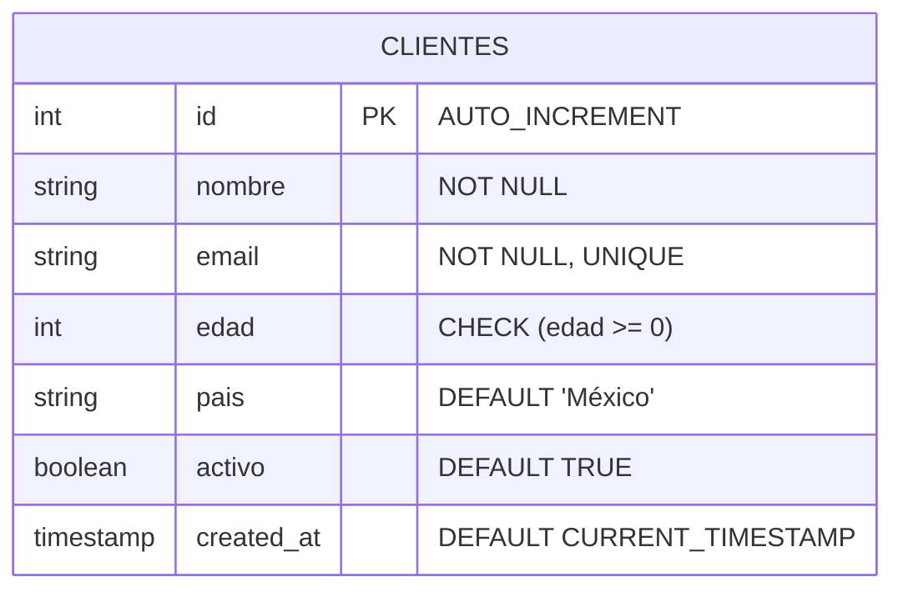
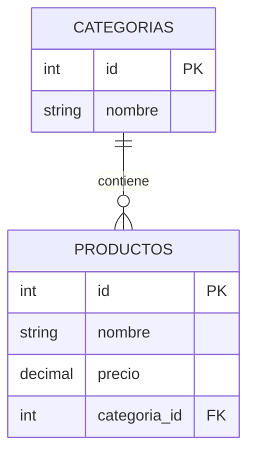
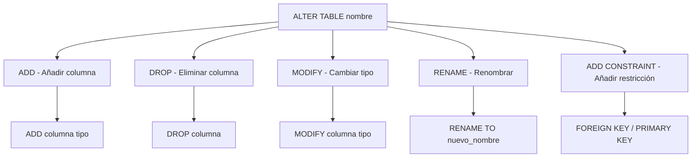
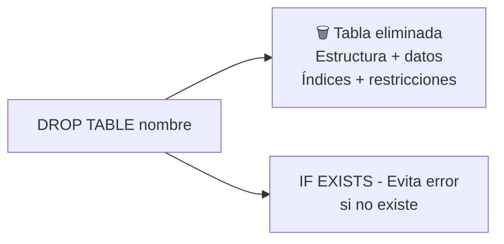
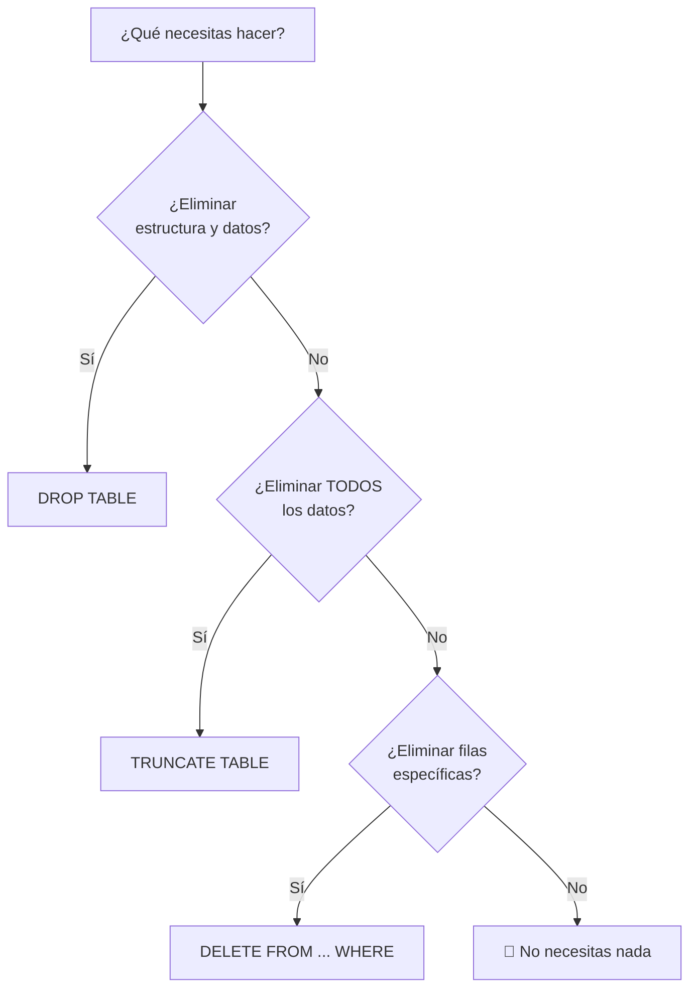
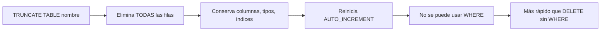
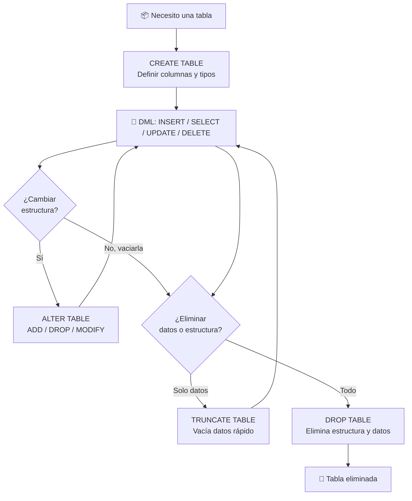
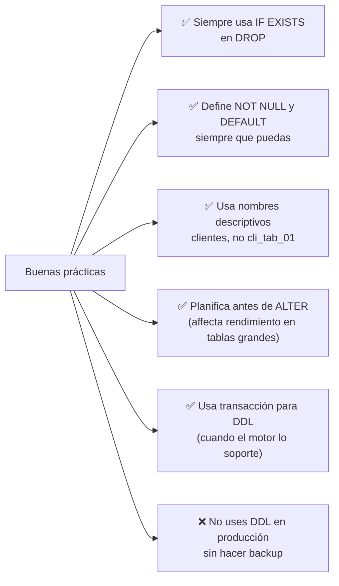

# Lenguaje de definición de datos (DDL)

El **DDL** (Data Definition Language) es el subconjunto de SQL que permite **crear, modificar y eliminar** la estructura de los objetos de la base de datos (tablas, índices, vistas, etc.).



> ⚠️ **Importante:** A diferencia de DML (INSERT, UPDATE, DELETE), las operaciones DDL **no se pueden deshacer con ROLLBACK** en la mayoría de motores. Ejecutan un COMMIT implícito.

---

## CREATE TABLE

Crea una nueva tabla en la base de datos. Es la operación fundamental del DDL.



### Sintaxis básica

```sql
CREATE TABLE nombre_tabla (
    columna1 tipo [restricciones],
    columna2 tipo [restricciones],
    ...
    [restricciones_de_tabla]
);
```

### Restricciones (constraints)

Las restricciones garantizan la **integridad** de los datos:

| Restricción | Significado | Ejemplo |
|---|---|---|
| `PRIMARY KEY` | Identificador único de cada fila | `id INT PRIMARY KEY` |
| `FOREIGN KEY` | Referencia a la PK de otra tabla | `FOREIGN KEY (cat_id) REFERENCES categorias(id)` |
| `UNIQUE` | Valores no repetidos en la columna | `email VARCHAR(200) UNIQUE` |
| `NOT NULL` | La columna no puede estar vacía | `nombre VARCHAR(100) NOT NULL` |
| `DEFAULT` | Valor por defecto si no se especifica | `activo BOOLEAN DEFAULT TRUE` |
| `CHECK` | Valida que el valor cumpla una condición | `CHECK (edad >= 0)` |
| `AUTO_INCREMENT` | Genera un valor incremental automático | `id INT AUTO_INCREMENT` |

### Ejemplo completo

```sql
CREATE TABLE clientes (
    id INT PRIMARY KEY AUTO_INCREMENT,
    nombre VARCHAR(100) NOT NULL,
    email VARCHAR(200) NOT NULL UNIQUE,
    edad INT CHECK (edad >= 0 AND edad <= 150),
    pais VARCHAR(50) DEFAULT 'México',
    activo BOOLEAN DEFAULT TRUE,
    created_at TIMESTAMP DEFAULT CURRENT_TIMESTAMP
);
```



### CREATE TABLE con FOREIGN KEY

```sql
-- Tabla padre
CREATE TABLE categorias (
    id INT PRIMARY KEY AUTO_INCREMENT,
    nombre VARCHAR(100) NOT NULL
);

-- Tabla hija con FK
CREATE TABLE productos (
    id INT PRIMARY KEY AUTO_INCREMENT,
    nombre VARCHAR(150) NOT NULL,
    precio DECIMAL(10, 2) NOT NULL,
    categoria_id INT,
    FOREIGN KEY (categoria_id) REFERENCES categorias(id)
        ON DELETE CASCADE
        ON UPDATE CASCADE
);
```



#### Acciones referenciales (ON DELETE / ON UPDATE)

| Acción | Comportamiento |
|---|---|
| `CASCADE` | Elimina/actualiza automáticamente las filas hijas |
| `SET NULL` | Pone la FK a NULL cuando se elimina/actualiza el padre |
| `RESTRICT` | Impide eliminar/actualizar si hay hijas referenciando |
| `NO ACTION` | Similar a RESTRICT (difiere según el motor) |
| `SET DEFAULT` | Asigna el valor por defecto (poco soportado) |

```sql
FOREIGN KEY (cliente_id) REFERENCES clientes(id)
    ON DELETE CASCADE
    -- Si borro un cliente, se borran sus pedidos automáticamente
```

### Crear tabla a partir de otra (CTAS)

```sql
-- Crea una tabla copiando estructura y datos de otra
CREATE TABLE clientes_backup AS
SELECT * FROM clientes;

-- Crea una tabla copiando solo la estructura (sin datos)
CREATE TABLE clientes_vacia LIKE clientes;
```

> ⚠️ CTAS (`CREATE TABLE ... AS SELECT`) no copia restricciones como PK, FK ni índices.

---

## ALTER TABLE

Modifica la estructura de una tabla existente.



### Añadir columnas

```sql
-- Añadir una columna simple
ALTER TABLE usuarios
ADD telefono VARCHAR(15);

-- Añadir con restricciones
ALTER TABLE usuarios
ADD codigo_postal VARCHAR(10) NOT NULL DEFAULT '00000';

-- Añadir al inicio (MySQL)
ALTER TABLE usuarios
ADD id_temporal INT FIRST;

-- Añadir después de otra columna (MySQL)
ALTER TABLE usuarios
ADD fecha_nacimiento DATE AFTER nombre;
```

### Eliminar columnas

```sql
-- Eliminar una columna
ALTER TABLE usuarios
DROP COLUMN telefono;

-- Eliminar múltiples columnas (PostgreSQL, MySQL 8+)
ALTER TABLE usuarios
DROP COLUMN telefono,
DROP COLUMN codigo_postal;
```

### Modificar columnas

```sql
-- Cambiar el tipo de dato
ALTER TABLE productos
MODIFY precio DECIMAL(12, 2);

-- Cambiar restricción (NOT NULL)
ALTER TABLE usuarios
MODIFY email VARCHAR(255) NOT NULL;

-- Cambiar valor por defecto
ALTER TABLE usuarios
ALTER COLUMN pais SET DEFAULT 'Colombia';
```

### Renombrar

```sql
-- Renombrar tabla
ALTER TABLE usuarios RENAME TO clientes;

-- Renombrar columna (MySQL)
ALTER TABLE usuarios
RENAME COLUMN nombre TO nombre_completo;

-- Renombrar columna (PostgreSQL)
ALTER TABLE usuarios
RENAME nombre TO nombre_completo;
```

### Añadir y eliminar restricciones

```sql
-- Añadir PRIMARY KEY
ALTER TABLE usuarios
ADD PRIMARY KEY (id);

-- Añadir FOREIGN KEY
ALTER TABLE pedidos
ADD CONSTRAINT fk_cliente
FOREIGN KEY (cliente_id) REFERENCES clientes(id);

-- Añadir UNIQUE
ALTER TABLE usuarios
ADD CONSTRAINT uq_email UNIQUE (email);

-- Añadir CHECK
ALTER TABLE productos
ADD CONSTRAINT ck_precio CHECK (precio > 0);

-- Eliminar una restricción
ALTER TABLE usuarios
DROP CONSTRAINT uq_email;
-- En MySQL:
ALTER TABLE usuarios
DROP INDEX uq_email;
```

### Ejemplo completo de evolución de tabla

```sql
-- 1. Creamos la tabla inicial
CREATE TABLE empleados (
    id INT PRIMARY KEY AUTO_INCREMENT,
    nombre VARCHAR(100)
);

-- 2. Añadimos columnas faltantes
ALTER TABLE empleados
ADD email VARCHAR(200),
ADD salario DECIMAL(10, 2),
ADD departamento_id INT;

-- 3. Modificamos tipos
ALTER TABLE empleados
MODIFY email VARCHAR(200) NOT NULL UNIQUE;

-- 4. Añadimos FK
ALTER TABLE empleados
ADD CONSTRAINT fk_departamento
FOREIGN KEY (departamento_id) REFERENCES departamentos(id);

-- 5. Añadimos restricción CHECK
ALTER TABLE empleados
ADD CONSTRAINT ck_salario CHECK (salario > 0);

-- 6. Renombramos columna
ALTER TABLE empleados
RENAME COLUMN departamento_id TO dept_id;

-- 7. Resultado final
DESCRIBE empleados;
```

---

## DROP TABLE

Elimina completamente una tabla (estructura y datos).



### Sintaxis

```sql
-- Eliminar una tabla (error si no existe)
DROP TABLE usuarios;

-- Eliminar si existe (evita error)
DROP TABLE IF EXISTS usuarios;

-- Eliminar múltiples tablas
DROP TABLE usuarios, pedidos, productos;

-- Eliminar con CASCADE (elimina objetos que dependen de ella)
DROP TABLE categorias CASCADE;
```

### Comparación: DROP vs TRUNCATE vs DELETE

| Operación | ¿Qué hace? | ¿Rápido? | ¿Deshacible? | ¿Conserva estructura? |
|---|---|---|---|---|
| `DROP TABLE` | Elimina tabla completa | ✅ Muy rápido | ❌ No | ❌ No |
| `TRUNCATE TABLE` | Vacía datos, conserva estructura | ✅ Rápido | ❌ No (en la mayoría) | ✅ Sí |
| `DELETE FROM` | Elimina filas (con WHERE) | ❌ Lento | ✅ Sí (con transacción) | ✅ Sí |



> ⚠️ **DROP no tiene vuelta atrás.** Siempre verifica antes:

```sql
> -- Verifica que es la tabla correcta
> SELECT * FROM tabla_a_borrar LIMIT 5;
> SHOW TABLES LIKE 'tabla_a_borrar';
>
> -- Solo entonces elimina
> DROP TABLE IF EXISTS tabla_a_borrar;
> 
```

---

## TRUNCATE TABLE

Elimina **todas las filas** de una tabla de forma rápida, conservando la estructura.



### Sintaxis

```sql
TRUNCATE TABLE nombre_tabla;

-- En PostgreSQL
TRUNCATE TABLE nombre_tabla RESTART IDENTITY;

-- En PostgreSQL: truncar múltiples tablas
TRUNCATE TABLE pedidos, productos CASCADE;
```

### Ejemplo práctico

```sql
-- Supón una tabla de logs temporal
CREATE TABLE logs_temporales (
    id INT PRIMARY KEY AUTO_INCREMENT,
    mensaje TEXT,
    created_at TIMESTAMP DEFAULT CURRENT_TIMESTAMP
);

-- Al final del día, vacías la tabla pero mantienes la estructura
TRUNCATE TABLE logs_temporales;

-- Después del TRUNCATE:
-- - La tabla sigue existiendo
-- - No hay filas
-- - AUTO_INCREMENT volvió a 1
-- - Los índices están intactos
```

### TRUNCATE vs DELETE sin WHERE

```sql
-- DELETE sin WHERE (lento, genera log por fila)
DELETE FROM logs_temporales;

-- TRUNCATE (rápido, libera espacio al instante)
TRUNCATE TABLE logs_temporales;
```

| Aspecto | DELETE sin WHERE | TRUNCATE |
|---|---|---|
| Velocidad | ❌ Lento (registra cada fila) | ✅ Muy rápido (desasigna páginas) |
| WHERE | ✅ Sí, puede filtrar | ❌ No, elimina todo |
| AUTO_INCREMENT | ❌ No se reinicia | ✅ Se reinicia |
| Transacción | ✅ Deshacible con ROLLBACK | ❌ No deshacible (COMMIT implícito) |
| Disparadores (triggers) | ✅ Los ejecuta | ❌ No los ejecuta |
| Espacio en disco | ❌ No lo libera | ✅ Lo libera |

---

## Resumen visual: ciclo de vida de una tabla



## Buenas prácticas con DDL



### Ejemplo final: creación completa con buenas prácticas

```sql
CREATE TABLE IF NOT EXISTS pedidos (
    id BIGINT PRIMARY KEY AUTO_INCREMENT,
    cliente_id INT NOT NULL,
    fecha DATE NOT NULL DEFAULT (CURRENT_DATE),
    total DECIMAL(12, 2) NOT NULL CHECK (total >= 0),
    estado ENUM('pendiente', 'pagado', 'enviado', 'entregado') DEFAULT 'pendiente',
    created_at TIMESTAMP DEFAULT CURRENT_TIMESTAMP,
    updated_at TIMESTAMP DEFAULT CURRENT_TIMESTAMP ON UPDATE CURRENT_TIMESTAMP,

    FOREIGN KEY (cliente_id) REFERENCES clientes(id)
        ON DELETE RESTRICT ON UPDATE CASCADE,

    INDEX idx_fecha (fecha),
    INDEX idx_cliente_estado (cliente_id, estado)
) ENGINE=InnoDB DEFAULT CHARSET=utf8mb4;
```

## Relacionados:
- [[sintaxis-basica-sql]] #anterior 
- [[lenguaje-de-manipulacion-de-datos-sql]] #siguiente 