# Lenguaje de manipulación de datos (DML)

El **DML** (Data Manipulation Language) es el subconjunto de SQL que permite **consultar, insertar, actualizar y eliminar** datos dentro de las tablas.

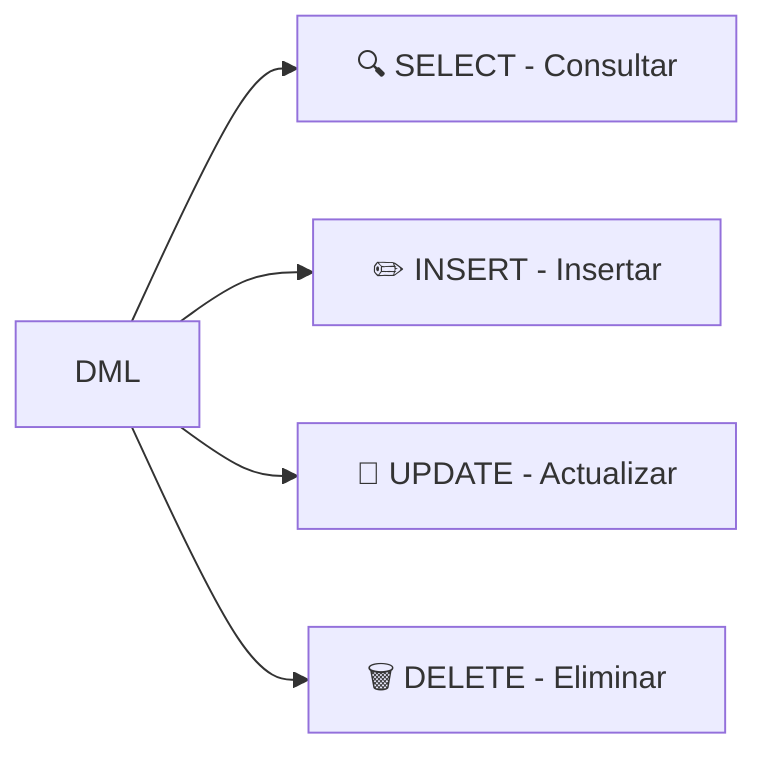

> Aunque `SELECT` es técnicamente DQL (Data Query Language), se estudia junto con DML por ser parte fundamental de la manipulación de datos.

---

## SELECT

Recupera datos de una o más tablas. Es la instrucción más usada en SQL.

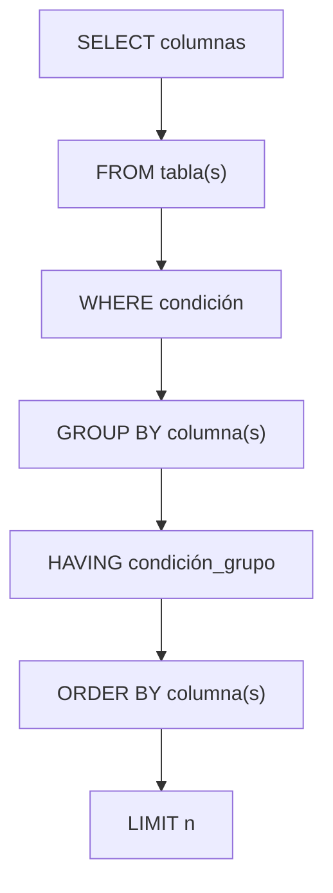

### Orden de ejecución (⚡ crítico entenderlo)

Aunque escribimos las cláusulas en un orden, el motor las ejecuta así:

```
FROM / JOIN  →  WHERE  →  GROUP BY  →  HAVING  →  SELECT  →  ORDER BY  →  LIMIT
     1           2            3            4          5           6           7
```


> ⚡ **Implicación importante:** No puedes usar alias definidos en `SELECT` dentro del `WHERE`, porque el `SELECT` aún no se ha ejecutado. Pero sí puedes usarlos en `ORDER BY`.

```sql
-- ❌ ERROR: precio_iva aún no existe en WHERE
SELECT nombre, precio * 1.21 AS precio_iva
FROM productos
WHERE precio_iva > 100;

-- ✅ Correcto
SELECT nombre, precio * 1.21 AS precio_iva
FROM productos
WHERE precio * 1.21 > 100
ORDER BY precio_iva;  -- ORDER BY se ejecuta después de SELECT
```

---

### FROM

Indica la(s) tabla(s) de dónde se obtienen los datos.

```sql
-- Fuente simple
SELECT * FROM usuarios;

-- Múltiples tablas (producto cartesiano, casi siempre con JOIN)
SELECT * FROM usuarios, pedidos;

-- Alias de tabla (útil para consultas legibles)
SELECT u.nombre, p.total
FROM usuarios AS u
JOIN pedidos AS p ON u.id = p.usuario_id;

-- Subconsulta en FROM (tabla derivada)
SELECT categoria, AVG(precio) AS precio_promedio
FROM (
    SELECT categoria, precio
    FROM productos
    WHERE activo = TRUE
) AS sub
GROUP BY categoria;
```

### WHERE

Filtra las filas antes de agrupar o seleccionar.

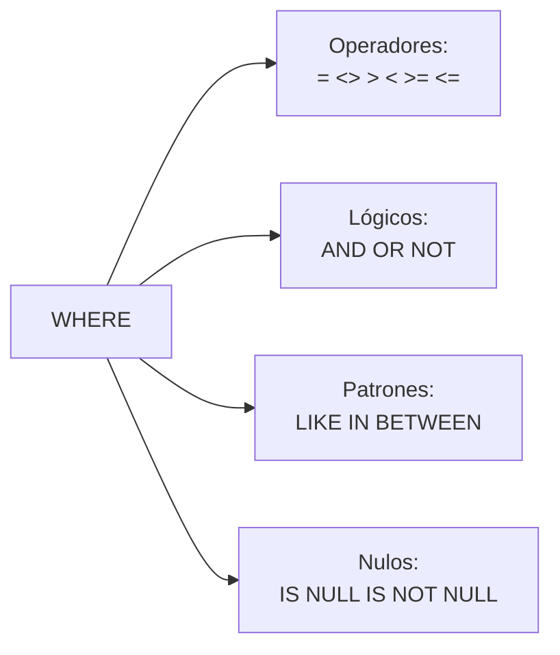

```sql
-- Comparación básica
SELECT * FROM usuarios WHERE edad >= 18;

-- Múltiples condiciones con AND/OR
SELECT * FROM productos
WHERE (categoria = 'Electrónicos' OR categoria = 'Cómputo')
  AND precio < 1000
  AND activo = TRUE;

-- Búsqueda por patrón
SELECT * FROM usuarios WHERE email LIKE '%@gmail.com';
SELECT * FROM usuarios WHERE nombre LIKE 'A_a';  -- Ana, Ala

-- Rangos
SELECT * FROM pedidos WHERE total BETWEEN 100 AND 500;
SELECT * FROM pedidos WHERE fecha BETWEEN '2024-01-01' AND '2024-12-31';

-- Conjuntos
SELECT * FROM usuarios WHERE pais IN ('MX', 'CO', 'AR', 'CL');

-- Valores nulos
SELECT * FROM usuarios WHERE telefono IS NULL;
SELECT * FROM usuarios WHERE telefono IS NOT NULL;
```

#### Ejemplo: combinando filtros

```sql
-- Encontrar pedidos pendientes de clientes mexicanos con total > $500
SELECT p.id, p.total, u.nombre, u.email
FROM pedidos p
JOIN usuarios u ON p.usuario_id = u.id
WHERE p.estado = 'pendiente'
  AND u.pais = 'MX'
  AND p.total > 500
ORDER BY p.total DESC;
```

---

### JOINs

Permiten combinar filas de dos o más tablas basándose en una condición relacionada.

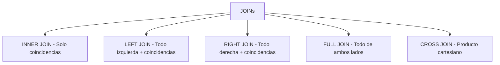

#### INNER JOIN

Solo devuelve filas que tienen **coincidencia en ambas tablas**.

```sql
SELECT u.nombre, p.total, p.fecha
FROM usuarios u
INNER JOIN pedidos p ON u.id = p.usuario_id;
```

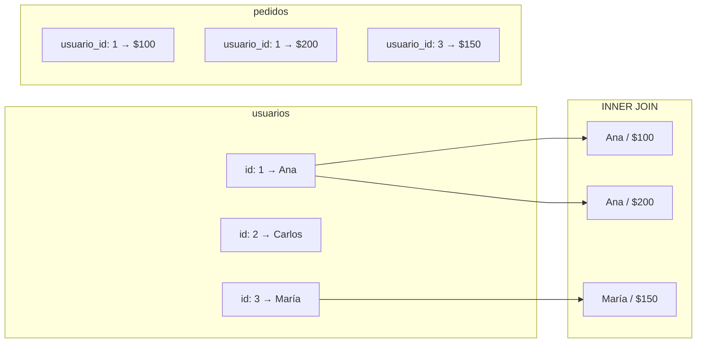

> Carlos (id: 2) **no aparece** porque no tiene pedidos.

#### LEFT JOIN

Devuelve **todas las filas de la tabla izquierda** y las coincidencias de la derecha. Si no hay coincidencia, las columnas de la derecha son `NULL`.

```sql
SELECT u.nombre, p.total, p.fecha
FROM usuarios u
LEFT JOIN pedidos p ON u.id = p.usuario_id;
```

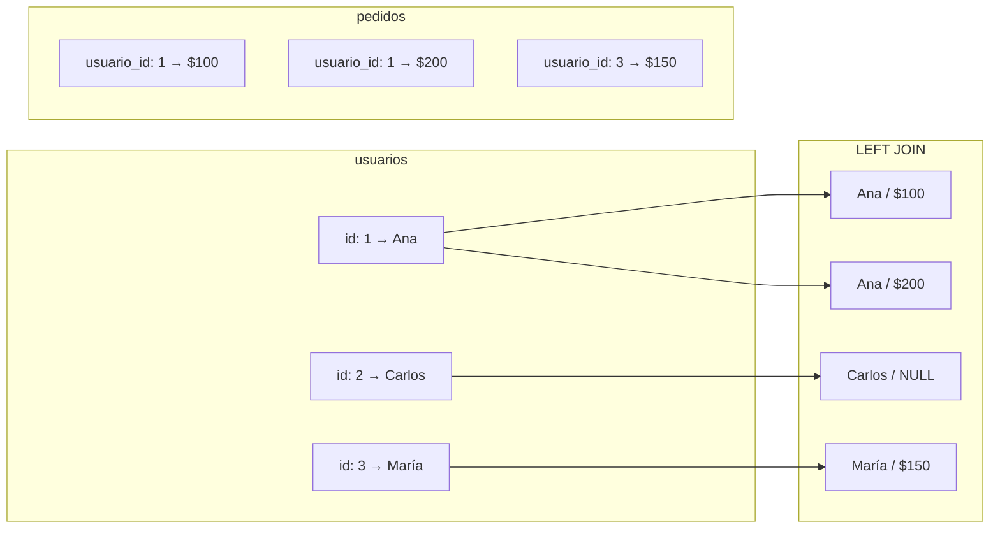

> Carlos (id: 2) **sí aparece** pero con `NULL` en total y fecha.

#### RIGHT JOIN

Es el inverso de LEFT JOIN: devuelve todas las filas de la tabla derecha.

```sql
SELECT u.nombre, p.total
FROM usuarios u
RIGHT JOIN pedidos p ON u.id = p.usuario_id;
```

> Se usa poco porque normalmente se puede reescribir como LEFT JOIN invirtiendo el orden de las tablas.

#### FULL JOIN

Devuelve **todas las filas de ambas tablas**. Las filas sin coincidencia tienen `NULL` en la tabla opuesta.

```sql
-- MySQL no soporta FULL JOIN nativo, se simula con UNION
SELECT u.nombre, p.total
FROM usuarios u
LEFT JOIN pedidos p ON u.id = p.usuario_id
UNION
SELECT u.nombre, p.total
FROM usuarios u
RIGHT JOIN pedidos p ON u.id = p.usuario_id;
```

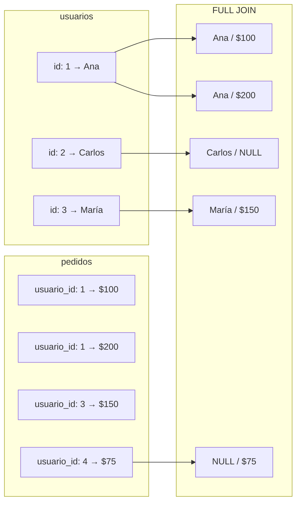

#### CROSS JOIN

Producto cartesiano: cada fila de A se combina con cada fila de B.

```sql
SELECT u.nombre, p.nombre
FROM usuarios u
CROSS JOIN productos p;
```

> ⚠️ Con 100 usuarios y 50 productos, devuelve 5000 filas. Útil para generar combinaciones de datos.

#### Resumen visual de JOINs

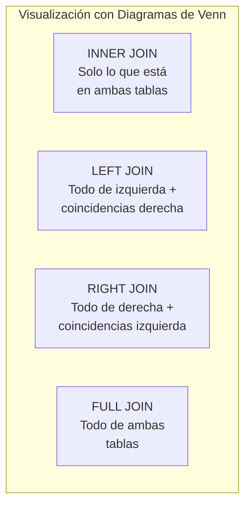

#### Ejemplo: reporte completo con JOINs

```sql
-- Reporte: pedidos con datos del cliente y del producto
SELECT
    p.id AS pedido_id,
    u.nombre AS cliente,
    pr.nombre AS producto,
    dp.cantidad,
    dp.precio_unitario,
    (dp.cantidad * dp.precio_unitario) AS subtotal
FROM pedidos p
JOIN usuarios u ON p.usuario_id = u.id
JOIN detalle_pedido dp ON p.id = dp.pedido_id
JOIN productos pr ON dp.producto_id = pr.id
WHERE p.estado = 'pagado'
ORDER BY p.fecha DESC, u.nombre;
```

---

### GROUP BY

Agrupa filas que tienen el mismo valor en una o más columnas, normalmente para usar **funciones de agregación**.

```sql
SELECT columna_agrupacion, FUNCION_AGREGACION(columna)
FROM tabla
GROUP BY columna_agrupacion;
```

#### Funciones de agregación

| Función | Descripción |
|---|---|
| `COUNT(*)` | Cuenta filas |
| `COUNT(columna)` | Cuenta valores NO NULL de una columna |
| `SUM(columna)` | Suma de valores |
| `AVG(columna)` | Promedio |
| `MAX(columna)` | Valor máximo |
| `MIN(columna)` | Valor mínimo |

#### Ejemplos progresivos

```sql
-- 1. Contar usuarios por país
SELECT pais, COUNT(*) AS total_usuarios
FROM usuarios
GROUP BY pais;

-- 2. Total de ventas por cliente (solo clientes con ventas)
SELECT usuario_id, SUM(total) AS gasto_total
FROM pedidos
GROUP BY usuario_id;

-- 3. Promedio de precio por categoría (con alias)
SELECT
    categoria,
    COUNT(*) AS total_productos,
    AVG(precio) AS precio_promedio,
    MIN(precio) AS mas_barato,
    MAX(precio) AS mas_caro
FROM productos
GROUP BY categoria;

-- 4. Agrupación por múltiples columnas
SELECT
    pais,
    ciudad,
    COUNT(*) AS total_usuarios
FROM usuarios
GROUP BY pais, ciudad
ORDER BY pais, total_usuarios DESC;

-- 5. GROUP BY con expresión
SELECT
    YEAR(fecha) AS anio,
    MONTH(fecha) AS mes,
    SUM(total) AS ventas_totales
FROM pedidos
GROUP BY YEAR(fecha), MONTH(fecha)
ORDER BY anio DESC, mes DESC;
```

> ⚡ **Regla:** Toda columna en el `SELECT` que no esté dentro de una función de agregación debe aparecer en el `GROUP BY`.

```sql
-- ❌ ERROR: 'nombre' no está en GROUP BY ni en función de agregación
SELECT nombre, pais, COUNT(*)
FROM usuarios
GROUP BY pais;

-- ✅ Correcto
SELECT pais, COUNT(*)
FROM usuarios
GROUP BY pais;
```

---

### HAVING

Filtra los resultados **después** de la agrupación (GROUP BY). Es como un WHERE para grupos.


```sql
SELECT pais, COUNT(*) AS total_usuarios
FROM usuarios
GROUP BY pais
HAVING COUNT(*) > 10;

-- Con múltiples condiciones
SELECT
    categoria,
    COUNT(*) AS total,
    AVG(precio) AS precio_promedio
FROM productos
GROUP BY categoria
HAVING COUNT(*) >= 5 AND AVG(precio) > 50
ORDER BY total DESC;
```

#### Diferencia clave: WHERE vs HAVING

```sql
-- WHERE filtra filas individuales ANTES de agrupar
-- HAVING filtra grupos DESPUÉS de agrupar

SELECT
    categoria,
    COUNT(*) AS total,
    AVG(precio) AS precio_promedio
FROM productos
WHERE activo = TRUE            -- ✅ Filtra productos inactivos (por fila)
GROUP BY categoria
HAVING COUNT(*) > 3;            -- ✅ Solo categorías con más de 3 productos activos
```

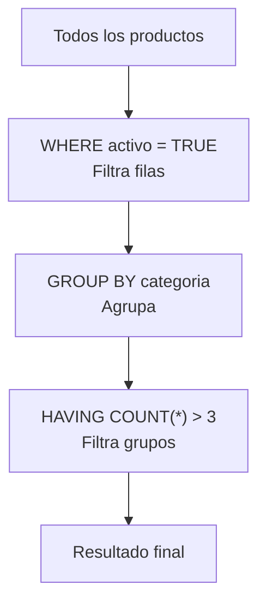

---

### ORDER BY

Ordena los resultados ascendente o descendentemente.

```sql
-- Ascendente (por defecto)
SELECT * FROM usuarios ORDER BY nombre;

-- Descendente
SELECT * FROM productos ORDER BY precio DESC;

-- Múltiples criterios
SELECT * FROM usuarios
ORDER BY pais ASC, edad DESC, nombre ASC;

-- Por posición de columna (no recomendado)
SELECT nombre, email, edad FROM usuarios ORDER BY 3 DESC;
-- ORDER BY 3 = ordena por la 3ra columna: edad

-- Por expresión
SELECT nombre, precio * 1.21 AS precio_iva
FROM productos
ORDER BY precio_iva DESC;
```

> ⚡ `ORDER BY` se ejecuta al final (después de SELECT), por eso puede usar alias.

---

## INSERT

Añade nuevas filas a una tabla.

### Sintaxis

```sql
-- Básico (especificando columnas)
INSERT INTO tabla (col1, col2, col3) VALUES (val1, val2, val3);

-- Múltiples filas
INSERT INTO tabla (col1, col2) VALUES
    (val1, val2),
    (val3, val4),
    (val5, val6);

-- Insertar desde otra tabla
INSERT INTO tabla_destino (col1, col2)
SELECT col1, col2 FROM tabla_origen WHERE condicion;

-- Insertar con valores por defecto
INSERT INTO tabla DEFAULT VALUES;
```

### Ejemplos

```sql
-- Insertar un usuario
INSERT INTO usuarios (nombre, email, edad, pais)
VALUES ('Ana López', 'ana@email.com', 28, 'México');

-- Insertar múltiples productos
INSERT INTO productos (nombre, precio, categoria_id)
VALUES
    ('Laptop', 15000.00, 1),
    ('Mouse', 250.50, 1),
    ('Teclado', 450.00, 1);

-- Insertar desde SELECT (backup)
INSERT INTO usuarios_backup (nombre, email)
SELECT nombre, email FROM usuarios WHERE activo = TRUE;
```

### INSERT ... ON DUPLICATE KEY (MySQL)

```sql
-- Si el email ya existe, actualiza el nombre en vez de fallar
INSERT INTO usuarios (id, nombre, email)
VALUES (1, 'Ana López', 'ana@email.com')
ON DUPLICATE KEY UPDATE nombre = VALUES(nombre);
```

### INSERT OR REPLACE / UPSERT (PostgreSQL)

```sql
-- PostgreSQL: INSERT ... ON CONFLICT
INSERT INTO usuarios (id, nombre, email)
VALUES (1, 'Ana López', 'ana@email.com')
ON CONFLICT (id) DO UPDATE SET
    nombre = EXCLUDED.nombre,
    email = EXCLUDED.email;
```

---

## UPDATE

Modifica datos existentes.

### Sintaxis

```sql
UPDATE tabla
SET col1 = valor1, col2 = valor2
WHERE condición;
```

### Ejemplos

```sql
-- Actualizar un campo
UPDATE usuarios
SET email = 'nuevo@email.com'
WHERE id = 10;

-- Actualizar múltiples campos
UPDATE productos
SET
    precio = 299.99,
    stock = stock - 1,
    updated_at = NOW()
WHERE id = 5;

-- Actualizar con valor calculado
UPDATE productos
SET precio = precio * 1.15  -- Incremento del 15%
WHERE categoria_id = 3;

-- Actualizar con JOIN (MySQL)
UPDATE pedidos p
JOIN clientes c ON p.cliente_id = c.id
SET p.estado = 'VIP'
WHERE c.total_gastado > 10000;

-- Actualizar con subconsulta
UPDATE productos
SET precio = (
    SELECT AVG(precio) FROM productos WHERE categoria_id = 1
)
WHERE id = 100;
```

> ⚠️ **¡Siempre con WHERE!**
```sql
> -- ❌ Esto actualiza TODOS los registros
> UPDATE usuarios SET email = 'todos@mail.com';
>
> -- ✅ Siempre verifica primero
> SELECT * FROM usuarios WHERE id = 10;
> UPDATE usuarios SET email = 'nuevo@mail.com' WHERE id = 10;
```

---

## DELETE

Elimina filas de una tabla.

### Sintaxis

```sql
DELETE FROM tabla WHERE condición;

-- Eliminar con JOIN (MySQL)
DELETE p
FROM pedidos p
JOIN clientes c ON p.cliente_id = c.id
WHERE c.activo = FALSE;

-- Eliminar todo (¡CUIDADO!)
DELETE FROM tabla;
```

### Ejemplos

```sql
-- Eliminar un registro específico
DELETE FROM usuarios WHERE id = 42;

-- Eliminar múltiples registros
DELETE FROM productos WHERE stock = 0 AND activo = FALSE;

-- Eliminar con subconsulta
DELETE FROM pedidos
WHERE usuario_id IN (
    SELECT id FROM usuarios WHERE activo = FALSE
);

-- Eliminar los más antiguos (MySQL - requiere subconsulta)
DELETE FROM logs
WHERE id IN (
    SELECT id FROM (
        SELECT id FROM logs ORDER BY created_at ASC LIMIT 1000
    ) AS tmp
);
```

### DELETE vs TRUNCATE

```sql
-- DELETE: lento, deshacible, puedes usar WHERE
DELETE FROM logs WHERE fecha < '2023-01-01';

-- TRUNCATE: rápido, no deshacible, elimina todo, reinicia AUTO_INCREMENT
TRUNCATE TABLE logs;
```

---

## Resumen visual DML

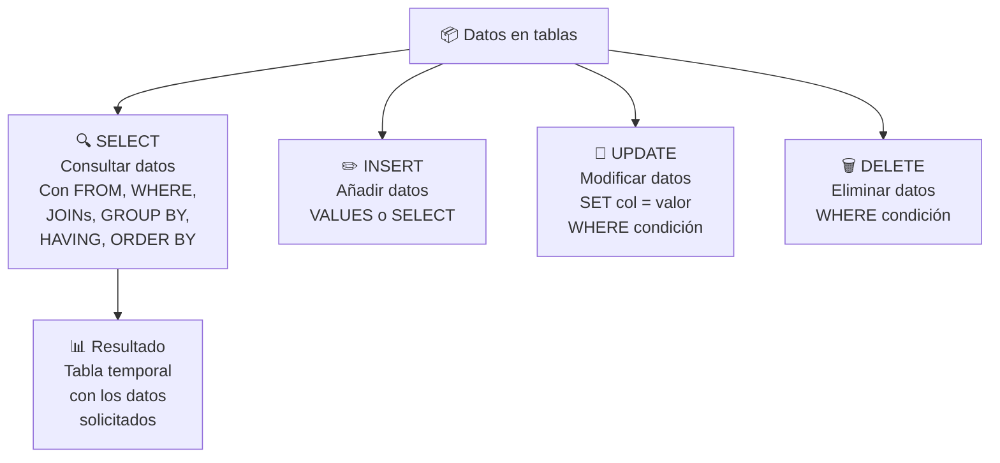

## Guía rápida de referencia

| Cláusula | ¿Qué hace? | ¿Obligatoria? | Orden ejecución |
|---|---|---|---|
| `SELECT` | Columnas a mostrar | ✅ Sí | 5 |
| `FROM` | Tabla(s) de origen | ✅ Sí | 1 |
| `JOIN` | Combinar tablas | ❌ No | 1 |
| `WHERE` | Filtrar filas | ❌ No | 2 |
| `GROUP BY` | Agrupar filas | ❌ No | 3 |
| `HAVING` | Filtrar grupos | ❌ No | 4 |
| `ORDER BY` | Ordenar resultado | ❌ No | 6 |
| `LIMIT` | Limitar filas | ❌ No | 7 |

## Checklist antes de UPDATE o DELETE

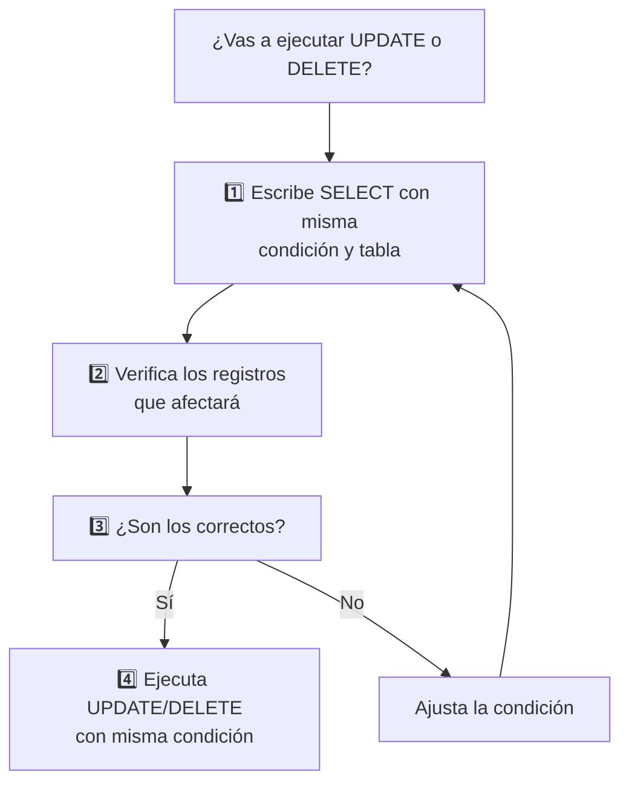

## Relacionados:
- [[lenguaje-de-definicion-de-datos]] #anterior 
- [[consultas-de-agregacion-sql]] #siguiente 