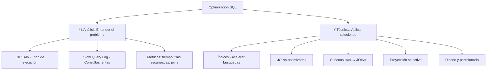
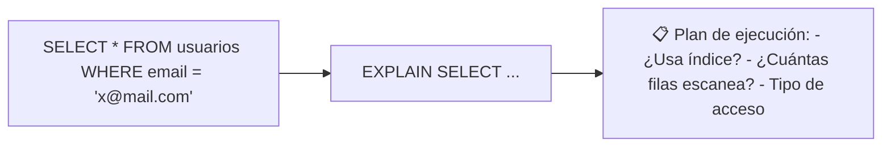
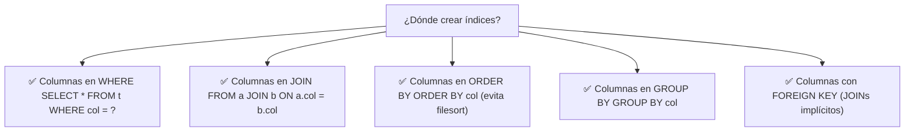
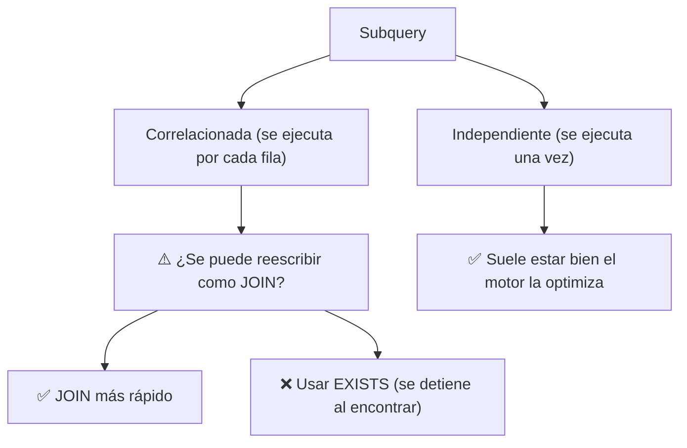
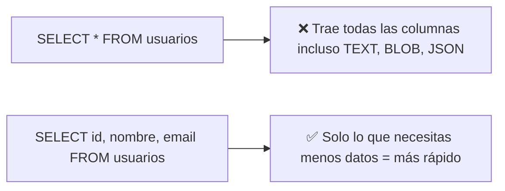
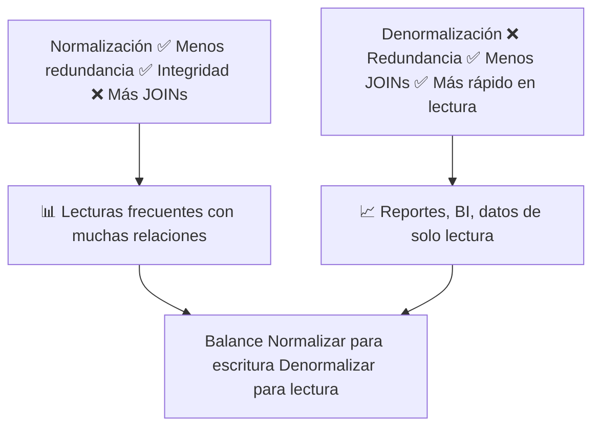
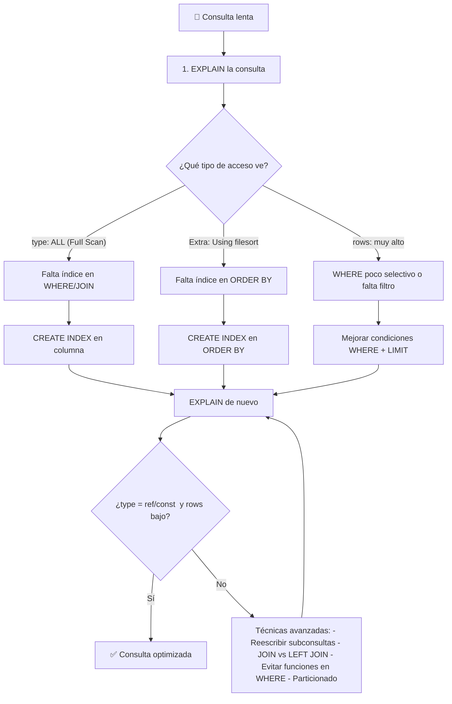
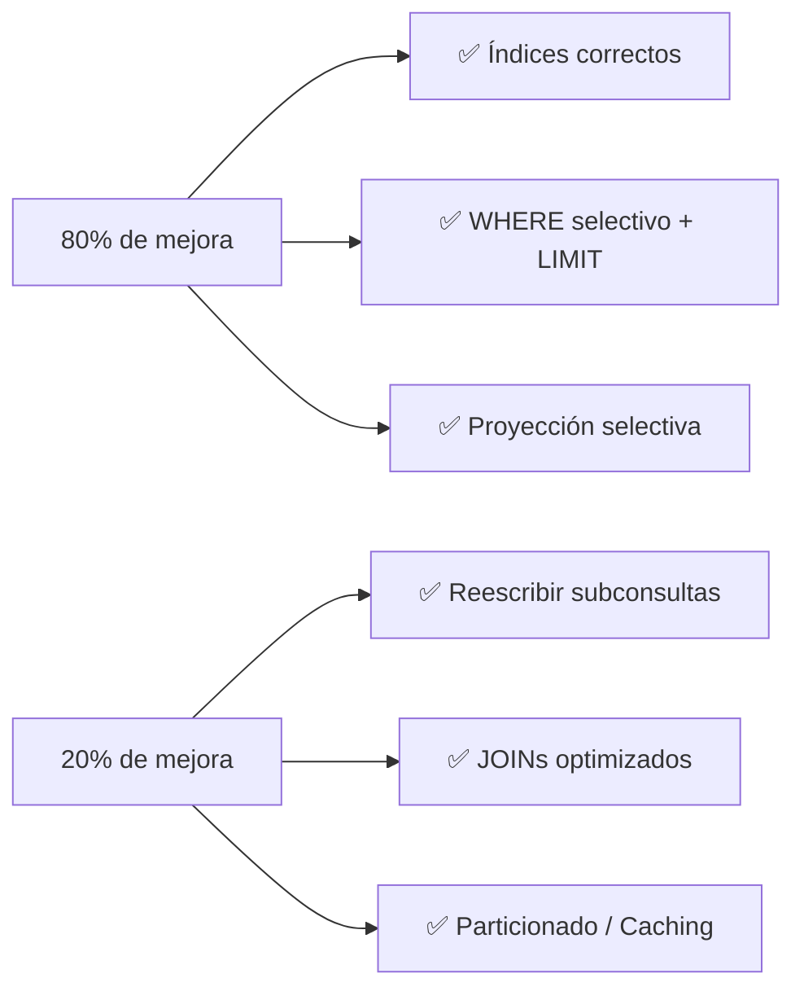

# Optimización del desempeño

La optimización SQL consiste en hacer que las consultas se ejecuten **más rápido** consumiendo **menos recursos**. No se trata de escribir SQL diferente, sino de entender cómo el motor ejecuta las consultas.



### Las 3 causas principales de consultas lentas

| # | Causa | Solución |
|---|---|---|
| 1 | **Falta de índice** en columna de WHERE o JOIN | `CREATE INDEX` |
| 2 | **Full Table Scan** en tabla grande | Índice + WHERE selectivo |
| 3 | **Demasiadas filas** procesadas sin necesidad | WHERE, LIMIT, proyección |

---

## Técnicas de análisis de consultas

Antes de optimizar, hay que saber **qué está mal**. El motor SQL provee herramientas para analizar el plan de ejecución.

### EXPLAIN / EXPLAIN ANALYZE



```sql
-- Ver el plan de ejecución (sin ejecutar la consulta)
EXPLAIN SELECT * FROM usuarios WHERE email = 'ana@email.com';

-- MySQL: ejecuta y muestra plan real (MySQL 8.0.18+)
EXPLAIN ANALYZE SELECT * FROM usuarios WHERE email = 'ana@email.com';

-- PostgreSQL
EXPLAIN (ANALYZE, BUFFERS) SELECT * FROM usuarios WHERE email = 'ana@email.com';
```

**Interpretar EXPLAIN (MySQL):**

| Columna | Significado | Lo que quieres ver |
|---|---|---|
| `type` | Tipo de acceso | `const`, `ref`, `range` ✅ / `ALL` ❌ |
| `key` | Índice usado | Nombre del índice ✅ / `NULL` ❌ |
| `rows` | Filas estimadas escaneadas | Lo más bajo posible |
| `Extra` | Información adicional | `Using index` ✅ / `Using filesort` ❌ |

```sql
-- ❌ MAL: Full Table Scan (type: ALL, rows: 1,000,000)
EXPLAIN SELECT * FROM usuarios WHERE email = 'ana@email.com';
-- type: ALL, rows: 1000000, Extra: Using where

-- ✅ BIEN: Con índice (type: ref, rows: 1)
CREATE INDEX idx_email ON usuarios(email);
EXPLAIN SELECT * FROM usuarios WHERE email = 'ana@email.com';
-- type: ref, key: idx_email, rows: 1
```

### Slow Query Log

```sql
-- MySQL: habilitar log de consultas lentas
SET GLOBAL slow_query_log = 'ON';
SET GLOBAL long_query_time = 2;  -- consultas que tardan > 2 segundos
SET GLOBAL slow_query_log_file = '/var/log/mysql/slow.log';

-- Ver las consultas lentas
SELECT * FROM mysql.slow_log ORDER BY start_time DESC LIMIT 10;
```

### Identificar cuellos de botella comunes

```sql
-- 1. Consultas que escanean demasiadas filas
EXPLAIN SELECT * FROM pedidos WHERE YEAR(fecha) = 2024;
-- ❌ YEAR(fecha) impide usar índice

-- 2. Consultas con ORDER BY sin índice
EXPLAIN SELECT * FROM pedidos ORDER BY fecha DESC;
-- Extra: Using filesort (lento)

-- 3. JOINs sin índice en la columna de unión
EXPLAIN SELECT * FROM pedidos p JOIN usuarios u ON p.usuario_id = u.id;
-- type: ALL en la tabla interna (lento)
```

---

## Técnicas de optimización de consultas

### Usando índices

La técnica más efectiva y la primera que debes aplicar.



```sql
-- Sin índice: Full Scan en cada consulta
SELECT * FROM usuarios WHERE email = 'x@mail.com';     -- 500ms
SELECT * FROM usuarios WHERE pais = 'MX';                -- 500ms

-- Con índices:
CREATE INDEX idx_email ON usuarios(email);
CREATE INDEX idx_pais ON usuarios(pais);

SELECT * FROM usuarios WHERE email = 'x@mail.com';     -- 1ms ⚡
SELECT * FROM usuarios WHERE pais = 'MX';                -- 2ms ⚡
```

#### Índices compuestos estratégicos

```sql
-- Consulta frecuente:
SELECT * FROM pedidos
WHERE cliente_id = 42 AND fecha BETWEEN '2024-01-01' AND '2024-12-31'
ORDER BY fecha DESC;

-- ✅ Índice compuesto que cubre WHERE, rango y ORDER
CREATE INDEX idx_cliente_fecha ON pedidos(cliente_id, fecha DESC);
```

#### Índices cubrientes (Covering Index)

Cuando el índice contiene **todas** las columnas que necesita la consulta, el motor ni siquiera toca la tabla.

```sql
-- Consulta: solo necesita email y nombre
SELECT email, nombre FROM usuarios WHERE email LIKE '%@gmail.com';

-- Índice que cubre ambas columnas
CREATE INDEX idx_email_nombre ON usuarios(email, nombre);
-- Extra: Using index (¡no toca la tabla!)
```

### Optimizando JOINs


#### Indexar columnas de JOIN

```sql
-- ❌ Sin índice en la FK: Full Scan en la tabla interna
SELECT * FROM pedidos p
JOIN usuarios u ON p.usuario_id = u.id;
-- u: type ALL (1M filas escaneadas)

-- ✅ Con índice en usuario_id
CREATE INDEX idx_pedidos_usuario ON pedidos(usuario_id);
-- u: type ref (solo filas coincidentes)
```

#### Preferir INNER JOIN sobre LEFT JOIN

```sql
-- LEFT JOIN es más costoso porque debe preservar filas sin coincidencia
-- Si no necesitas filas sin coincidencia, usa INNER JOIN

-- ❌ LEFT JOIN innecesario
SELECT u.nombre, COUNT(p.id) AS pedidos
FROM usuarios u
LEFT JOIN pedidos p ON u.id = p.usuario_id
WHERE u.activo = TRUE
GROUP BY u.id;
-- Si todos los usuarios activos tienen pedidos, sobra LEFT

-- ✅ Más rápido
SELECT u.nombre, COUNT(p.id) AS pedidos
FROM usuarios u
JOIN pedidos p ON u.id = p.usuario_id
WHERE u.activo = TRUE
GROUP BY u.id;
```

### Reduciendo subconsultas

Las subconsultas, especialmente las correlacionadas, pueden ser lentas. Muchas veces se pueden reescribir como JOINs.



#### Subquery correlacionada → JOIN

```sql
-- ❌ LENTO: subquery correlacionada (se ejecuta por cada fila)
SELECT e.nombre, e.salario
FROM empleados e
WHERE e.salario > (
    SELECT AVG(salario)
    FROM empleados
    WHERE departamento_id = e.departamento_id
);

-- ✅ RÁPIDO: reescrito con JOIN + GROUP BY
SELECT e.nombre, e.salario
FROM empleados e
JOIN (
    SELECT departamento_id, AVG(salario) AS salario_prom
    FROM empleados
    GROUP BY departamento_id
) dept_avg ON e.departamento_id = dept_avg.departamento_id
WHERE e.salario > dept_avg.salario_prom;
```

#### IN → EXISTS

```sql
-- IN carga toda la subquery en memoria
SELECT * FROM empleados
WHERE departamento_id IN (
    SELECT id FROM departamentos WHERE presupuesto > 500000
);

-- EXISTS es más eficiente (se detiene al encontrar match)
SELECT * FROM empleados e
WHERE EXISTS (
    SELECT 1 FROM departamentos d
    WHERE d.id = e.departamento_id AND d.presupuesto > 500000
);
```

| Situación | Recomendación |
|---|---|
| Subquery pequeña (< 1000 valores) | `IN` puede ser más rápido |
| Subquery grande o con NULLs | `EXISTS` es mejor |
| Subquery correlacionada | Reescribir como `JOIN` |
| `NOT IN` con posibles NULLs | Usar `NOT EXISTS` |

### Proyección selectiva

Nunca selecciones más columnas de las que necesitas.



```sql
-- ❌ MAL: SELECT * trae columnas innecesarias
SELECT * FROM usuarios WHERE email = 'x@mail.com';
-- Trae: id, nombre, email, password_hash, bio, foto, created_at, ...
-- ↑ Si solo necesitas nombre y email, estás desperdiciando recursos

-- ✅ BIEN: solo las columnas necesarias
SELECT id, nombre, email FROM usuarios WHERE email = 'x@mail.com';
-- 3 columnas vs 15 → 5x más rápido

-- ❌ MAL: ORDER BY en columna no indexada
SELECT * FROM pedidos ORDER BY total DESC;

-- ✅ BIEN: con índice
CREATE INDEX idx_total ON pedidos(total);
SELECT * FROM pedidos ORDER BY total DESC;
-- Usa índice evita filesort
```

#### LIMIT y paginación

```sql
-- Siempre usa LIMIT si no necesitas todos los resultados
SELECT * FROM logs ORDER BY created_at DESC LIMIT 50;

-- Paginación eficiente con WHERE (en vez de OFFSET)
-- ❌ LENTO: OFFSET escanea filas descartadas
SELECT * FROM usuarios ORDER BY id LIMIT 20 OFFSET 100000;

-- ✅ RÁPIDO: paginación por cursor
SELECT * FROM usuarios WHERE id > 100000 ORDER BY id LIMIT 20;
```

---

## Otras técnicas de optimización

### Evitar funciones en columnas indexadas

```sql
-- ❌ LENTO: función en columna impide usar índice
SELECT * FROM pedidos WHERE YEAR(fecha) = 2024;

-- ✅ RÁPIDO: comparación directa permite usar índice
SELECT * FROM pedidos WHERE fecha >= '2024-01-01' AND fecha < '2025-01-01';

-- ❌ LENTO
SELECT * FROM usuarios WHERE LOWER(email) = 'ana@email.com';

-- ✅ RÁPIDO (si el email se guarda en minúsculas o se usa un índice funcional)
SELECT * FROM usuarios WHERE email = 'ana@email.com';

-- PostgreSQL: índice funcional
CREATE INDEX idx_lower_email ON usuarios(LOWER(email));
```

### Normalización vs Denormalización



```sql
-- Normalizado (varios JOINs para obtener info completa)
SELECT u.nombre, d.nombre AS depto, p.nombre AS proyecto
FROM usuarios u
JOIN departamentos d ON u.departamento_id = d.id
JOIN proyectos p ON u.proyecto_actual_id = p.id;

-- Denormalizado (tabla plana, sin JOINs)
SELECT nombre, departamento_nombre, proyecto_nombre
FROM usuarios_denormalizado;
```

### Particionado de tablas

Para tablas muy grandes (> 10M filas), dividir la tabla en partes más pequeñas.

```sql
-- MySQL: partición por rango de fechas
CREATE TABLE pedidos (
    id INT NOT NULL,
    fecha DATE NOT NULL,
    total DECIMAL(10,2)
)
PARTITION BY RANGE (YEAR(fecha)) (
    PARTITION p2022 VALUES LESS THAN (2023),
    PARTITION p2023 VALUES LESS THAN (2024),
    PARTITION p2024 VALUES LESS THAN (2025),
    PARTITION p_future VALUES LESS THAN MAXVALUE
);

-- La consulta solo toca la partición relevante
SELECT * FROM pedidos WHERE fecha BETWEEN '2024-01-01' AND '2024-06-30';
-- Solo escanea la partición p2024
```

---

## Resumen visual: flujo de optimización



### Checklist de optimización

| # | Técnica | ¿Qué revisar? |
|---|---|---|
| 1 | **EXPLAIN** | ¿El tipo de acceso es `ALL`? → falta índice |
| 2 | **Índices** | ¿Las columnas en WHERE/JOIN/ORDER BY tienen índice? |
| 3 | **SELECT *** | ¿Solo seleccionas las columnas que necesitas? |
| 4 | **Subconsultas** | ¿Puedes reescribir como JOIN? |
| 5 | **LEFT JOIN** | ¿Realmente necesitas LEFT JOIN o puede ser INNER? |
| 6 | **Funciones en WHERE** | `WHERE YEAR(fecha)` → `WHERE fecha >= ? AND fecha < ?` |
| 7 | **LIKE** | `LIKE '%texto'` no usa índice; `LIKE 'texto%'` sí |
| 8 | **LIMIT** | ¿Usaste LIMIT cuando corresponde? |

### Antes y después

```sql
-- ❌ ANTES: Consulta lenta (3 segundos)
SELECT *
FROM pedidos p, usuarios u, productos pr, detalle_pedido dp
WHERE p.usuario_id = u.id
  AND YEAR(p.fecha) = 2024
  AND dp.pedido_id = p.id
  AND dp.producto_id = pr.id
ORDER BY pr.nombre;

-- ✅ DESPUÉS: Consulta optimizada (0.05 segundos)
CREATE INDEX idx_pedidos_fecha ON pedidos(fecha);
CREATE INDEX idx_detalle_pedido ON detalle_pedido(pedido_id);

SELECT p.id, u.nombre, pr.nombre AS producto, dp.cantidad
FROM pedidos p
JOIN usuarios u ON p.usuario_id = u.id
JOIN detalle_pedido dp ON dp.pedido_id = p.id
JOIN productos pr ON dp.producto_id = pr.id
WHERE p.fecha >= '2024-01-01' AND p.fecha < '2025-01-01'
ORDER BY pr.nombre
LIMIT 100;
```

### La regla del 80/20 en optimización



> 💡 **Empieza siempre por los índices.** En el 80% de los casos, un índice bien puesto resuelve el problema. Luego aborda técnicas más avanzadas si es necesario.

## Relacionados:
- [[stored-procedures-and-functions-sql]] #anterior 
- [[sql-avanzado]] #siguiente 