# Restricciones de datos

Las **restricciones (constraints)** son reglas que se aplican a las columnas de una tabla para garantizar la **integridad y calidad de los datos**. Son el mecanismo principal para que la base de datos se proteja a sí misma de datos inválidos.

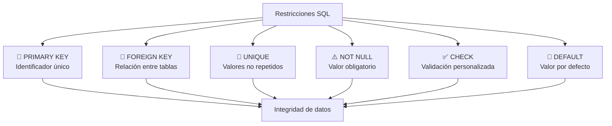

### ¿Por qué son importantes?

| Sin restricciones | Con restricciones |
|---|---|
| Dos clientes con el mismo ID | ❌ | ✅ Cada fila tiene un identificador único |
| Email duplicado | ❌ | ✅ UNIQUE impide duplicados |
| Usuario sin nombre | ❌ | ✅ NOT NULL obliga a tener nombre |
| Precio negativo | ❌ | ✅ CHECK impide precios negativos |
| Pedido huérfano (sin cliente) | ❌ | ✅ FK asegura que el cliente existe |

> 💡 **Regla de oro:** Pon tantas restricciones como tenga sentido. Es mejor que la base de datos rechace un dato malo a que tu aplicación tenga que lidiar con él después.

---

## PRIMARY KEY

Identifica de forma **única** cada fila de una tabla. Es la restricción más importante.

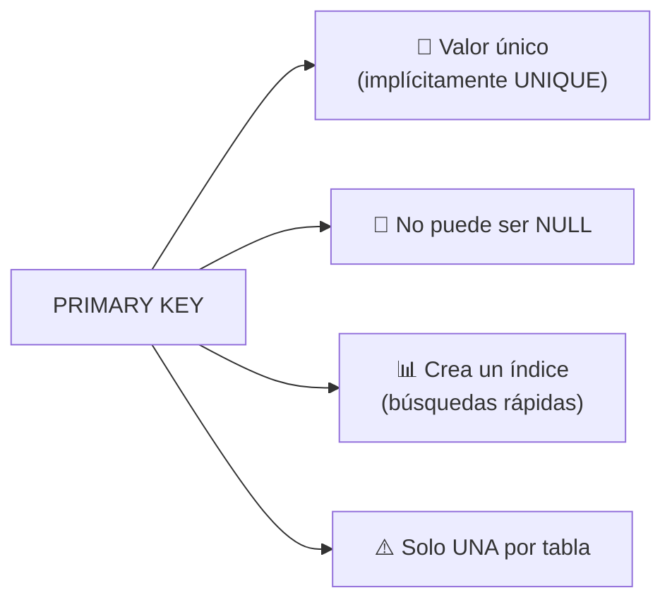

### Características

| Propiedad | Descripción |
|---|---|
| **Unicidad** | Cada valor debe ser único en toda la tabla |
| **No nulo** | Nunca puede contener NULL |
| **Cantidad** | Solo una PRIMARY KEY por tabla (puede tener múltiples columnas) |
| **Índice** | Crea automáticamente un índice para búsquedas rápidas |
| **Referenciable** | Es el destino natural de las FOREIGN KEY |

### Sintaxis

```sql
-- Como restricción de columna
CREATE TABLE usuarios (
    id INT PRIMARY KEY,
    nombre VARCHAR(100)
);

-- Como restricción de tabla (necesario para PK compuesta)
CREATE TABLE usuarios (
    id INT,
    email VARCHAR(200),
    nombre VARCHAR(100),
    PRIMARY KEY (id, email)  -- PK compuesta
);

-- Después de crear la tabla
ALTER TABLE usuarios ADD PRIMARY KEY (id);
```

### Tipos de PRIMARY KEY

```sql
-- 1. Entero auto-incremental (el más común)
CREATE TABLE usuarios (
    id INT PRIMARY KEY AUTO_INCREMENT,
    nombre VARCHAR(100)
);

-- 2. UUID (útil en sistemas distribuidos)
CREATE TABLE usuarios (
    id CHAR(36) PRIMARY KEY,
    nombre VARCHAR(100)
);

-- 3. Natural (usando un valor del mundo real)
CREATE TABLE paises (
    codigo_iso CHAR(3) PRIMARY KEY,  -- 'MEX', 'USA', 'CAN'
    nombre VARCHAR(100)
);

-- 4. Compuesta (varias columnas como PK)
CREATE TABLE inscripciones (
    estudiante_id INT,
    curso_id INT,
    fecha_inscripcion DATE,
    PRIMARY KEY (estudiante_id, curso_id)  -- Un estudiante una vez por curso
);
```

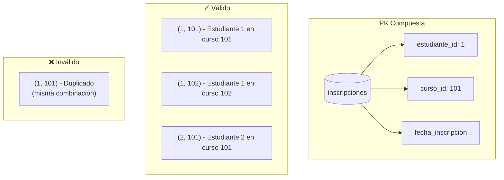

### Buenas prácticas

```sql
-- ✅ Usa INT AUTO_INCREMENT para la mayoría de casos
CREATE TABLE clientes (
    id INT PRIMARY KEY AUTO_INCREMENT,
    ...
);

-- ✅ Nombra la PK explícitamente (opcional)
CREATE TABLE productos (
    producto_id INT PRIMARY KEY,
    ...
);

-- ❌ No uses datos mutables como PK
-- El email puede cambiar, mejor usa un ID numérico
```

---

## FOREIGN KEY

Crea una relación entre dos tablas, asegurando que los valores de una columna existan en otra tabla (integridad referencial).

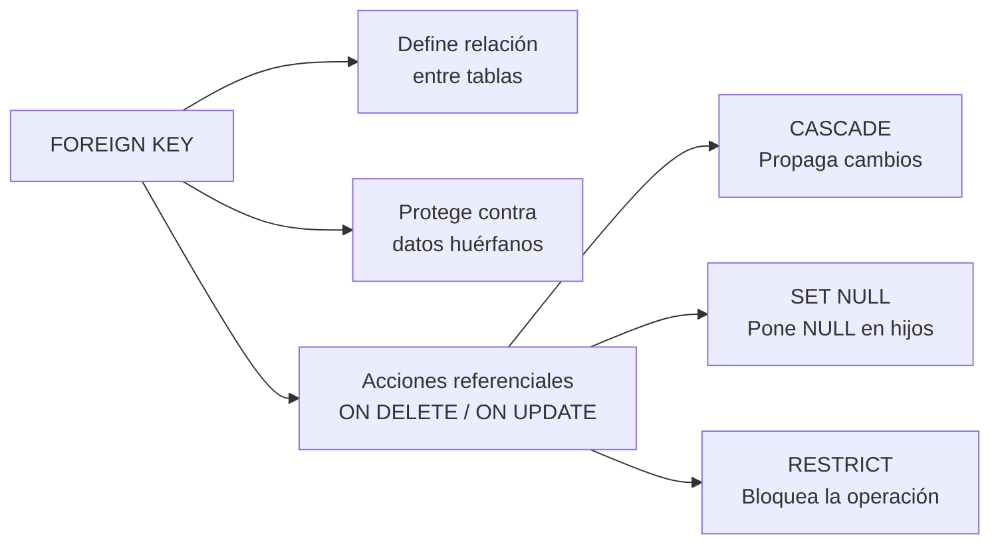

### Sintaxis

```sql
-- A nivel de columna
CREATE TABLE pedidos (
    id INT PRIMARY KEY,
    cliente_id INT REFERENCES clientes(id),
    total DECIMAL(10, 2)
);

-- A nivel de tabla (recomendado: más control)
CREATE TABLE pedidos (
    id INT PRIMARY KEY,
    cliente_id INT NOT NULL,
    total DECIMAL(10, 2),
    FOREIGN KEY (cliente_id) REFERENCES clientes(id)
        ON DELETE CASCADE
        ON UPDATE CASCADE
);

-- FK compuesta
CREATE TABLE detalle_pedido (
    pedido_id INT,
    producto_id INT,
    cantidad INT,
    PRIMARY KEY (pedido_id, producto_id),
    FOREIGN KEY (pedido_id) REFERENCES pedidos(id),
    FOREIGN KEY (producto_id) REFERENCES productos(id)
);
```

### Acciones referenciales

```sql
-- CASCADE: borra/actualiza automáticamente las filas hijas
FOREIGN KEY (cliente_id) REFERENCES clientes(id)
    ON DELETE CASCADE
    ON UPDATE CASCADE;

-- SET NULL: pone la FK a NULL cuando se elimina/actualiza el padre
FOREIGN KEY (cliente_id) REFERENCES clientes(id)
    ON DELETE SET NULL;

-- RESTRICT: impide eliminar/actualizar si hay hijas referenciando
FOREIGN KEY (cliente_id) REFERENCES clientes(id)
    ON DELETE RESTRICT;  -- (por defecto en algunos motores)

-- NO ACTION: similar a RESTRICT (verifica al final de la transacción)
FOREIGN KEY (cliente_id) REFERENCES clientes(id)
    ON DELETE NO ACTION;
```

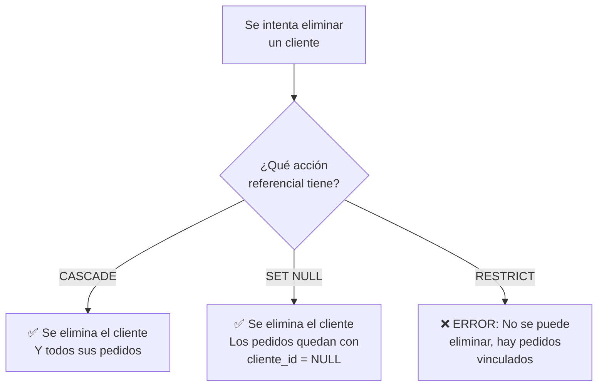

### Ejemplo completo: relación 1 a N

```sql
CREATE TABLE clientes (
    id INT PRIMARY KEY AUTO_INCREMENT,
    nombre VARCHAR(100) NOT NULL,
    email VARCHAR(200) UNIQUE NOT NULL
);

CREATE TABLE pedidos (
    id INT PRIMARY KEY AUTO_INCREMENT,
    cliente_id INT NOT NULL,
    fecha DATE NOT NULL DEFAULT (CURRENT_DATE),
    total DECIMAL(10, 2) CHECK (total >= 0),
    FOREIGN KEY (cliente_id) REFERENCES clientes(id)
        ON DELETE RESTRICT
        ON UPDATE CASCADE
);
```

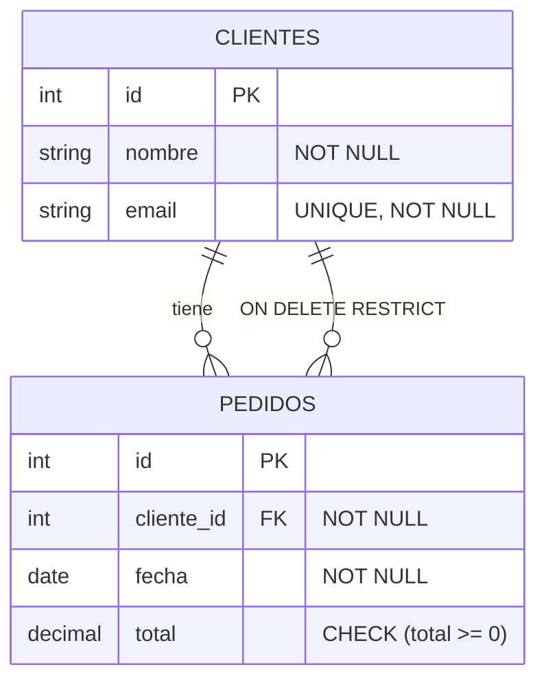

### Buenas prácticas

```sql
-- ✅ La FK debe tener el mismo tipo que la PK que referencia
CREATE TABLE clientes (id INT PRIMARY KEY, ...);
CREATE TABLE pedidos (cliente_id INT, ...);  -- mismo tipo: INT

-- ✅ Define siempre ON DELETE y ON UPDATE explícitamente
-- (no asumas el comportamiento por defecto)

-- ✅ Indexa las FK para mejor rendimiento (lo hace automático en MySQL)
CREATE INDEX idx_pedidos_cliente ON pedidos(cliente_id);
```

---

## UNIQUE

Asegura que todos los valores en una columna (o combinación de columnas) sean **diferentes entre sí**.

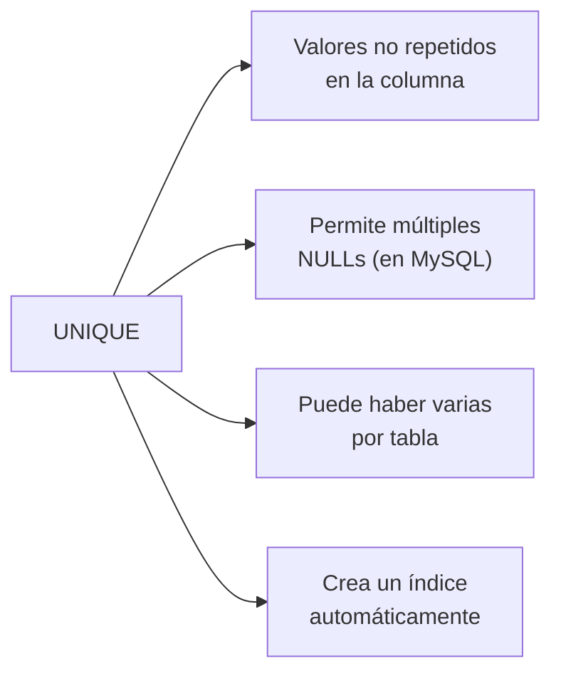

### Sintaxis

```sql
-- A nivel de columna
CREATE TABLE usuarios (
    id INT PRIMARY KEY,
    email VARCHAR(200) UNIQUE,
    curp VARCHAR(18) UNIQUE
);

-- A nivel de tabla (útil para combinaciones)
CREATE TABLE usuarios (
    id INT PRIMARY KEY,
    nombre VARCHAR(100),
    apellido VARCHAR(100),
    UNIQUE (nombre, apellido)  -- No puede haber dos "Juan Pérez"
);

-- Después de crear la tabla
ALTER TABLE usuarios ADD UNIQUE (email);
ALTER TABLE usuarios ADD CONSTRAINT uq_email UNIQUE (email);
```

### UNIQUE vs PRIMARY KEY

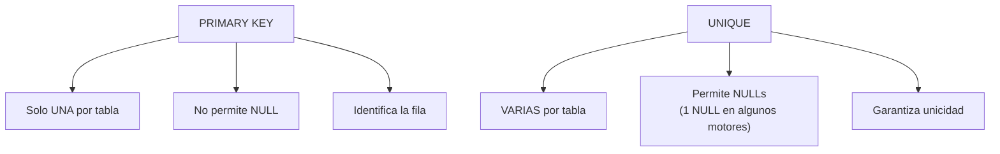

```sql
-- Múltiples UNIQUE en una tabla
CREATE TABLE usuarios (
    id INT PRIMARY KEY,
    email VARCHAR(200) UNIQUE,           -- Nadie puede repetir email
    numero_seguro_social VARCHAR(11) UNIQUE,  -- Nadie puede repetir NSS
    nombre VARCHAR(100)
);
```

### Ejemplos

```sql
-- UNIQUE compuesto (la combinación debe ser única)
CREATE TABLE inscripciones (
    estudiante_id INT,
    curso_id INT,
    periodo VARCHAR(10),
    UNIQUE (estudiante_id, curso_id, periodo)
    -- Un estudiante no puede inscribirse al mismo curso en el mismo periodo
);

-- UNIQUE con condición (PostgreSQL)
CREATE TABLE usuarios (
    id INT PRIMARY KEY,
    email VARCHAR(200),
    activo BOOLEAN,
    UNIQUE (email) WHERE activo = TRUE  -- solo emails activos deben ser únicos
);
```

---

## NOT NULL

Obliga a que una columna **siempre tenga un valor**. No puede estar vacía.

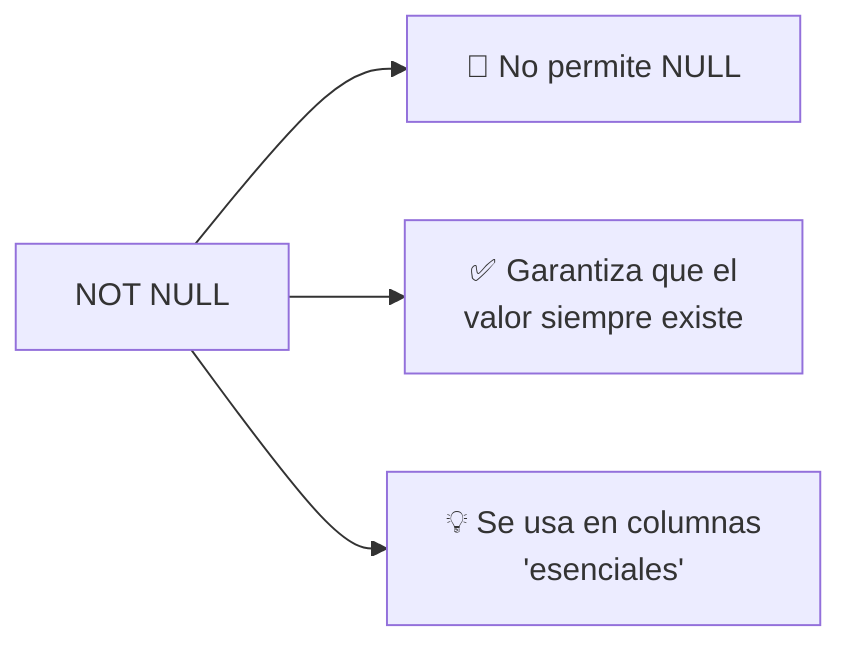

### Sintaxis

```sql
CREATE TABLE usuarios (
    id INT PRIMARY KEY,
    nombre VARCHAR(100) NOT NULL,        -- ⚠️ Obligatorio
    email VARCHAR(200) NOT NULL,         -- ⚠️ Obligatorio
    telefono VARCHAR(15),                -- ✅ Opcional (NULL permitido)
    activo BOOLEAN DEFAULT TRUE NOT NULL -- ⚠️ Obligatorio con default
);

-- Añadir NOT NULL después
ALTER TABLE usuarios MODIFY email VARCHAR(200) NOT NULL;
```

### ¿Cuándo usar NOT NULL?

```sql
-- ✅ Columnas que siempre deben tener valor
CREATE TABLE productos (
    id INT PRIMARY KEY,
    nombre VARCHAR(200) NOT NULL,     -- Un producto siempre tiene nombre
    precio DECIMAL(10,2) NOT NULL,    -- Un producto siempre tiene precio
    sku VARCHAR(50) NOT NULL          -- Código único de producto
);

-- ✅ Columnas con DEFAULT + NOT NULL
CREATE TABLE pedidos (
    id INT PRIMARY KEY,
    fecha DATE NOT NULL DEFAULT (CURRENT_DATE),
    estado VARCHAR(20) NOT NULL DEFAULT 'pendiente',
    total DECIMAL(10,2) NOT NULL DEFAULT 0
);

-- ❌ NO uses NOT NULL si el dato puede ser desconocido
ALTER TABLE usuarios ADD segundo_apellido VARCHAR(100) NOT NULL;
-- ¿Qué pasa con usuarios que no tienen segundo apellido?
```

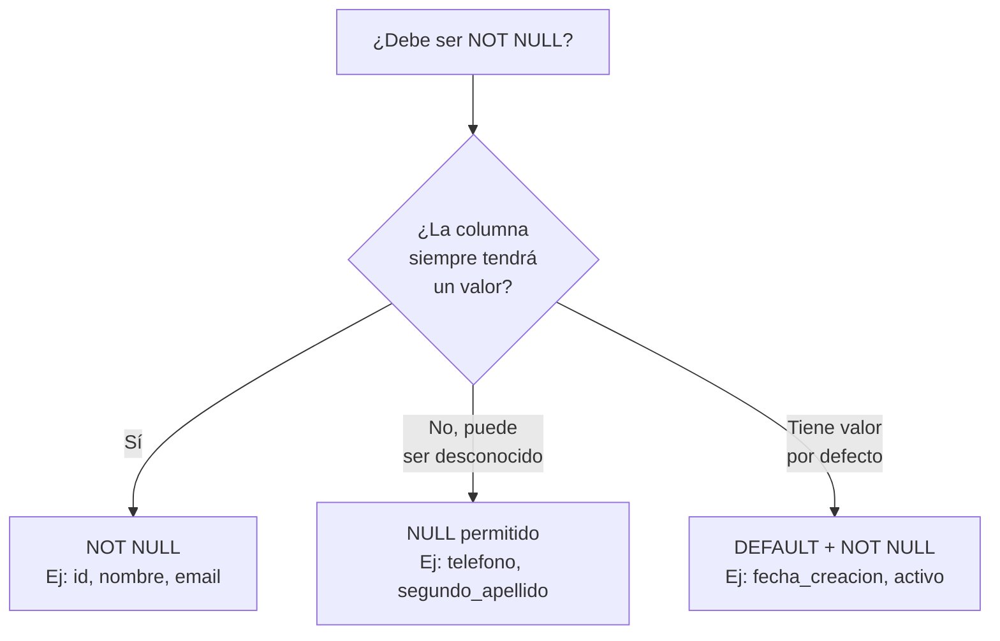

---

## CHECK

Valida que los valores de una columna cumplan una **condición personalizada**.

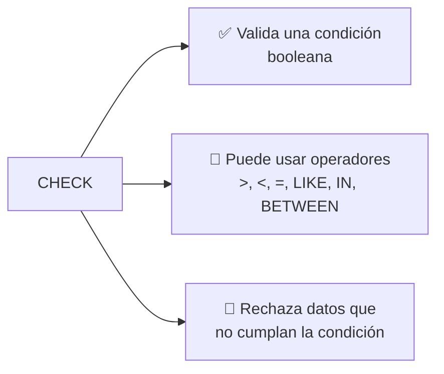

### Sintaxis

```sql
-- A nivel de columna
CREATE TABLE productos (
    id INT PRIMARY KEY,
    precio DECIMAL(10,2) CHECK (precio > 0),
    edad INT CHECK (edad >= 0 AND edad <= 150)
);

-- A nivel de tabla (permite referencias a otras columnas)
CREATE TABLE pedidos (
    id INT PRIMARY KEY,
    cantidad INT,
    precio_unitario DECIMAL(10,2),
    descuento DECIMAL(10,2),
    CHECK (cantidad > 0),
    CHECK (precio_unitario > 0),
    CHECK (descuento >= 0 AND descuento <= precio_unitario),
    CHECK (fecha_envio IS NULL OR fecha_envio >= fecha_pedido)
);

-- CHECK con nombre (recomendado para mensajes de error claros)
CREATE TABLE empleados (
    id INT PRIMARY KEY,
    salario DECIMAL(10,2),
    CONSTRAINT ck_salario_positivo CHECK (salario > 0),
    CONSTRAINT ck_salario_maximo CHECK (salario < 1000000)
);
```

### Ejemplos prácticos

```sql
-- Validaciones de rango
CREATE TABLE estudiantes (
    id INT PRIMARY KEY,
    edad INT CHECK (edad >= 12 AND edad <= 120),
    anio_ingreso INT CHECK (anio_ingreso BETWEEN 1950 AND 2100)
);

-- Validaciones de formato
CREATE TABLE usuarios (
    id INT PRIMARY KEY,
    email VARCHAR(200) CHECK (email LIKE '%@%.%'),
    codigo_postal VARCHAR(5) CHECK (codigo_postal ~ '^[0-9]{5}$')  -- PostgreSQL
);

-- Validaciones entre columnas
CREATE TABLE productos (
    id INT PRIMARY KEY,
    precio_regular DECIMAL(10,2) NOT NULL,
    precio_oferta DECIMAL(10,2),
    CHECK (precio_oferta IS NULL OR precio_oferta < precio_regular)
    -- La oferta debe ser menor que el precio regular
);

-- Validaciones complejas
CREATE TABLE cuentas (
    id INT PRIMARY KEY,
    tipo VARCHAR(10) CHECK (tipo IN ('ahorro', 'cheques', 'inversión')),
    saldo DECIMAL(12,2) NOT NULL,
    tasa_interes DECIMAL(5,2),
    CHECK (
        (tipo = 'ahorro' AND tasa_interes BETWEEN 0.5 AND 5.0) OR
        (tipo = 'cheques' AND tasa_interes = 0) OR
        (tipo = 'inversión' AND tasa_interes BETWEEN 3.0 AND 15.0)
    )
);
```

---

## DEFAULT

Asigna un **valor por defecto** a una columna cuando no se especifica uno en el INSERT.

### Sintaxis

```sql
CREATE TABLE usuarios (
    id INT PRIMARY KEY AUTO_INCREMENT,
    pais VARCHAR(50) DEFAULT 'México',
    activo BOOLEAN DEFAULT TRUE,
    fecha_creacion TIMESTAMP DEFAULT CURRENT_TIMESTAMP,
    updated_at TIMESTAMP DEFAULT CURRENT_TIMESTAMP ON UPDATE CURRENT_TIMESTAMP
);

-- Valores por defecto con expresiones
CREATE TABLE pedidos (
    id INT PRIMARY KEY AUTO_INCREMENT,
    fecha DATE DEFAULT (CURRENT_DATE),
    total DECIMAL(10,2) DEFAULT 0.00,
    codigo VARCHAR(20) DEFAULT CONCAT('PED-', UUID())
);
```

---

## Resumen: todas las restricciones

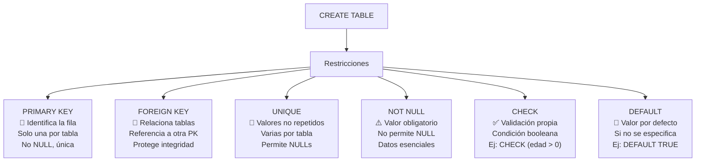

### Tabla comparativa

| Restricción | Garantiza | ¿Crea índice? | ¿Permite NULL? | ¿Cuántas por tabla? |
|---|---|---|---|---|
| **PRIMARY KEY** | Identificador único | ✅ Sí | ❌ No | Una |
| **FOREIGN KEY** | Integridad referencial | ✅ Sí (en algunos motores) | ✅ Depende | Varias |
| **UNIQUE** | Unicidad de valores | ✅ Sí | ✅ Sí (1 NULL en algunos) | Varias |
| **NOT NULL** | Valor siempre presente | ❌ No | ❌ No | Varias |
| **CHECK** | Validación personalizada | ❌ No | N/A | Varias |
| **DEFAULT** | Valor por defecto | ❌ No | N/A | Varias |

### Ejemplo final: todas las restricciones juntas

```sql
CREATE TABLE pedidos (
    -- PK
    id INT PRIMARY KEY AUTO_INCREMENT,

    -- NOT NULL
    cliente_id INT NOT NULL,
    direccion_envio VARCHAR(300) NOT NULL,

    -- DEFAULT
    fecha_pedido DATE NOT NULL DEFAULT (CURRENT_DATE),
    estado VARCHAR(20) NOT NULL DEFAULT 'pendiente',
    activo BOOLEAN DEFAULT TRUE,

    -- CHECK
    total DECIMAL(12,2) CHECK (total >= 0),
    descuento DECIMAL(5,2) DEFAULT 0 CHECK (descuento >= 0 AND descuento <= 100),

    -- UNIQUE
    codigo_seguimiento VARCHAR(50) UNIQUE,

    -- FK
    FOREIGN KEY (cliente_id) REFERENCES clientes(id)
        ON DELETE RESTRICT ON UPDATE CASCADE,

    -- CHECK multi-columna
    CHECK (fecha_envio IS NULL OR fecha_envio >= fecha_pedido)
);
```

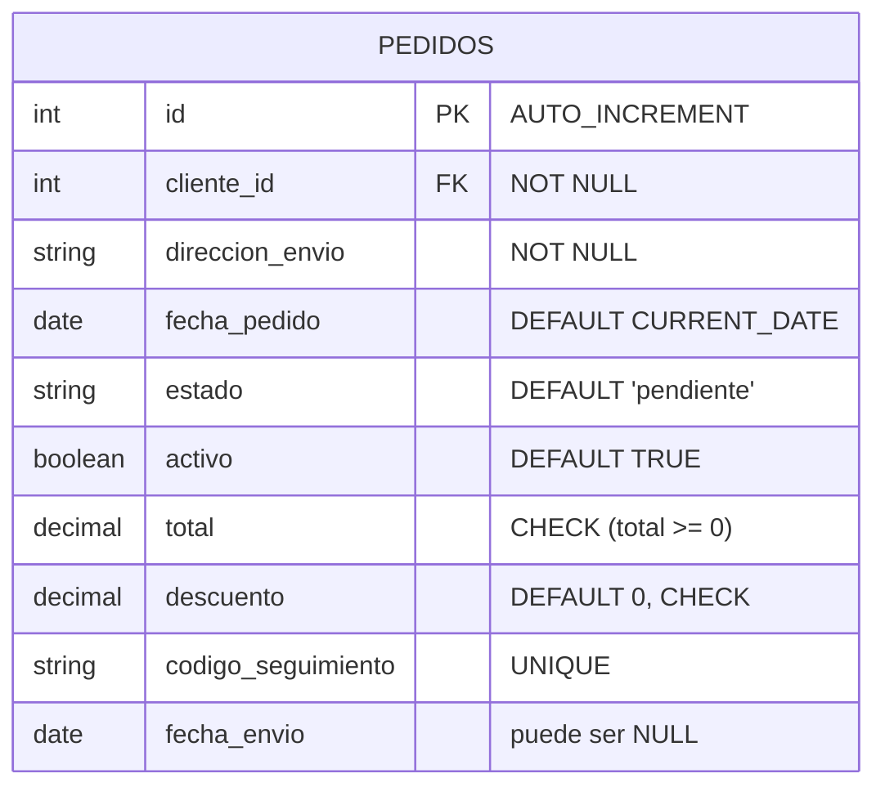
## Relacionados:
- [[consultas-de-agregacion-sql]] #anterior 
- [[join-queries-sql]] #siguiente 