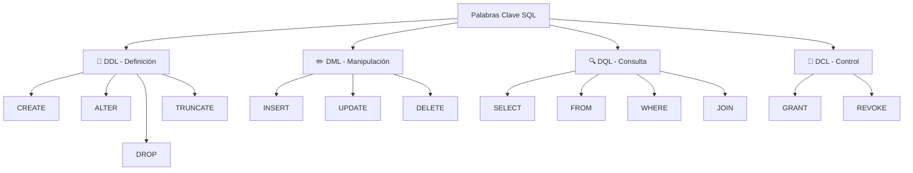
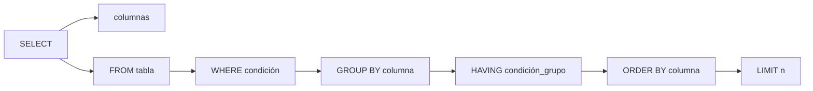
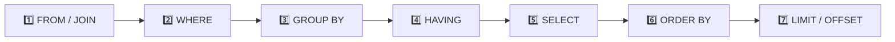
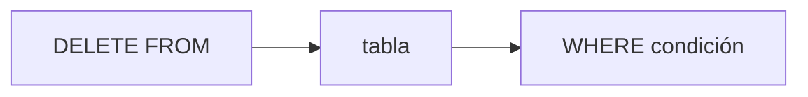
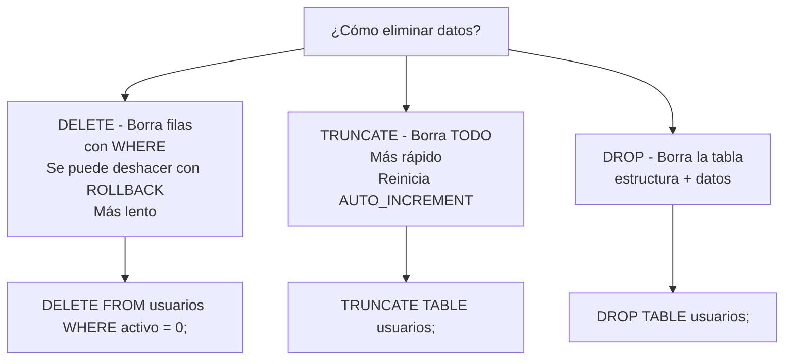
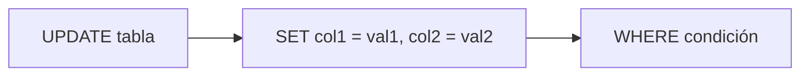
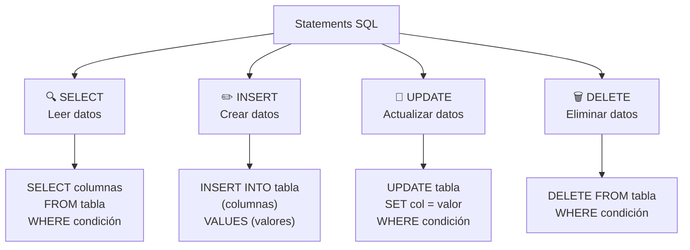

# Sintaxis básica de SQL

## Palabras clave de SQL

Las palabras clave (keywords) son instrucciones reservadas que entiende el motor de la base de datos. No pueden usarse como nombres de tablas o columnas.



| Categoría | Palabras clave | ¿Qué hacen? |
|---|---|---|
| **DDL** | `CREATE`, `ALTER`, `DROP`, `TRUNCATE` | Crean, modifican o eliminan estructuras (tablas, bases de datos) |
| **DML** | `INSERT`, `UPDATE`, `DELETE` | Manipulan los datos dentro de las tablas |
| **DQL** | `SELECT`, `FROM`, `WHERE`, `JOIN`, `GROUP BY`, `ORDER BY` | Consultan y recuperan datos |
| **DCL** | `GRANT`, `REVOKE` | Controlan permisos de usuarios |

### Convenciones de sintaxis

```sql
-- Las palabras clave SQL se escriben en MAYÚSCULAS (convención)
-- Los nombres de tablas y columnas en minúsculas
-- Cada statement termina con punto y coma ;

SELECT nombre, email
FROM usuarios
WHERE edad > 18;
```

> 💡 **Regla nemotécnica:** "SQL se lee como una oración en inglés: SELECT (qué) FROM (de dónde) WHERE (condición)."

---

## Tipos de datos

Cada columna en una tabla debe tener un tipo de dato definido. Los más comunes:

```mermaid
flowchart LR
    Tipos[Tipos de datos] --> Numericos[🔢 Numéricos]
    Tipos --> Texto[📝 Texto]
    Tipos --> Fechas[📅 Fecha / Hora]
    Tipos --> Especiales[🔣 Especiales]

    Numericos --> INT[INT - Entero]
    Numericos --> DECIMAL[DECIMAL - Decimal exacto]
    Numericos --> FLOAT[FLOAT - Decimal aproximado]
    Numericos --> BOOLEAN[BOOLEAN - Verdadero/Falso]

    Texto --> CHAR[CHAR(n) - Fijo]
    Texto --> VARCHAR[VARCHAR(n) - Variable]
    Texto --> TEXT[TEXT - Largo]

    Fechas --> DATE[DATE - Fecha]
    Fechas --> DATETIME[DATETIME - Fecha+hora]
    Fechas --> TIMESTAMP[TIMESTAMP - Marca temporal]

    Especiales --> JSON[JSON]
    Especiales --> UUID[UUID]
```

### Tabla completa de tipos comunes

| Categoría | Tipo | Tamaño | Descripción | Ejemplo |
|---|---|---|---|---|
| **Enteros** | `INT` | 4 bytes | Número entero (-2³¹ a 2³¹-1) | `edad INT` |
| | `SMALLINT` | 2 bytes | Entero pequeño | `anio SMALLINT` |
| | `BIGINT` | 8 bytes | Entero grande | `id BIGINT` |
| | `TINYINT` | 1 byte | Entero muy pequeño / booleano | `activo TINYINT(1)` |
| **Decimales** | `DECIMAL(p,s)` | variable | Decimal exacto (p=precisión, s=escala) | `precio DECIMAL(10,2)` |
| | `FLOAT` | 4 bytes | Decimal aproximado | `temperatura FLOAT` |
| **Texto** | `CHAR(n)` | n bytes | Longitud fija (n hasta 255) | `codigo CHAR(3)` |
| | `VARCHAR(n)` | n+1 bytes | Longitud variable (n hasta 65535) | `nombre VARCHAR(100)` |
| | `TEXT` | hasta 64KB | Texto largo | `descripcion TEXT` |
| **Fecha** | `DATE` | 3 bytes | Solo fecha (YYYY-MM-DD) | `fecha_nac DATE` |
| | `DATETIME` | 8 bytes | Fecha + hora | `created_at DATETIME` |
| | `TIMESTAMP` | 4 bytes | Marca temporal (1970-2038) | `updated_at TIMESTAMP` |
| **Especial** | `BOOLEAN` | 1 byte | true / false (en MySQL es TINYINT) | `activo BOOLEAN` |
| | `JSON` | variable | Datos en formato JSON | `metadata JSON` |
| | `UUID` | 16 bytes | Identificador único universal | `id UUID` |

### Ejemplo práctico de creación con tipos

```sql
CREATE TABLE productos (
    id INT PRIMARY KEY AUTO_INCREMENT,
    nombre VARCHAR(150) NOT NULL,
    precio DECIMAL(10, 2) NOT NULL,
    stock INT DEFAULT 0,
    descripcion TEXT,
    fecha_creacion DATETIME DEFAULT CURRENT_TIMESTAMP,
    activo BOOLEAN DEFAULT TRUE
);
```

---

## Operadores

```mermaid
flowchart TD
    Op[Operadores SQL] --> Aritmeticos[➕ Aritméticos]
    Op --> Comparacion[⚖️ Comparación]
    Op --> Logicos[🧠 Lógicos]
    Op --> Cadena[🔗 Cadena]
    Op --> Conjunto[📊 Conjunto]

    Aritmeticos --> suma["+ (suma)"]
    Aritmeticos --> resta["- (resta)"]
    Aritmeticos --> mult["* (multiplicación)"]
    Aritmeticos --> div["/ (división)"]
    Aritmeticos --> mod["% (módulo)"]

    Comparacion --> eq["= (igual)"]
    Comparacion --> neq["<> o != (distinto)"]
    Comparacion --> may["> (mayor)"]
    Comparacion --> men["< (menor)"]
    Comparacion --> mayeq[">= (mayor igual)"]
    Comparacion --> meneq["<= (menor igual)"]

    Logicos --> AND[AND - Y]
    Logicos --> OR[OR - O]
    Logicos --> NOT[NOT - Negación]
    Logicos --> IN[IN - En conjunto]
    Logicos --> BETWEEN[BETWEEN - Entre]
    Logicos --> LIKE[LIKE - Patrón]
    Logicos --> ISNULL["IS NULL - Es nulo"]

    Conjunto --> UNION[UNION - Unión]
    Conjunto --> INTERSECT[INTERSECT - Intersección]
    Conjunto --> EXCEPT[EXCEPT - Diferencia]

    Cadena --> concat["|| (concatenar)"]
    Cadena --> length["LENGTH()"]
    Cadena --> upper["UPPER()"]
    Cadena --> lower["LOWER()"]
```



### Operadores aritméticos

```sql
SELECT
    precio,
    precio * 1.21 AS precio_con_iva,  -- multiplicación
    stock - 1 AS stock_actualizado,     -- resta
    (precio * 0.1) AS descuento,        -- paréntesis para agrupar
    id % 2 AS es_par                     -- módulo
FROM productos;
```

### Operadores de comparación

```sql
-- =   igualdad
SELECT * FROM usuarios WHERE email = 'ana@email.com';

-- <> o !=   distinto
SELECT * FROM productos WHERE categoria_id <> 5;

-- >, <, >=, <=
SELECT * FROM pedidos WHERE total > 100;
SELECT * FROM productos WHERE stock <= 0;

-- BETWEEN  rango inclusivo
SELECT * FROM pedidos WHERE fecha BETWEEN '2024-01-01' AND '2024-12-31';

-- IN  pertenece a un conjunto
SELECT * FROM usuarios WHERE pais IN ('MX', 'CO', 'AR');

-- LIKE  búsqueda por patrón
-- % = cualquier secuencia, _ = un solo carácter
SELECT * FROM usuarios WHERE email LIKE '%@gmail.com';
SELECT * FROM productos WHERE nombre LIKE 'Cam%';
SELECT * FROM clientes WHERE codigo LIKE 'A_';

-- IS NULL / IS NOT NULL
SELECT * FROM usuarios WHERE telefono IS NULL;
SELECT * FROM usuarios WHERE telefono IS NOT NULL;
```

### Operadores lógicos

```sql
-- AND: ambas condiciones deben cumplirse
SELECT * FROM productos
WHERE precio > 50 AND stock > 0;

-- OR: al menos una condición debe cumplirse
SELECT * FROM productos
WHERE categoria = 'Electrónicos' OR categoria = 'Computo';

-- NOT: niega la condición
SELECT * FROM usuarios
WHERE NOT activo;

-- Combinación: AND tiene prioridad sobre OR (usa paréntesis)
SELECT * FROM pedidos
WHERE (total > 500 OR envio_gratis = TRUE)
  AND estado = 'pendiente';
```

---

## Statements

Los **statements** (sentencias) son las instrucciones que ejecutamos en SQL.

### SELECT

Recupera datos de una o más tablas.



**Sintaxis completa:**
```sql
SELECT [DISTINCT] columna1, columna2, ...
FROM tabla
[WHERE condición]
[GROUP BY columna]
[HAVING condición_grupo]
[ORDER BY columna [ASC | DESC]]
[LIMIT n [OFFSET m]];
```

**Ejemplos progresivos:**

```sql
-- 1. SELECT básico - todas las columnas
SELECT * FROM usuarios;

-- 2. Seleccionar columnas específicas
SELECT nombre, email FROM usuarios;

-- 3. Con alias (AS)
SELECT nombre AS "Nombre completo", email AS Correo FROM usuarios;

-- 4. Con DISTINCT (valores únicos)
SELECT DISTINCT pais FROM usuarios;

-- 5. Con WHERE (filtrar)
SELECT nombre, edad FROM usuarios WHERE edad >= 18;

-- 6. Con ORDER BY (ordenar)
SELECT nombre, precio FROM productos ORDER BY precio DESC;

-- 7. Con LIMIT (limitar resultados)
SELECT * FROM usuarios ORDER BY id DESC LIMIT 10;

-- 8. Con funciones de agregación + GROUP BY + HAVING
SELECT
    categoria,
    COUNT(*) AS total_productos,
    AVG(precio) AS precio_promedio
FROM productos
GROUP BY categoria
HAVING COUNT(*) > 5
ORDER BY total_productos DESC;
```

#### Orden de ejecución lógica

Aunque escribimos `SELECT` primero, el motor ejecuta en este orden:



> ⚡ **Importante:** Por eso NO puedes usar alias del `SELECT` en el `WHERE`, pero SÍ en `ORDER BY`. El `WHERE` se ejecuta antes que el `SELECT`.

```sql
-- ✅ Correcto: ORDER BY puede usar alias
SELECT nombre, precio * 1.21 AS precio_iva
FROM productos
ORDER BY precio_iva;

-- ❌ Incorrecto: WHERE NO puede usar alias del SELECT
SELECT nombre, precio * 1.21 AS precio_iva
FROM productos
WHERE precio_iva > 100;  -- ERROR

-- ✅ Correcto: repetir la expresión
SELECT nombre, precio * 1.21 AS precio_iva
FROM productos
WHERE precio * 1.21 > 100;
```

---

### INSERT

Añade nuevas filas a una tabla.


**Sintaxis básica:**
```sql
INSERT INTO tabla (col1, col2, col3)
VALUES (val1, val2, val3);
```

**Ejemplos:**

```sql
-- Insertar un registro completo (sin especificar columnas - NO recomendado)
INSERT INTO usuarios VALUES (1, 'Ana', 'ana@mail.com', 25);

-- ✅ Insertar especificando columnas (recomendado)
INSERT INTO usuarios (nombre, email, edad)
VALUES ('Ana', 'ana@mail.com', 25);

-- Insertar múltiples registros a la vez
INSERT INTO usuarios (nombre, email, edad)
VALUES
    ('Carlos', 'carlos@mail.com', 30),
    ('María', 'maria@mail.com', 28),
    ('Luis', 'luis@mail.com', 35);

-- Insertar con valores por defecto
INSERT INTO usuarios (nombre, email)
VALUES ('Sofía', 'sofia@mail.com');
-- edad tomará NULL o el valor DEFAULT definido en la tabla
```

> ⚠️ **Importante:** Siempre especifica las columnas. Si la tabla cambia de orden, tu INSERT seguirá funcionando.

---

### DELETE

Elimina filas de una tabla.



**Sintaxis básica:**
```sql
DELETE FROM tabla WHERE condición;
```

**Ejemplos:**

```sql
-- Eliminar un registro específico
DELETE FROM usuarios WHERE id = 5;

-- Eliminar varios registros que cumplan condición
DELETE FROM productos WHERE stock = 0 AND activo = FALSE;

-- Eliminar todos los registros (¡CUIDADO!)
DELETE FROM productos;  -- Borra TODO
```

> ⚠️ **¡ATENCIÓN!** Un `DELETE` sin `WHERE` borra **todas** las filas de la tabla. Siempre verifica antes:
> ```sql
> -- Verifica primero qué vas a borrar
> SELECT * FROM usuarios WHERE id = 5;
> -- Luego borra con la misma condición
> DELETE FROM usuarios WHERE id = 5;
> ```

#### Diferencia entre DELETE, TRUNCATE y DROP



```sql
-- DELETE: elimina filas específicas (lento, pero con control)
DELETE FROM logs WHERE fecha < '2023-01-01';

-- TRUNCATE: elimina todas las filas, rápido, reinicia IDs
TRUNCATE TABLE logs;

-- DROP: elimina toda la tabla
DROP TABLE logs;
```

---

### UPDATE

Modifica datos existentes en una tabla.



**Sintaxis básica:**
```sql
UPDATE tabla
SET col1 = valor1, col2 = valor2
WHERE condición;
```

**Ejemplos:**

```sql
-- Actualizar un campo específico
UPDATE usuarios
SET email = 'nuevoemail@mail.com'
WHERE id = 3;

-- Actualizar múltiples campos
UPDATE productos
SET
    precio = 199.99,
    stock = stock + 10,
    updated_at = CURRENT_TIMESTAMP
WHERE id = 42;

-- Actualizar usando el valor actual
UPDATE productos
SET precio = precio * 1.10  -- aumentar 10%
WHERE categoria = 'Electrónicos';
```

> ⚠️ **¡CUIDADO!** Igual que con DELETE, un UPDATE sin WHERE afecta **todas** las filas:

```sql
> -- Esto cambia el email de TODOS los usuarios
> UPDATE usuarios SET email = 'todos@mail.com';
>
> -- Siempre verifica primero con SELECT
> SELECT * FROM usuarios WHERE id = 3;
> -- Luego actualiza con la misma condición
> UPDATE usuarios SET email = 'nuevo@mail.com' WHERE id = 3;
> 
```
---

## Resumen visual de statements



### Checklist de seguridad

| Statement | ¿Necesita WHERE? | Peligro sin WHERE |
|---|---|---|
| `SELECT` | No obligatorio | Devuelve toda la tabla (puede ser lento) |
| `UPDATE` | **Casi siempre** | Modifica **todas** las filas |
| `DELETE` | **Casi siempre** | Elimina **todas** las filas |
| `INSERT` | No aplica | Solo añade datos |

> 💡 **Regla de oro:** Antes de cualquier `UPDATE` o `DELETE`, escribe primero un `SELECT` con la misma condición para verificar qué filas vas a modificar o eliminar.

---

## Ejemplo completo: ciclo de vida de datos

```sql
-- 1. CREAR tabla
CREATE TABLE tareas (
    id INT PRIMARY KEY AUTO_INCREMENT,
    titulo VARCHAR(200) NOT NULL,
    completada BOOLEAN DEFAULT FALSE,
    created_at DATETIME DEFAULT CURRENT_TIMESTAMP
);

-- 2. INSERTAR datos
INSERT INTO tareas (titulo) VALUES
    ('Estudiar SQL'),
    ('Hacer ejercicio'),
    ('Leer un libro');

-- 3. CONSULTAR datos
SELECT * FROM tareas WHERE completada = FALSE;

-- 4. ACTUALIZAR datos
UPDATE tareas SET completada = TRUE WHERE titulo = 'Estudiar SQL';

-- 5. VERIFICAR actualización
SELECT * FROM tareas;

-- 6. ELIMINAR datos
DELETE FROM tareas WHERE completada = TRUE;

-- 7. VERIFICAR resultados finales
SELECT * FROM tareas;
```

## Relacionados:
- [[aprender-las-bases-sql]] #anterior 
- [[lenguaje-de-definicion-de-datos]] #siguiente 