# SQL Avanzado

Técnicas SQL que van más allá de las consultas básicas para resolver problemas complejos de análisis de datos.

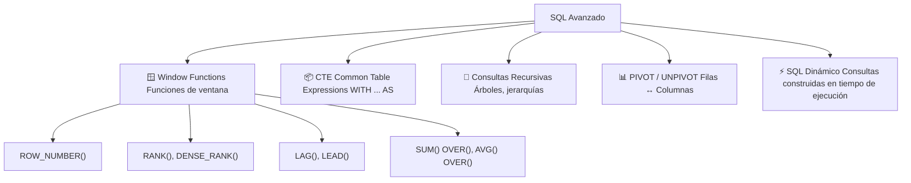

---

## CTE (Common Table Expressions)

Un CTE es una **tabla temporal** que existe solo durante la ejecución de una consulta. Hace el SQL más legible y permite reutilizar subconsultas.

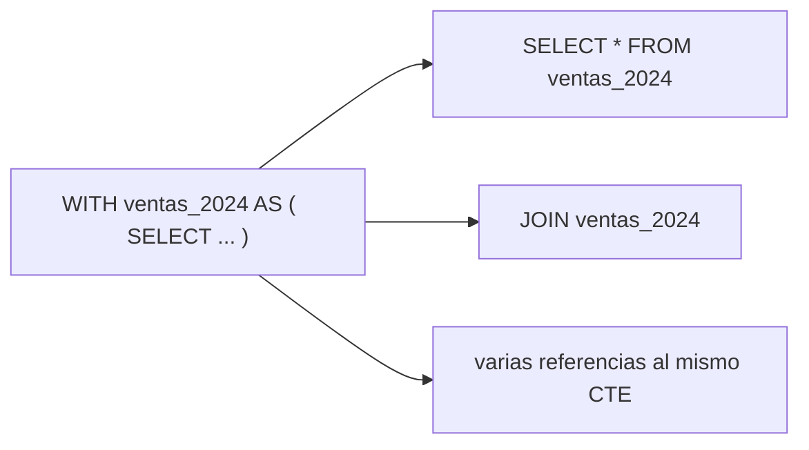

### Sintaxis

```sql
WITH nombre_cte AS (
    consulta_sql
)
SELECT * FROM nombre_cte;
```

### Datos de ejemplo

```sql
CREATE TABLE ventas (
    id INT PRIMARY KEY AUTO_INCREMENT,
    producto VARCHAR(50),
    categoria VARCHAR(50),
    cantidad INT,
    precio DECIMAL(10,2),
    fecha DATE
);

INSERT INTO ventas (producto, categoria, cantidad, precio, fecha) VALUES
    ('Laptop',   'Electrónicos', 2, 15000.00, '2024-01-15'),
    ('Mouse',    'Electrónicos', 5,   250.00, '2024-01-15'),
    ('Camiseta', 'Ropa',         10,  350.00, '2024-02-15'),
    ('Laptop',   'Electrónicos', 1, 15000.00, '2024-03-15'),
    ('Pantalón', 'Ropa',         4,   800.00, '2024-03-01');
```

### Ejemplo básico

```sql
-- Sin CTE: subconsulta anidada
SELECT producto, ingresos
FROM (
    SELECT producto, SUM(cantidad * precio) AS ingresos
    FROM ventas
    GROUP BY producto
) AS resumen
WHERE ingresos > 5000;

-- Con CTE: más legible
WITH resumen_ventas AS (
    SELECT producto, SUM(cantidad * precio) AS ingresos
    FROM ventas
    GROUP BY producto
)
SELECT producto, ingresos
FROM resumen_ventas
WHERE ingresos > 5000;
```

### Múltiples CTEs

```sql
WITH
ventas_por_producto AS (
    SELECT producto, SUM(cantidad * precio) AS ingresos
    FROM ventas
    GROUP BY producto
),
ventas_por_categoria AS (
    SELECT categoria, SUM(cantidad * precio) AS ingresos
    FROM ventas
    GROUP BY categoria
)
SELECT 'producto' AS tipo, producto AS nombre, ingresos FROM ventas_por_producto
UNION ALL
SELECT 'categoria', categoria, ingresos FROM ventas_por_categoria
ORDER BY ingresos DESC;
```

### CTE reutilizable

```sql
-- El CTE se puede referenciar múltiples veces
WITH ventas_2024 AS (
    SELECT * FROM ventas
    WHERE YEAR(fecha) = 2024
)
SELECT
    (SELECT SUM(cantidad * precio) FROM ventas_2024) AS total_ventas,
    (SELECT COUNT(DISTINCT producto) FROM ventas_2024) AS total_productos,
    (SELECT AVG(cantidad * precio) FROM ventas_2024) AS ticket_promedio;
```

---

## Consultas recursivas

Permiten recorrer estructuras jerárquicas o en árbol (organigramas, categorías, rutas).

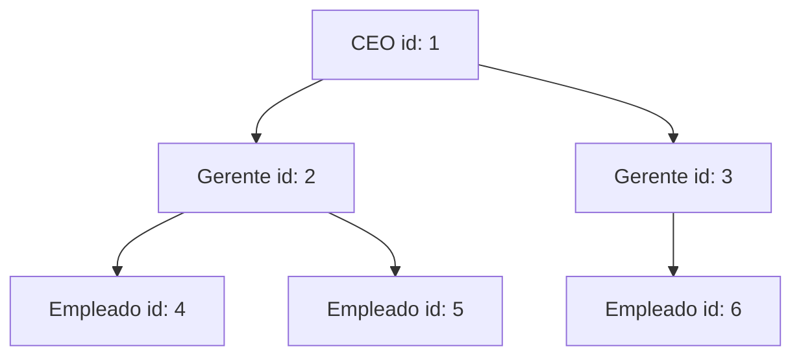

### Datos de ejemplo

```sql
CREATE TABLE empleados (
    id INT PRIMARY KEY,
    nombre VARCHAR(50),
    jefe_id INT  -- FK a la misma tabla
);

INSERT INTO empleados VALUES
    (1, 'Ana (CEO)',    NULL),
    (2, 'Carlos (Gerente)', 1),
    (3, 'María (Gerente)',  1),
    (4, 'Luis',         2),
    (5, 'Sofía',        2),
    (6, 'Pedro',        3);
```

### Sintaxis de CTE recursivo

```sql
WITH RECURSIVE nombre_cte AS (
    -- Ancla: caso base (primera iteración)
    SELECT ...
    WHERE condición_inicial

    UNION ALL

    -- Paso recursivo: se referencia a sí mismo
    SELECT ...
    FROM nombre_cte
    WHERE condición_recursiva
)
SELECT * FROM nombre_cte;
```

### Ejemplo: jerarquía completa

```sql
WITH RECURSIVE jerarquia AS (
    -- Ancla: el CEO (no tiene jefe)
    SELECT
        id,
        nombre,
        jefe_id,
        1 AS nivel,
        CAST(nombre AS CHAR(200)) AS ruta
    FROM empleados
    WHERE jefe_id IS NULL

    UNION ALL

    -- Paso recursivo: empleados que reportan a alguien del CTE
    SELECT
        e.id,
        e.nombre,
        e.jefe_id,
        j.nivel + 1,
        CONCAT(j.ruta, ' → ', e.nombre)
    FROM empleados e
    JOIN jerarquia j ON e.jefe_id = j.id
)
SELECT * FROM jerarquia ORDER BY ruta;
```

**Resultado:**

| id | nombre | jefe_id | nivel | ruta |
|---|---|---|---|---|
| 1 | Ana (CEO) | NULL | 1 | Ana (CEO) |
| 2 | Carlos (Gerente) | 1 | 2 | Ana (CEO) → Carlos (Gerente) |
| 4 | Luis | 2 | 3 | Ana (CEO) → Carlos (Gerente) → Luis |
| 5 | Sofía | 2 | 3 | Ana (CEO) → Carlos (Gerente) → Sofía |
| 3 | María (Gerente) | 1 | 2 | Ana (CEO) → María (Gerente) |
| 6 | Pedro | 3 | 3 | Ana (CEO) → María (Gerente) → Pedro |

### Ejemplo: estructura de categorías

```sql
CREATE TABLE categorias (
    id INT PRIMARY KEY,
    nombre VARCHAR(100),
    padre_id INT
);

INSERT INTO categorias VALUES
    (1,  'Electrónicos', NULL),
    (2,  'Computadoras', 1),
    (3,  'Laptops',      2),
    (4,  'Accesorios',   1),
    (5,  'Mouse',        4),
    (6,  'Teclados',     4),
    (7,  'Ropa',         NULL),
    (8,  'Camisetas',    7);

WITH RECURSIVE arbol_categorias AS (
    SELECT id, nombre, padre_id, 1 AS nivel,
           CAST(nombre AS CHAR(200)) AS ruta
    FROM categorias
    WHERE padre_id IS NULL

    UNION ALL

    SELECT c.id, c.nombre, c.padre_id, a.nivel + 1,
           CONCAT(a.ruta, ' > ', c.nombre)
    FROM categorias c
    JOIN arbol_categorias a ON c.padre_id = a.id
)
SELECT * FROM arbol_categorias ORDER BY ruta;
```

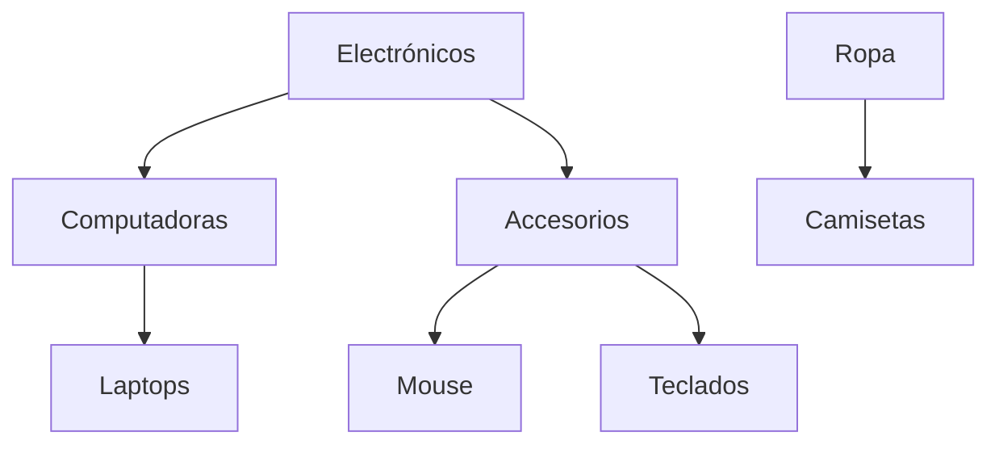

---

## Window Functions (Funciones de ventana)

Las funciones de ventana realizan cálculos **a través de un conjunto de filas relacionadas** sin agruparlas en una sola salida. A diferencia de GROUP BY, **cada fila conserva su identidad**.

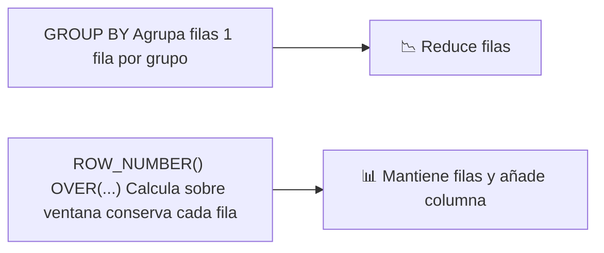

### Diferencia: GROUP BY vs Window Function

```sql
-- GROUP BY: una fila por categoría
SELECT categoria, SUM(cantidad * precio) AS total
FROM ventas
GROUP BY categoria;
-- Electrónicos → 1 fila
-- Ropa → 1 fila

-- Window Function: cada fila + columna con el total de su categoría
SELECT
    producto,
    categoria,
    cantidad * precio AS importe,
    SUM(cantidad * precio) OVER (PARTITION BY categoria) AS total_categoria
FROM ventas;
-- Conserva todas las filas y añade el total de su categoría
```

**Resultado de la Window Function:**

| producto | categoria | importe | total_categoria |
|---|---|---|---|
| Laptop | Electrónicos | 30000 | 45500 |
| Mouse | Electrónicos | 1250 | 45500 |
| Laptop | Electrónicos | 15000 | 45500 |
| Camiseta | Ropa | 3500 | 6700 |
| Pantalón | Ropa | 3200 | 6700 |

### Sintaxis general

```sql
funcion_ventana() OVER (
    [PARTITION BY columna(s)]  -- divide en grupos
    [ORDER BY columna(s)]      -- orden dentro del grupo
    [ROWS/RANGE frame]         -- define la ventana (opcional)
) AS alias
```

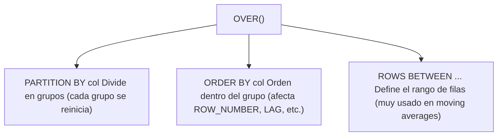

### ROW_NUMBER

Asigna un número único a cada fila dentro de una partición.

```sql
SELECT
    producto,
    categoria,
    cantidad * precio AS importe,
    ROW_NUMBER() OVER (ORDER BY cantidad * precio DESC) AS ranking_global,
    ROW_NUMBER() OVER (PARTITION BY categoria ORDER BY cantidad * precio DESC) AS ranking_categoria
FROM ventas;
```

| producto | categoria | importe | ranking_global | ranking_categoria |
|---|---|---|---|---|
| Laptop | Electrónicos | 30000 | 1 | 1 |
| Laptop | Electrónicos | 15000 | 2 | 2 |
| Pantalón | Ropa | 3200 | 3 | 1 |
| Camiseta | Ropa | 3500 | 4 | 2 |
| Mouse | Electrónicos | 1250 | 5 | 3 |

### RANK y DENSE_RANK

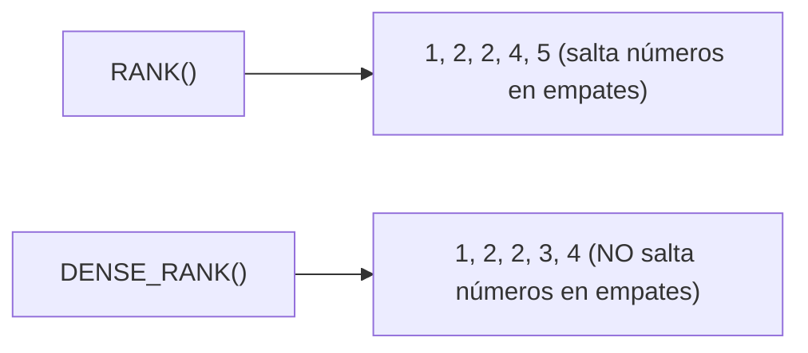

```sql
SELECT
    producto,
    cantidad * precio AS importe,
    ROW_NUMBER() OVER (ORDER BY cantidad * precio DESC) AS rn,
    RANK()       OVER (ORDER BY cantidad * precio DESC) AS rk,
    DENSE_RANK() OVER (ORDER BY cantidad * precio DESC) AS dr
FROM ventas;
```

| producto | importe | ROW_NUMBER | RANK | DENSE_RANK |
|---|---|---|---|---|
| Laptop | 30000 | 1 | 1 | 1 |
| Laptop | 15000 | 2 | 2 | 2 |
| Pantalón | 3200 | 3 | 3 | 3 |
| Camiseta | 3500 | 4 | 4 | 4 |
| Mouse | 1250 | 5 | 5 | 5 |

*(Con datos sin empates se ven igual. Con empates, RANK salta números.)*

```sql
-- Con empates (dos filas con 30000):
-- ROW_NUMBER: 1, 2, 3, 4, 5
-- RANK:       1, 1, 3, 4, 5  (salta el 2)
-- DENSE_RANK: 1, 1, 2, 3, 4  (no salta números)
```

### LAG y LEAD

Acceden a filas **anteriores (LAG)** o **siguientes (LEAD)** dentro de la ventana.

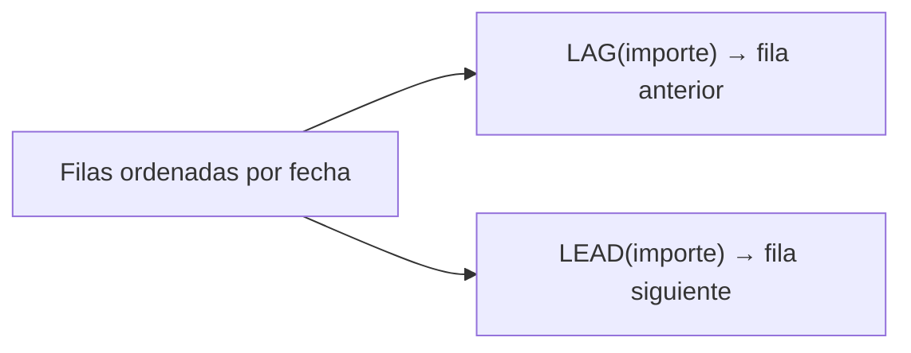

```sql
SELECT
    producto,
    fecha,
    cantidad * precio AS importe,
    LAG(cantidad * precio) OVER (ORDER BY fecha) AS venta_anterior,
    LEAD(cantidad * precio) OVER (ORDER BY fecha) AS venta_siguiente,
    cantidad * precio - LAG(cantidad * precio) OVER (ORDER BY fecha) AS diferencia
FROM ventas
ORDER BY fecha;
```

| producto | fecha | importe | venta_anterior | venta_siguiente | diferencia |
|---|---|---|---|---|---|
| Laptop | 2024-01-15 | 30000 | NULL | 1250 | NULL |
| Mouse | 2024-01-15 | 1250 | 30000 | 3500 | -28750 |
| Camiseta | 2024-02-15 | 3500 | 1250 | 3200 | 2250 |
| Pantalón | 2024-03-01 | 3200 | 3500 | 15000 | -300 |
| Laptop | 2024-03-15 | 15000 | 3200 | NULL | 11800 |

```sql
-- LAG/LEAD con offset (2 filas atrás/adelante)
SELECT
    fecha,
    SUM(cantidad * precio) AS venta_diaria,
    LAG(SUM(cantidad * precio), 7) OVER (ORDER BY fecha) AS venta_hace_7_dias
FROM ventas
GROUP BY fecha;
```

### SUM/AVG/MIN/MAX con OVER

Agregaciones sin perder el detalle de cada fila.

```sql
SELECT
    producto,
    categoria,
    cantidad * precio AS importe,
    SUM(cantidad * precio) OVER (PARTITION BY categoria) AS total_categoria,
    AVG(cantidad * precio) OVER (PARTITION BY categoria) AS promedio_categoria,
    MIN(cantidad * precio) OVER (PARTITION BY categoria) AS minimo_categoria,
    MAX(cantidad * precio) OVER (PARTITION BY categoria) AS maximo_categoria,
    cantidad * precio - AVG(cantidad * precio) OVER (PARTITION BY categoria) AS dif_promedio
FROM ventas;
```

### Ventanas acumuladas (Running Total)

```sql
SELECT
    producto,
    fecha,
    cantidad * precio AS importe,
    SUM(cantidad * precio) OVER (ORDER BY fecha) AS acumulado_global,
    SUM(cantidad * precio) OVER (PARTITION BY categoria ORDER BY fecha) AS acumulado_categoria
FROM ventas;
```

| producto | fecha | importe | acumulado_global | acumulado_categoria |
|---|---|---|---|---|
| Laptop | 2024-01-15 | 30000 | 30000 | 30000 |
| Mouse | 2024-01-15 | 1250 | 31250 | 31250 |
| Camiseta | 2024-02-15 | 3500 | 34750 | 3500 |
| Pantalón | 2024-03-01 | 3200 | 37950 | 6700 |
| Laptop | 2024-03-15 | 15000 | 52950 | 46250 |

### Frame: ventanas móviles (Moving Average)

```sql
-- Promedio móvil de 3 días
SELECT
    fecha,
    SUM(cantidad * precio) AS venta_diaria,
    AVG(SUM(cantidad * precio)) OVER (
        ORDER BY fecha
        ROWS BETWEEN 2 PRECEDING AND CURRENT ROW
    ) AS promedio_movil_3_dias
FROM ventas
GROUP BY fecha
ORDER BY fecha;
```

| ROWS BETWEEN | Significado |
|---|---|
| `ROWS BETWEEN 2 PRECEDING AND CURRENT ROW` | Últimas 3 filas (incluyendo actual) |
| `ROWS BETWEEN 1 PRECEDING AND 1 FOLLOWING` | Anterior + actual + siguiente |
| `ROWS UNBOUNDED PRECEDING` | Desde el inicio hasta la fila actual |
| `ROWS BETWEEN CURRENT ROW AND UNBOUNDED FOLLOWING` | Desde actual hasta el final |

### FIRST_VALUE / LAST_VALUE / NTH_VALUE

```sql
SELECT
    producto,
    categoria,
    cantidad * precio AS importe,
    FIRST_VALUE(producto) OVER (PARTITION BY categoria ORDER BY cantidad * precio DESC) AS mas_vendido_categoria,
    LAST_VALUE(producto) OVER (PARTITION BY categoria ORDER BY cantidad * precio DESC
        ROWS BETWEEN UNBOUNDED PRECEDING AND UNBOUNDED FOLLOWING) AS menos_vendido_categoria
FROM ventas;
```

---

## PIVOT / UNPIVOT

Convierten filas en columnas (PIVOT) y columnas en filas (UNPIVOT).

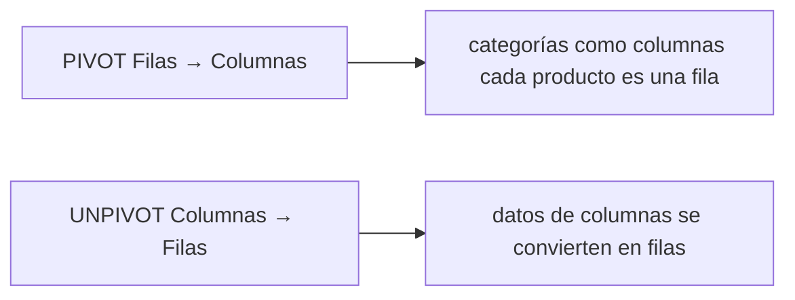

### PIVOT en MySQL (simulado con CASE)

MySQL no tiene PIVOT nativo, se simula con agregación condicional:

```sql
-- Datos originales
SELECT categoria, producto, SUM(cantidad * precio) AS ingresos
FROM ventas
GROUP BY categoria, producto;

-- PIVOT manual: cada categoría es una columna
SELECT
    producto,
    SUM(CASE WHEN categoria = 'Electrónicos' THEN cantidad * precio ELSE 0 END) AS electronicos,
    SUM(CASE WHEN categoria = 'Ropa' THEN cantidad * precio ELSE 0 END) AS ropa,
    SUM(cantidad * precio) AS total
FROM ventas
GROUP BY producto;
```

**Antes (filas por categoría):**

| producto | categoria | ingresos |
|---|---|---|
| Laptop | Electrónicos | 45000 |
| Mouse | Electrónicos | 1250 |
| Camiseta | Ropa | 3500 |
| Pantalón | Ropa | 3200 |

**Después (categorías como columnas):**

| producto | electronicos | ropa | total |
|---|---|---|---|
| Camiseta | 0 | 3500 | 3500 |
| Laptop | 45000 | 0 | 45000 |
| Mouse | 1250 | 0 | 1250 |
| Pantalón | 0 | 3200 | 3200 |

### PIVOT en PostgreSQL

```sql
-- PostgreSQL: con tablefunc (extensión)
CREATE EXTENSION IF NOT EXISTS tablefunc;

SELECT * FROM crosstab(
    'SELECT producto, categoria, SUM(cantidad * precio) AS ingresos
     FROM ventas GROUP BY producto, categoria ORDER BY producto',
    'SELECT DISTINCT categoria FROM ventas ORDER BY categoria'
) AS resultado(producto TEXT, electronicos NUMERIC, ropa NUMERIC);
```

### UNPIVOT (columnas → filas)

```sql
-- Datos originales (tabla ancha)
CREATE TABLE ventas_mensuales (
    producto VARCHAR(50),
    enero INT,
    febrero INT,
    marzo INT
);

INSERT INTO ventas_mensuales VALUES
    ('Laptop', 100, 150, 120),
    ('Mouse',  50,  60,  55);

-- UNPIVOT manual con UNION ALL
SELECT producto, 'enero' AS mes, enero AS ventas FROM ventas_mensuales
UNION ALL
SELECT producto, 'febrero', febrero FROM ventas_mensuales
UNION ALL
SELECT producto, 'marzo', marzo FROM ventas_mensuales
ORDER BY producto, mes;
```

**Antes (columnas separadas):**

| producto | enero | febrero | marzo |
|---|---|---|---|
| Laptop | 100 | 150 | 120 |
| Mouse | 50 | 60 | 55 |

**Después (datos en filas):**

| producto | mes | ventas |
|---|---|---|
| Laptop | enero | 100 |
| Laptop | febrero | 150 |
| Laptop | marzo | 120 |
| Mouse | enero | 50 |
| Mouse | febrero | 60 |
| Mouse | marzo | 55 |

---

## SQL Dinámico

Construye y ejecuta consultas SQL en tiempo de ejecución. Útil cuando la estructura de la consulta no se conoce hasta el momento de ejecución.

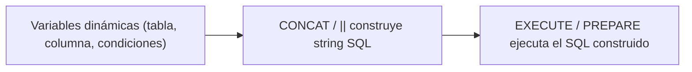

### MySQL: SQL Dinámico con PREPARE

```sql
-- Construir y ejecutar una consulta dinámicamente
SET @tabla = 'empleados';
SET @columna = 'nombre';
SET @valor = 'Ana';

SET @sql = CONCAT('SELECT * FROM ', @tabla,
                  ' WHERE ', @columna, ' = ?');

PREPARE stmt FROM @sql;
EXECUTE stmt USING @valor;
DEALLOCATE PREPARE stmt;
```

### PostgreSQL: SQL Dinámico

```sql
-- PostgreSQL: EXECUTE dentro de función
CREATE OR REPLACE FUNCTION ejecutar_consulta_dinamica(
    tabla_nombre TEXT,
    condicion TEXT
)
RETURNS TABLE(id INT, nombre TEXT)
LANGUAGE plpgsql
AS $$
BEGIN
    RETURN QUERY EXECUTE
        format('SELECT id, nombre FROM %I WHERE %s', tabla_nombre, condicion);
END;
$$;

SELECT * FROM ejecutar_consulta_dinamica('empleados', 'salario > 50000');
```

### Caso de uso: reporte dinámico

```sql
-- Generar reporte donde el usuario elige las columnas y la tabla
DELIMITER //

CREATE PROCEDURE sp_reporte_dinamico(
    IN tabla VARCHAR(50),
    IN columnas VARCHAR(500),
    IN filtro VARCHAR(200)
)
BEGIN
    SET @sql = CONCAT(
        'SELECT ', columnas,
        ' FROM ', tabla,
        ' WHERE ', filtro,
        ' LIMIT 100'
    );

    PREPARE stmt FROM @sql;
    EXECUTE stmt;
    DEALLOCATE PREPARE stmt;
END //

DELIMITER ;

-- Usar: reporte de empleados con salario > 50000
CALL sp_reporte_dinamico('empleados', 'nombre, salario', 'salario > 50000');

-- Usar: reporte con diferentes columnas
CALL sp_reporte_dinamico('empleados', 'id, nombre, departamento', 'activo = TRUE');
```

> ⚠️ **SQL Injection:** Nunca concatenes input del usuario directamente. Usa siempre `?` (placeholders) o `QUOTE()` / `format()` con `%I`.

---

## Resumen visual

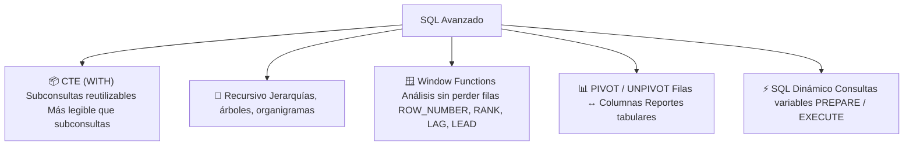

### Guía rápida de Window Functions

| Función | ¿Qué hace? |
|---|---|
| `ROW_NUMBER()` | Número único de fila (1, 2, 3, 4, 5) |
| `RANK()` | Ranking con saltos en empates (1, 1, 3, 4) |
| `DENSE_RANK()` | Ranking sin saltos (1, 1, 2, 3) |
| `LAG(col)` | Valor de la fila anterior |
| `LEAD(col)` | Valor de la fila siguiente |
| `FIRST_VALUE(col)` | Primer valor de la ventana |
| `LAST_VALUE(col)` | Último valor de la ventana |
| `SUM/AVG/MIN/MAX OVER()` | Agregación sin agrupar |
## Relacionados:
- [[optimizacion-de-desempeño-sql]] #anterior 