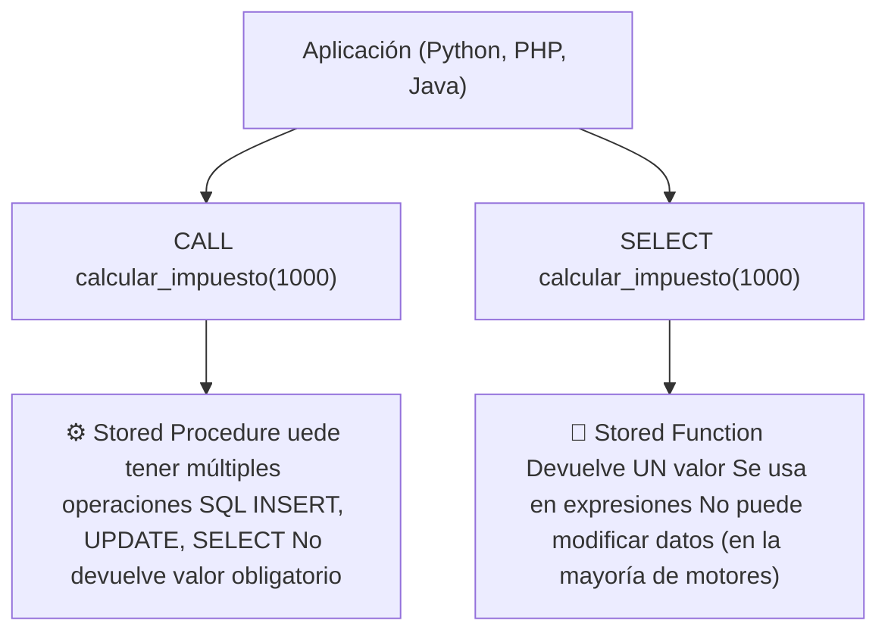
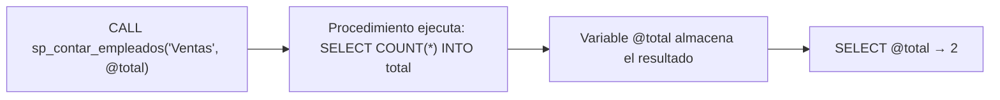
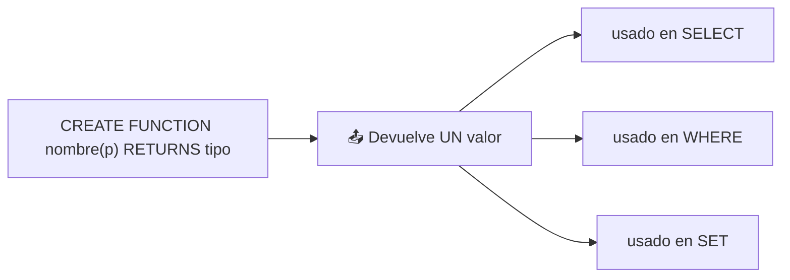
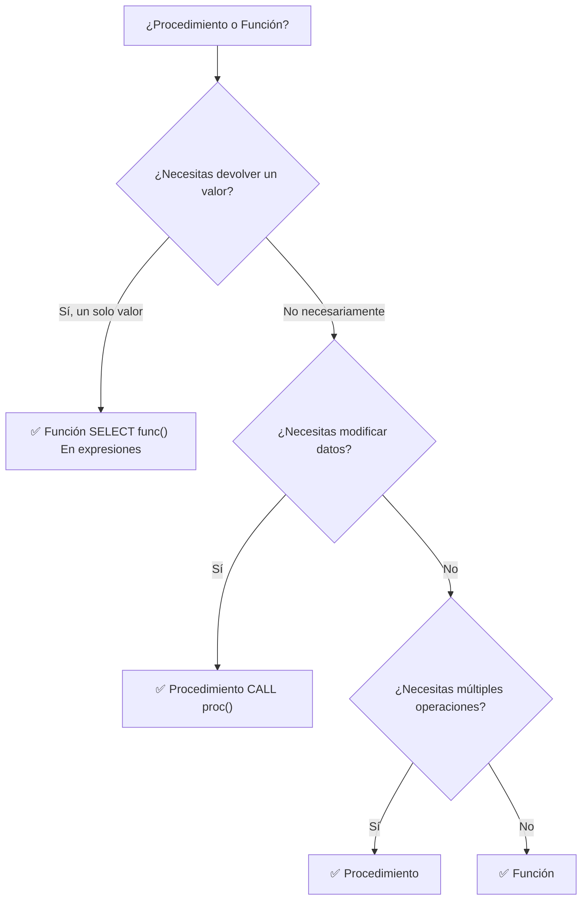
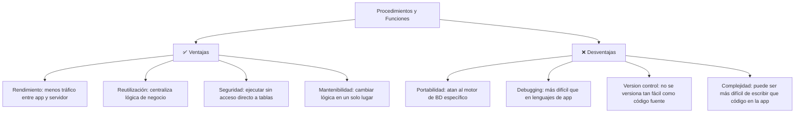
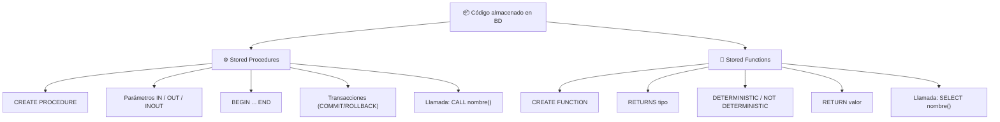

# Funciones y procedimientos almacenados (Stored Procedures & Functions)

Los **procedimientos almacenados** y las **funciones** son bloques de código SQL que se guardan en el servidor de la base de datos y pueden ejecutarse bajo demanda. Permiten encapsular lógica de negocio directamente en la BD.



### ¿Para qué sirven?

| Beneficio | Explicación |
|---|---|
| **Rendimiento** | El código se ejecuta en el servidor, no hay que enviar múltiples consultas |
| **Reutilización** | Una vez creado, cualquier aplicación lo usa sin duplicar lógica |
| **Seguridad** | Puedes dar permiso de ejecución sin dar acceso a las tablas |
| **Mantenibilidad** | La lógica de negocio está centralizada en la BD |
| **Reducción de tráfico** | Enviar solo `CALL proc()` en lugar de miles de líneas SQL |

---

## Stored Procedures (Procedimientos almacenados)

Un procedimiento almacenado es un conjunto de instrucciones SQL que se ejecutan como una unidad. Puede tener parámetros de entrada, salida y entrada/salida.


### Sintaxis básica

```sql
-- MySQL / MariaDB
DELIMITER //

CREATE PROCEDURE nombre_procedimiento(
    IN parametro_entrada INT,
    OUT parametro_salida VARCHAR(100),
    INOUT parametro_io INT
)
BEGIN
    -- Cuerpo del procedimiento
    instrucciones SQL;
END //

DELIMITER ;

-- PostgreSQL
CREATE OR REPLACE PROCEDURE nombre_procedimiento(
    parametro_entrada INT,
    INOUT parametro_salida INT
)
LANGUAGE plpgsql
AS $$
BEGIN
    -- Cuerpo del procedimiento
END;
$$;
```

> 💡 `DELIMITER //` cambia el delimitador para que el `;` dentro del procedimiento no termine la definición. Al final se restaura con `DELIMITER ;`.

### Crear datos de ejemplo

```sql
CREATE TABLE empleados (
    id INT PRIMARY KEY AUTO_INCREMENT,
    nombre VARCHAR(100),
    salario DECIMAL(10,2),
    departamento VARCHAR(50)
);

INSERT INTO empleados (nombre, salario, departamento) VALUES
    ('Ana',    50000, 'Ventas'),
    ('Carlos', 45000, 'Ventas'),
    ('María',  80000, 'TI'),
    ('Luis',   75000, 'TI'),
    ('Sofía',  40000, 'RH');
```

### Parámetros

| Tipo | Descripción |
|---|---|
| `IN` | El parámetro solo se usa como entrada (valor de solo lectura) |
| `OUT` | El parámetro devuelve un valor al llamante (solo escritura) |
| `INOUT` | El parámetro recibe un valor y puede devolver otro modificado |

### Procedimiento con parámetro IN

```sql
DELIMITER //

CREATE PROCEDURE sp_empleados_por_depto(
    IN depto_nombre VARCHAR(50)
)
BEGIN
    SELECT id, nombre, salario
    FROM empleados
    WHERE departamento = depto_nombre
    ORDER BY salario DESC;
END //

DELIMITER ;

-- Llamar al procedimiento
CALL sp_empleados_por_depto('TI');
```

**Resultado:**

| id | nombre | salario |
|---|---|---|
| 3 | María | 80000 |
| 4 | Luis | 75000 |

### Procedimiento con parámetros IN y OUT

```sql
DELIMITER //

CREATE PROCEDURE sp_contar_empleados(
    IN depto_nombre VARCHAR(50),
    OUT total INT
)
BEGIN
    SELECT COUNT(*) INTO total
    FROM empleados
    WHERE departamento = depto_nombre;
END //

DELIMITER ;

-- Llamar al procedimiento
CALL sp_contar_empleados('Ventas', @total);
SELECT @total AS total_ventas;  -- 2
```



### Procedimiento con INOUT

```sql
DELIMITER //

CREATE PROCEDURE sp_aumentar_salario(
    INOUT salario_actual DECIMAL(10,2),
    IN porcentaje DECIMAL(5,2)
)
BEGIN
    SET salario_actual = salario_actual * (1 + porcentaje / 100);
END //

DELIMITER ;

-- Llamar al procedimiento
SET @salario = 50000;
CALL sp_aumentar_salario(@salario, 10);
SELECT @salario;  -- 55000 (50000 + 10%)
```

### Procedimiento con lógica condicional

```sql
DELIMITER //

CREATE PROCEDURE sp_asignar_categoria(
    IN emp_id INT,
    OUT categoria VARCHAR(20)
)
BEGIN
    DECLARE salario_emp DECIMAL(10,2);

    SELECT salario INTO salario_emp
    FROM empleados WHERE id = emp_id;

    IF salario_emp >= 80000 THEN
        SET categoria = 'Senior';
    ELSEIF salario_emp >= 50000 THEN
        SET categoria = 'Mid';
    ELSE
        SET categoria = 'Junior';
    END IF;

    UPDATE empleados
    SET categoria_laboral = categoria
    WHERE id = emp_id;
END //

DELIMITER ;
```

### Procedimiento con transacción

```sql
DELIMITER //

CREATE PROCEDURE sp_transferir(
    IN cuenta_origen INT,
    IN cuenta_destino INT,
    IN monto DECIMAL(10,2)
)
BEGIN
    DECLARE EXIT HANDLER FOR SQLEXCEPTION
    BEGIN
        ROLLBACK;
        SELECT 'Error: transferencia cancelada' AS mensaje;
    END;

    START TRANSACTION;

    UPDATE cuentas SET saldo = saldo - monto WHERE id = cuenta_origen;

    IF (SELECT saldo FROM cuentas WHERE id = cuenta_origen) < 0 THEN
        SIGNAL SQLSTATE '45000'
        SET MESSAGE_TEXT = 'Saldo insuficiente';
    END IF;

    UPDATE cuentas SET saldo = saldo + monto WHERE id = cuenta_destino;

    COMMIT;
    SELECT 'Transferencia exitosa' AS mensaje;
END //

DELIMITER ;
```

---

## Stored Functions (Funciones almacenadas)

Una función es similar a un procedimiento pero **siempre devuelve un valor** y se usa dentro de expresiones SQL.



### Sintaxis básica

```sql
-- MySQL
DELIMITER //

CREATE FUNCTION nombre_funcion(
    parametro TIPO
)
RETURNS tipo_retorno
DETERMINISTIC  -- misma entrada → misma salida
BEGIN
    DECLARE resultado tipo_retorno;
    -- lógica
    RETURN resultado;
END //

DELIMITER ;

-- PostgreSQL
CREATE FUNCTION nombre_funcion(parametro INT)
RETURNS INT
LANGUAGE plpgsql
AS $$
BEGIN
    RETURN resultado;
END;
$$;
```

### Características de las funciones

| Propiedad | Función | Procedimiento |
|---|---|---|
| **Devuelve valor** | ✅ Obligatorio (RETURN) | ❌ Opcional (OUT/INOUT) |
| **Usable en SQL** | ✅ En SELECT, WHERE, SET | ❌ Solo con CALL |
| **Modifica datos** | ❌ Generalmente no | ✅ Sí |
| **Transacciones** | ❌ No puede | ✅ Sí |
| **Llamada** | `SELECT func()` | `CALL proc()` |

### DETERMINISTIC vs NOT DETERMINISTIC

```sql
-- DETERMINISTIC: misma entrada → misma salida
-- (permite optimizaciones, indexación en MySQL)
CREATE FUNCTION calcular_iva(precio DECIMAL(10,2))
RETURNS DECIMAL(10,2)
DETERMINISTIC  -- 100 → 116 siempre
BEGIN
    RETURN precio * 1.16;
END;

-- NOT DETERMINISTIC: puede dar diferente resultado
-- aunque la entrada sea la misma
CREATE FUNCTION obtener_fecha_actual()
RETURNS DATETIME
NOT DETERMINISTIC  -- cambia cada segundo
BEGIN
    RETURN NOW();
END;
```

### Función simple: calcular impuesto

```sql
DELIMITER //

CREATE FUNCTION calcular_impuesto(precio DECIMAL(10,2))
RETURNS DECIMAL(10,2)
DETERMINISTIC
BEGIN
    DECLARE impuesto DECIMAL(10,2);
    SET impuesto = precio * 0.16;
    RETURN impuesto;
END //

DELIMITER ;

-- Usar en consultas
SELECT
    nombre,
    precio,
    calcular_impuesto(precio) AS iva,
    precio + calcular_impuesto(precio) AS total
FROM productos;
```

### Función con lógica condicional

```sql
DELIMITER //

CREATE FUNCTION obtener_rango_salarial(salario DECIMAL(10,2))
RETURNS VARCHAR(20)
DETERMINISTIC
BEGIN
    IF salario >= 80000 THEN
        RETURN 'Senior';
    ELSEIF salario >= 50000 THEN
        RETURN 'Mid';
    ELSE
        RETURN 'Junior';
    END IF;
END //

DELIMITER ;

SELECT
    nombre,
    salario,
    obtener_rango_salarial(salario) AS rango
FROM empleados;
```

**Resultado:**

| nombre | salario | rango |
|---|---|---|
| Ana | 50000 | Mid |
| Carlos | 45000 | Junior |
| María | 80000 | Senior |
| Luis | 75000 | Mid |
| Sofía | 40000 | Junior |

### Función en WHERE

```sql
-- Encontrar empleados que ganan más de $5000/mes
SELECT nombre, salario
FROM empleados
WHERE obtener_rango_salarial(salario) = 'Senior';
```

### Función con SELECT INTO

```sql
DELIMITER //

CREATE FUNCTION salario_promedio_depto(depto VARCHAR(50))
RETURNS DECIMAL(10,2)
READS SQL DATA  -- indica que la función lee datos
BEGIN
    DECLARE promedio DECIMAL(10,2);

    SELECT AVG(salario) INTO promedio
    FROM empleados
    WHERE departamento = depto;

    RETURN COALESCE(promedio, 0);
END //

DELIMITER ;

SELECT salario_promedio_depto('TI');    -- 77500
SELECT salario_promedio_depto('RH');    -- 40000
SELECT salario_promedio_depto('XYZ');   -- 0 (no existe)
```

---

## Diferencias clave



| Aspecto | Procedimiento | Función |
|---|---|---|
| **Valor de retorno** | Opcional (OUT/INOUT) | Obligatorio (RETURN) |
| **Llamada** | `CALL nombre()` | `SELECT nombre()` |
| **Uso en SQL** | ❌ No | ✅ En SELECT, WHERE, etc. |
| **Modificar BD** | ✅ Sí | ❌ Generalmente no |
| **Transacciones** | ✅ Sí (BEGIN/COMMIT) | ❌ No |
| **Parámetros** | IN, OUT, INOUT | Solo IN |
| **CREATE** | `CREATE PROCEDURE` | `CREATE FUNCTION` |

---

## Gestión de procedimientos y funciones

```sql
-- Ver procedimientos existentes (MySQL)
SHOW PROCEDURE STATUS WHERE Db = 'mi_bd';
SHOW FUNCTION STATUS WHERE Db = 'mi_bd';

-- Ver definición
SHOW CREATE PROCEDURE sp_empleados_por_depto;
SHOW CREATE FUNCTION calcular_impuesto;

-- Eliminar
DROP PROCEDURE IF EXISTS sp_empleados_por_depto;
DROP FUNCTION IF EXISTS calcular_impuesto;

-- Modificar (no existe ALTER para procedimientos/funciones)
-- Hay que DROP y CREATE de nuevo, o usar CREATE OR REPLACE
CREATE OR REPLACE PROCEDURE sp_empleados_por_depto(
    IN depto_nombre VARCHAR(50)
)
BEGIN
    SELECT id, nombre, salario, departamento
    FROM empleados
    WHERE departamento = depto_nombre;
END;
```

---

## Ventajas y desventajas



### ¿Cuándo usarlos?

| Situación | Recomendación |
|---|---|
| Lógica que siempre es igual (calcular IVA, impuestos) | ✅ Función |
| Operaciones que deben ser atómicas (transferencias) | ✅ Procedimiento |
| Lógica simple que cambia frecuentemente | ❌ Mejor en la aplicación |
| Necesitas portabilidad entre BD (MySQL ↔ PostgreSQL) | ❌ Evitar, lógica en app |
| Reportes complejos con múltiples pasos | ✅ Procedimiento |
| Validaciones antes de INSERT/UPDATE | ✅ Función o Trigger |

---

## Ejemplo completo: sistema de pedidos

```sql
-- Procedimiento: crear pedido completo
DELIMITER //

CREATE PROCEDURE sp_crear_pedido(
    IN p_cliente_id INT,
    IN p_producto_id INT,
    IN p_cantidad INT,
    OUT p_pedido_id INT,
    OUT p_mensaje VARCHAR(100)
)
BEGIN
    DECLARE precio_actual DECIMAL(10,2);
    DECLARE stock_actual INT;

    DECLARE EXIT HANDLER FOR SQLEXCEPTION
    BEGIN
        ROLLBACK;
        SET p_mensaje = 'Error al crear pedido';
    END;

    START TRANSACTION;

    -- Obtener precio y verificar stock
    SELECT precio, stock INTO precio_actual, stock_actual
    FROM productos WHERE id = p_producto_id;

    IF stock_actual < p_cantidad THEN
        SET p_mensaje = 'Stock insuficiente';
        ROLLBACK;
    ELSE
        -- Crear pedido
        INSERT INTO pedidos (cliente_id, total)
        VALUES (p_cliente_id, precio_actual * p_cantidad);

        SET p_pedido_id = LAST_INSERT_ID();

        -- Insertar detalle
        INSERT INTO detalle_pedido (pedido_id, producto_id, cantidad, precio)
        VALUES (p_pedido_id, p_producto_id, p_cantidad, precio_actual);

        -- Actualizar stock
        UPDATE productos SET stock = stock - p_cantidad
        WHERE id = p_producto_id;

        SET p_mensaje = CONCAT('Pedido ', p_pedido_id, ' creado exitosamente');
        COMMIT;
    END IF;
END //

DELIMITER ;

-- Usar el procedimiento
CALL sp_crear_pedido(1, 5, 2, @pedido_id, @mensaje);
SELECT @pedido_id, @mensaje;
```

---

## Resumen visual



### Guía rápida

```sql
-- CREAR
CREATE PROCEDURE nombre(IN p INT) BEGIN ... END;
CREATE FUNCTION nombre(p INT) RETURNS INT BEGIN ... RETURN x; END;

-- LLAMAR
CALL nombre(valor);
SELECT nombre(valor);

-- VER
SHOW CREATE PROCEDURE nombre;
SHOW CREATE FUNCTION nombre;

-- ELIMINAR
DROP PROCEDURE IF EXISTS nombre;
DROP FUNCTION IF EXISTS nombre;
```

## Relacionados:
- [[integridad-y-seguridad-de-los-datos-sql]] #anterior 
- [[optimizacion-de-desempeño-sql]] #siguiente 