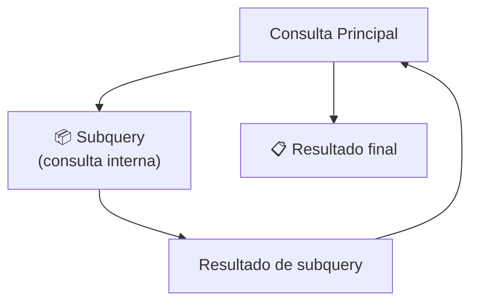
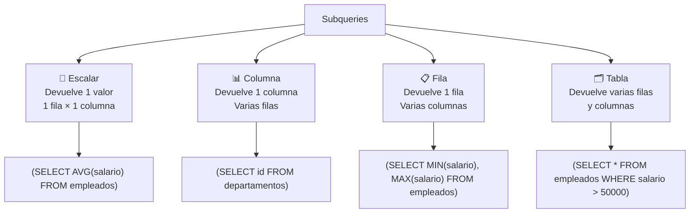
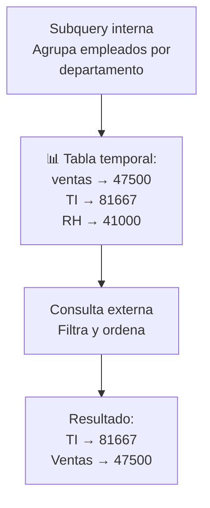
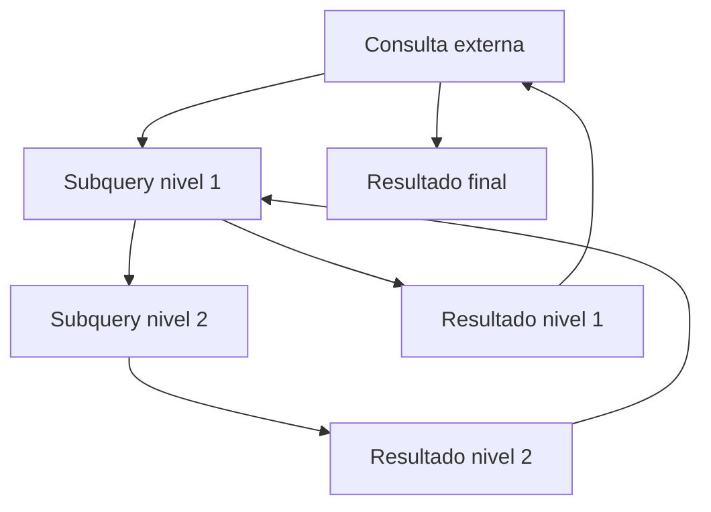
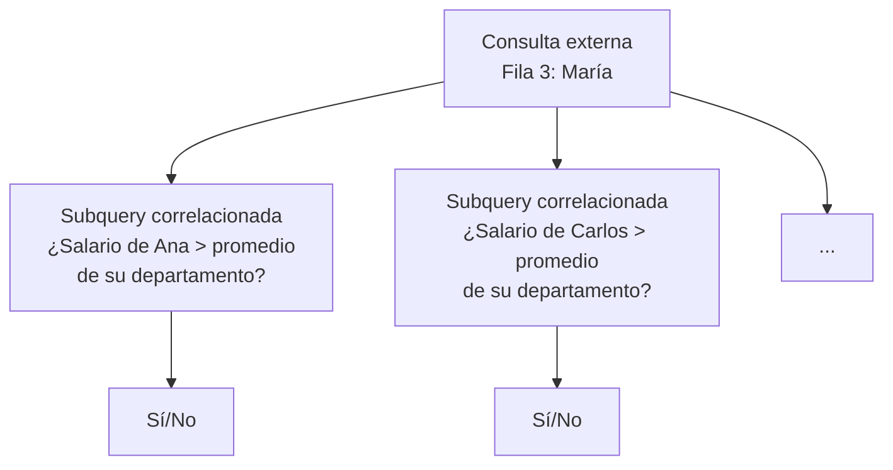
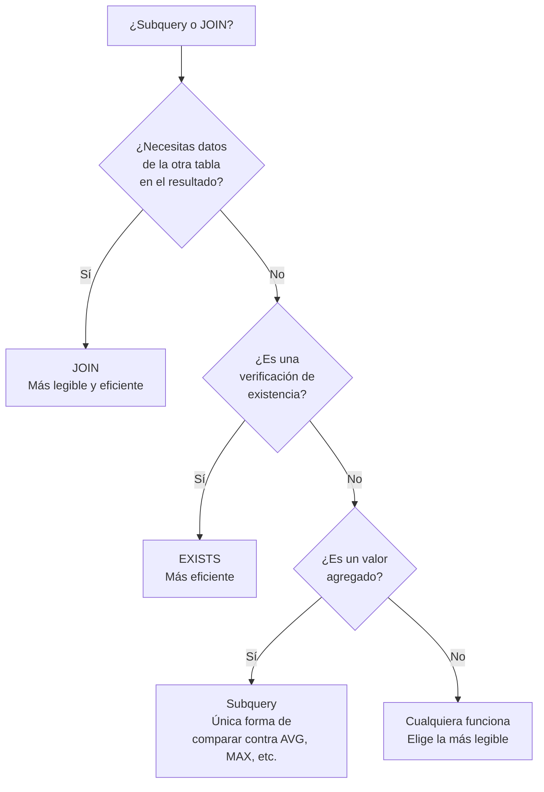
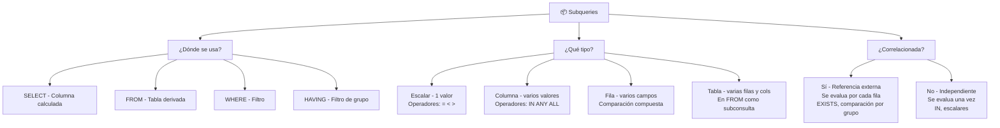

# Subqueries

Una **subquery** (subconsulta) es una consulta SQL dentro de otra consulta. La subquery se ejecuta primero y su resultado es usado por la consulta principal.



### ¿Para qué sirven?

- Comparar un valor contra un resultado agregado (`AVG`, `MAX`, etc.)
- Filtrar datos basados en otra tabla sin usar JOIN
- Crear columnas calculadas en SELECT
- Verificar existencia de registros relacionados

---

## Preparación: datos de ejemplo

```sql
CREATE TABLE empleados (
    id INT PRIMARY KEY,
    nombre VARCHAR(50),
    salario DECIMAL(10,2),
    departamento_id INT
);

CREATE TABLE departamentos (
    id INT PRIMARY KEY,
    nombre VARCHAR(50)
);

INSERT INTO departamentos VALUES
    (1, 'Ventas'),
    (2, 'TI'),
    (3, 'RH');

INSERT INTO empleados VALUES
    (1, 'Ana',    50000, 1),
    (2, 'Carlos', 45000, 1),
    (3, 'María',  80000, 2),
    (4, 'Luis',   75000, 2),
    (5, 'Sofía',  40000, 3),
    (6, 'Pedro',  42000, 3),
    (7, 'Elena',  90000, 2);
```

---

## Tipos de subqueries según el resultado



### Escalar

Devuelve **un solo valor** (una fila, una columna). Se usa donde esperas un valor único.

```sql
-- ¿Empleados que ganan más que el promedio?
SELECT nombre, salario
FROM empleados
WHERE salario > (SELECT AVG(salario) FROM empleados);
```


| nombre | salario |
|---|---|
| María | 80000 |
| Luis | 75000 |
| Elena | 90000 |

```sql
-- Subquery escalar en SELECT (como columna calculada)
SELECT
    nombre,
    salario,
    (SELECT AVG(salario) FROM empleados) AS salario_promedio,
    salario - (SELECT AVG(salario) FROM empleados) AS diferencia
FROM empleados;
```

### Columna

Devuelve **una columna con varias filas**. Se usa con `IN`, `ANY`, `ALL`.

```sql
-- ¿Empleados que trabajan en departamentos de Ventas o TI?
SELECT nombre
FROM empleados
WHERE departamento_id IN (
    SELECT id FROM departamentos
    WHERE nombre IN ('Ventas', 'TI')
);
```

| nombre |
|---|
| Ana |
| Carlos |
| María |
| Luis |
| Elena |

```sql
-- Subquery de columna con NOT IN
-- Empleados cuyo departamento NO está en la lista
SELECT nombre
FROM empleados
WHERE departamento_id NOT IN (
    SELECT id FROM departamentos WHERE nombre = 'RH'
);
```

> ⚠️ **Cuidado con NOT IN y NULLs:** Si la subquery devuelve algún NULL, `NOT IN` devuelve 0 resultados.
> ```sql
> -- Si (SELECT id FROM departamentos) devuelve {1, 2, NULL}
> -- NOT IN (1, 2, NULL) → SIEMPRE vacío
> -- Usa NOT EXISTS en su lugar
> ```

### Fila

Devuelve **una fila con varias columnas**. Se usa con comparadores de fila.

```sql
-- Encontrar el empleado que gana el salario mínimo de su departamento
-- (comparación de fila completa)
SELECT nombre, salario, departamento_id
FROM empleados
WHERE (departamento_id, salario) IN (
    SELECT departamento_id, MIN(salario)
    FROM empleados
    GROUP BY departamento_id
);
```

| nombre | salario | departamento_id |
|---|---|---|
| Carlos | 45000 | 1 |
| Luis | 75000 | 2 |
| Sofía | 40000 | 3 |

> 💡 La comparación `(col1, col2) IN (subquery)` es una forma elegante de comparar múltiples columnas a la vez.

### Tabla

Devuelve **varias filas y columnas**. Se usa como tabla derivada en el `FROM`.

```sql
-- Subquery como tabla derivada
SELECT
    dept_nombre,
    salario_promedio,
    total_empleados
FROM (
    SELECT
        d.nombre AS dept_nombre,
        AVG(e.salario) AS salario_promedio,
        COUNT(*) AS total_empleados
    FROM empleados e
    JOIN departamentos d ON e.departamento_id = d.id
    GROUP BY d.nombre
) AS resumen
WHERE salario_promedio > 45000
ORDER BY salario_promedio DESC;
```



```sql
-- Otro ejemplo: top 3 salarios por departamento
SELECT nombre, salario, departamento_id
FROM (
    SELECT
        nombre,
        salario,
        departamento_id,
        ROW_NUMBER() OVER (PARTITION BY departamento_id ORDER BY salario DESC) AS rn
    FROM empleados
) AS ranked
WHERE rn <= 3;
```

---

## Subqueries anidadas

Una subquery puede contener otra subquery, y así sucesivamente.



### Ejemplo: 3 niveles de anidamiento

```sql
-- Empleados que ganan más que el promedio
-- del departamento con mayor salario promedio
SELECT nombre, salario
FROM empleados
WHERE salario > (
    SELECT AVG(salario)
    FROM empleados
    WHERE departamento_id = (
        SELECT departamento_id
        FROM empleados
        GROUP BY departamento_id
        ORDER BY AVG(salario) DESC
        LIMIT 1
    )
);
```

**Explicación paso a paso:**


**Ejecutando paso a paso:**

```sql
-- Paso 1: ¿Cuál es el departamento con mayor salario promedio?
SELECT departamento_id
FROM empleados
GROUP BY departamento_id
ORDER BY AVG(salario) DESC
LIMIT 1;
-- Resultado: 2 (TI)

-- Paso 2: ¿Cuál es el salario promedio de ese departamento?
SELECT AVG(salario)
FROM empleados
WHERE departamento_id = 2;
-- Resultado: 81666.67

-- Paso 3: ¿Qué empleados ganan más que eso?
SELECT nombre, salario
FROM empleados
WHERE salario > 81666.67;
-- Resultado: Elena (90000)
```

---

## Subqueries correlacionadas

Una subquery **correlacionada** hace referencia a columnas de la consulta externa. Se evalúa **una vez por cada fila** de la consulta externa.



### Ejemplo

```sql
-- Empleados que ganan MÁS que el promedio de SU departamento
SELECT e1.nombre, e1.salario, e1.departamento_id
FROM empleados e1
WHERE e1.salario > (
    SELECT AVG(e2.salario)
    FROM empleados e2
    WHERE e2.departamento_id = e1.departamento_id
);
```

**Lo que pasa por cada fila:**

| empleado | salario | depto | Promedio de su depto | ¿Mayor? |
|---|---|---|---|---|
| Ana | 50000 | 1 (Ventas) | (50000+45000)/2 = 47500 | ✅ Sí |
| Carlos | 45000 | 1 | 47500 | ❌ No |
| María | 80000 | 2 (TI) | (80000+75000+90000)/3 = 81667 | ❌ No |
| Luis | 75000 | 2 | 81667 | ❌ No |
| Sofía | 40000 | 3 (RH) | (40000+42000)/2 = 41000 | ❌ No |
| Pedro | 42000 | 3 | 41000 | ✅ Sí |
| Elena | 90000 | 2 | 81667 | ✅ Sí |

**Resultado:**

| nombre | salario | departamento_id |
|---|---|---|
| Ana | 50000 | 1 |
| Pedro | 42000 | 3 |
| Elena | 90000 | 2 |

### Subquery correlacionada con EXISTS

```sql
-- Departamentos que tienen al menos un empleado
SELECT d.nombre
FROM departamentos d
WHERE EXISTS (
    SELECT 1
    FROM empleados e
    WHERE e.departamento_id = d.id
);
```

> ⭐ `EXISTS` es más eficiente que `IN` cuando la subquery es grande, porque se detiene en la primera coincidencia.

```sql
-- Departamentos SIN empleados
SELECT d.nombre
FROM departamentos d
WHERE NOT EXISTS (
    SELECT 1
    FROM empleados e
    WHERE e.departamento_id = d.id
);
```

### EXISTS vs IN

```sql
-- IN: obtiene todos los resultados de la subquery primero
SELECT * FROM empleados
WHERE departamento_id IN (
    SELECT id FROM departamentos WHERE nombre = 'Ventas'
);

-- EXISTS: verifica existencia fila por fila (más rápido con subqueries grandes)
SELECT * FROM empleados e
WHERE EXISTS (
    SELECT 1 FROM departamentos d
    WHERE d.id = e.departamento_id AND d.nombre = 'Ventas'
);
```

| Aspecto | IN | EXISTS |
|---|---|---|
| Evalúa | Toda la subquery primero | Fila por fila |
| NULLs | Problemas con NOT IN | ✅ Maneja NULLs correctamente |
| Subquery grande | ❌ Lento (carga todo en memoria) | ✅ Rápido (se detiene al encontrar match) |
| Subquery pequeña | ✅ Puede ser más rápido | ✅ Similar |

---

## Subqueries en diferentes cláusulas

### En SELECT (como columna calculada)

```sql
SELECT
    e.nombre,
    e.salario,
    (SELECT AVG(salario) FROM empleados) AS promedio_global,
    (SELECT AVG(salario) FROM empleados e2
     WHERE e2.departamento_id = e.departamento_id) AS promedio_depto
FROM empleados e;
```

### En FROM (tabla derivada)

```sql
SELECT
    depto_nombre,
    empleados_promedio
FROM (
    SELECT
        d.nombre AS depto_nombre,
        COUNT(*) AS total_empleados,
        AVG(e.salario) AS empleados_promedio
    FROM empleados e
    JOIN departamentos d ON e.departamento_id = d.id
    GROUP BY d.nombre
) AS resumen
WHERE total_empleados > 2;
```

### En WHERE (filtro)

```sql
-- Empleados que ganan más que el empleado con id 3
SELECT nombre, salario
FROM empleados
WHERE salario > (SELECT salario FROM empleados WHERE id = 3);
```

### En HAVING (filtro de grupo)

```sql
-- Departamentos donde el salario promedio es mayor
-- que el salario promedio general
SELECT
    d.nombre,
    AVG(e.salario) AS salario_promedio
FROM empleados e
JOIN departamentos d ON e.departamento_id = d.id
GROUP BY d.nombre
HAVING AVG(e.salario) > (SELECT AVG(salario) FROM empleados);
```

| nombre | salario_promedio |
|---|---|
| TI | 81666.67 |

---

## Comparación: subquery vs JOIN

Muchas subqueries se pueden reescribir como JOINs, y viceversa.

```sql
-- MISMA consulta con subquery y con JOIN:

-- Con subquery
SELECT nombre
FROM empleados
WHERE departamento_id IN (
    SELECT id FROM departamentos WHERE nombre = 'TI'
);

-- Con JOIN (equivalente)
SELECT e.nombre
FROM empleados e
JOIN departamentos d ON e.departamento_id = d.id
WHERE d.nombre = 'TI';
```



| Situación | Recomendación |
|---|---|
| Necesitas columnas de ambas tablas en el resultado | ✅ JOIN |
| Comparar contra un agregado (`AVG`, `MAX`) | ✅ Subquery |
| Verificar existencia | ✅ `EXISTS` (más rápido) |
| Filtrar por valores de otra tabla (sin mostrar sus columnas) | ✅ Cualquiera |
| Subquery en SELECT (columna calculada) | ✅ Subquery (JOIN no aplica) |

---

## Errores comunes

```sql
-- ❌ ERROR 1: Subquery devuelve múltiples filas donde se espera escalar
SELECT nombre
FROM empleados
WHERE salario = (SELECT salario FROM empleados WHERE departamento_id = 1);
-- ERROR: subquery returns more than 1 row
-- ✅ Corrección: usar IN en lugar de =
WHERE salario IN (SELECT salario FROM empleados WHERE departamento_id = 1);

-- ❌ ERROR 2: NOT IN con NULLs
SELECT * FROM empleados
WHERE departamento_id NOT IN (SELECT id FROM departamentos WHERE 1=0);
-- Si la subquery devuelve NULL, NOT IN siempre es falso
-- ✅ Corrección: usar NOT EXISTS
WHERE NOT EXISTS (SELECT 1 FROM departamentos WHERE id = empleados.departamento_id);

-- ❌ ERROR 3: Olvidar alias en tabla derivada
SELECT * FROM (SELECT * FROM empleados WHERE salario > 50000);
-- ERROR: Every derived table must have its own alias
-- ✅ Corrección:
SELECT * FROM (SELECT * FROM empleados WHERE salario > 50000) AS empleados_filtrados;
```

---

## Resumen visual



### Guía rápida

| Tipo | ¿Qué devuelve? | ¿Dónde se usa? | Operadores |
|---|---|---|---|
| **Escalar** | 1 valor | `SELECT`, `WHERE`, `HAVING` | `=`, `>`, `<`, `<>` |
| **Columna** | 1 columna, N filas | `WHERE`, `HAVING` | `IN`, `ANY`, `ALL`, `NOT IN` |
| **Fila** | 1 fila, N columnas | `WHERE` | `IN` (comparación compuesta) |
| **Tabla** | N filas, N columnas | `FROM` | Alias obligatorio |
| **Correlacionada** | Depende | `WHERE` (con `EXISTS`) | `EXISTS`, `NOT EXISTS` |
## Relacionados:
- [[join-queries-sql]] #anterior 
- [[funciones-avanzadas-sql]] #siguiente 