# Transacciones

Una **transacción** es un conjunto de operaciones SQL que se ejecutan como una **unidad lógica de trabajo**. O se ejecutan **todas** o **ninguna**.

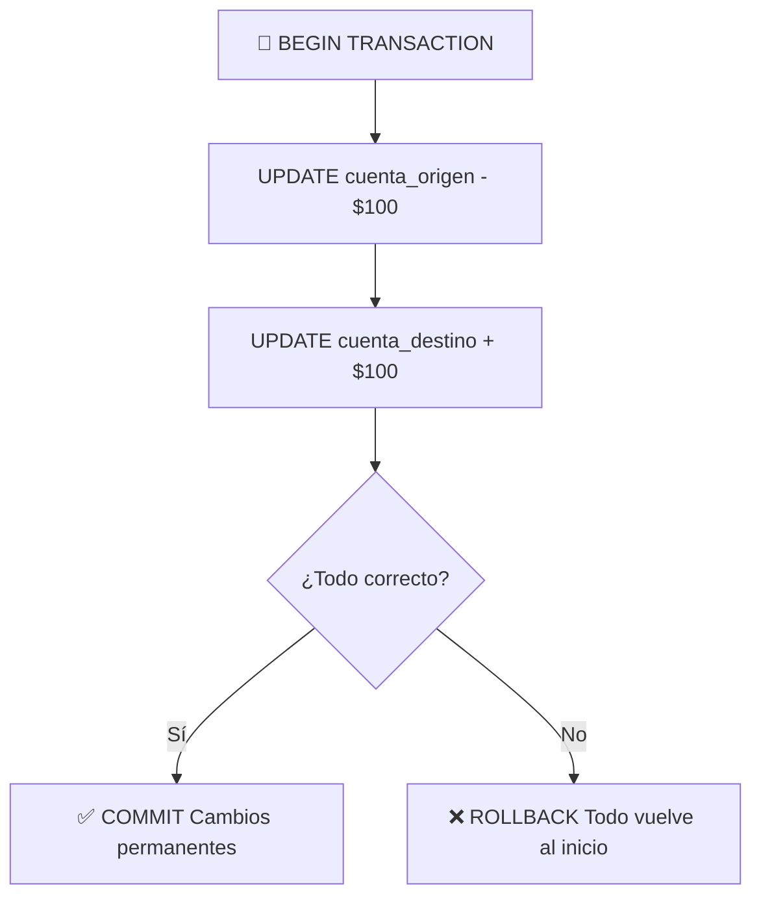

### Ejemplo clásico: transferencia bancaria

```sql
-- Sin transacción: si falla la segunda operación, el dinero se pierde
UPDATE cuentas SET saldo = saldo - 100 WHERE id = 1;
UPDATE cuentas SET saldo = saldo + 100 WHERE id = 2;  -- ❌ Si esto falla...

-- Con transacción: ambas se ejecutan o ninguna
START TRANSACTION;
UPDATE cuentas SET saldo = saldo - 100 WHERE id = 1;
UPDATE cuentas SET saldo = saldo + 100 WHERE id = 2;
COMMIT;
-- Si algo falla antes de COMMIT, hacemos ROLLBACK y todo vuelve como estaba
```

---

## BEGIN

Inicia una transacción explícita.

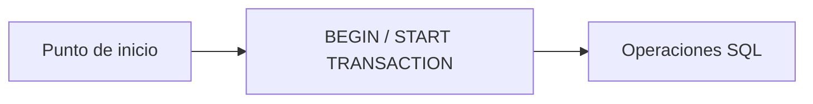

### Sintaxis

```sql
-- MySQL / MariaDB
START TRANSACTION;

-- PostgreSQL
BEGIN;

-- SQL Server
BEGIN TRANSACTION;

-- MySQL también acepta
BEGIN;
START TRANSACTION;  -- equivalente
```

```sql
START TRANSACTION;

INSERT INTO pedidos (cliente_id, total) VALUES (1, 500.00);
UPDATE productos SET stock = stock - 1 WHERE id = 42;
DELETE FROM carrito_compras WHERE usuario_id = 1;

-- Todo esto está en una "burbuja" que podemos deshacer
```

### Comportamiento por defecto

```sql
-- MySQL: autocommit = ON (cada statement es su propia transacción)
SHOW VARIABLES LIKE 'autocommit';
SET autocommit = 0;  -- Desactivar autocommit

-- PostgreSQL: autocommit = ON por defecto
-- SQL Server: autocommit = ON por defecto

-- Con autocommit ON:
UPDATE cuentas SET saldo = saldo - 100 WHERE id = 1;
-- ↑ Esto se confirma automáticamente

-- Con BEGIN / START TRANSACTION, autocommit se desactiva hasta COMMIT/ROLLBACK
START TRANSACTION;
UPDATE cuentas SET saldo = saldo - 100 WHERE id = 1;
-- ↑ Esto NO se ha confirmado todavía
COMMIT;  -- Ahora se confirma
```

---

## COMMIT

Confirma **permanentemente** todas las operaciones realizadas desde el BEGIN.

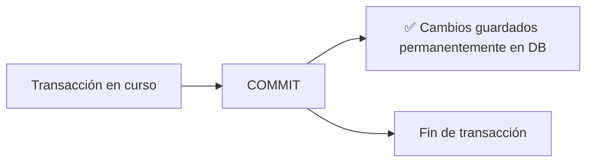

### Sintaxis

```sql
COMMIT;
-- o
COMMIT WORK;  -- equivalente
```

```sql
START TRANSACTION;

UPDATE cuentas SET saldo = saldo - 500 WHERE id = 1;
UPDATE cuentas SET saldo = saldo + 500 WHERE id = 2;

-- Si llegamos aquí sin errores:
COMMIT;
-- Los cambios son ahora visibles para otras conexiones
-- y persistentes aunque el servidor se apague
```

### ¿Qué pasa si hay un error?

```sql
START TRANSACTION;

UPDATE cuentas SET saldo = saldo - 500 WHERE id = 1;
-- ¡Error! La cuenta 2 no existe
UPDATE cuentas SET saldo = saldo + 500 WHERE id = 999;
-- ERROR: Foreign key violation

-- Sin COMMIT explícito:
-- ⚠️ La primera operación NO se ha confirmado
-- ⚠️ La transacción sigue abierta (puede bloquear otras operaciones)

-- MySQL: autocommit no libera los locks hasta COMMIT o ROLLBACK
```

> ⚡ **Siempre haz COMMIT o ROLLBACK explícitamente.** Las transacciones abiertas mantienen locks y pueden causar deadlocks.

---

## ROLLBACK

Deshace **todas** las operaciones realizadas desde el BEGIN (o desde el último SAVEPOINT).

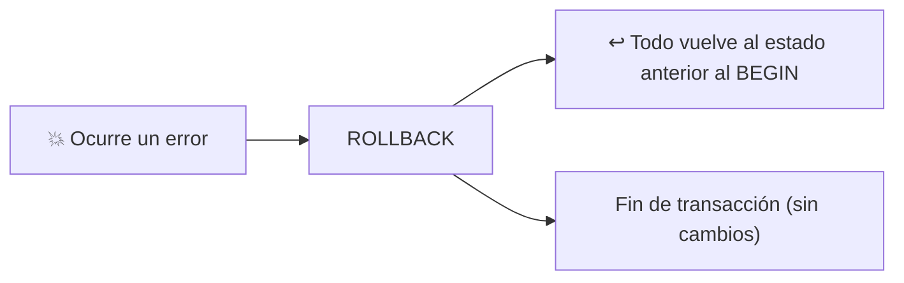

### Sintaxis

```sql
ROLLBACK;
-- o
ROLLBACK WORK;  -- equivalente
```

```sql
START TRANSACTION;

-- Intentar transferencia
UPDATE cuentas SET saldo = saldo - 500 WHERE id = 1;

-- Verificar saldo después del descuento
SELECT saldo FROM cuentas WHERE id = 1;
-- Saldo: 500 (era 1000)

-- Algo sale mal con la cuenta destino
-- Deshacemos todo:
ROLLBACK;

-- Verificar que el saldo volvió a su valor original
SELECT saldo FROM cuentas WHERE id = 1;
-- Saldo: 1000 ✅ (se deshizo el UPDATE)
```

### Ejemplo con control de errores

```sql
-- MySQL: con señales
START TRANSACTION;

UPDATE cuentas SET saldo = saldo - 500 WHERE id = 1;

IF (SELECT saldo FROM cuentas WHERE id = 1) < 0 THEN
    ROLLBACK;
    SELECT 'Saldo insuficiente' AS error;
ELSE
    UPDATE cuentas SET saldo = saldo + 500 WHERE id = 2;
    COMMIT;
END IF;
```

---

## SAVEPOINT

Crea un **punto de control** dentro de una transacción. Permite deshacer solo una parte de la transacción sin cancelarla completamente.

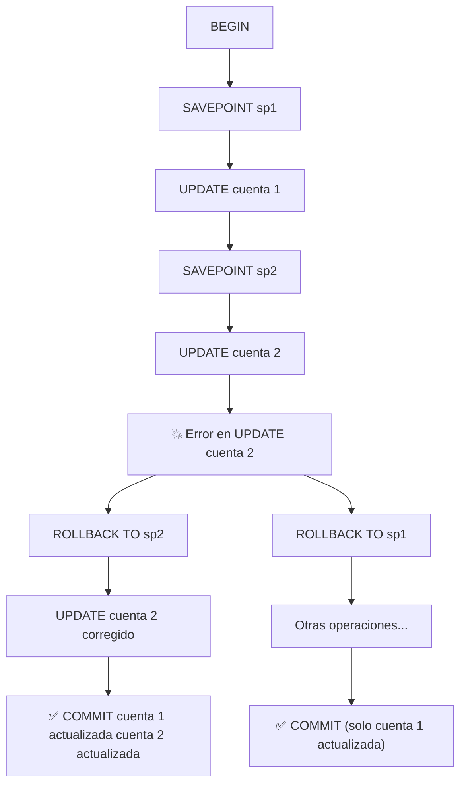

### Sintaxis

```sql
SAVEPOINT nombre_punto;
ROLLBACK TO SAVEPOINT nombre_punto;
RELEASE SAVEPOINT nombre_punto;  -- elimina el savepoint
```

### Ejemplo práctico

```sql
START TRANSACTION;

INSERT INTO logs(mensaje) VALUES('Iniciando proceso de pago');
SAVEPOINT log_creado;

-- Descontar del primer producto
UPDATE inventario SET stock = stock - 1 WHERE id = 100;
SAVEPOINT inventario_descontado;

-- Cobrar al cliente
UPDATE cuentas SET saldo = saldo - 500 WHERE id = 1;

-- Si el cobro falla (saldo insuficiente), podemos:
-- 1. Deshacer solo el cobro y el descuento (parcial)
ROLLBACK TO SAVEPOINT inventario_descontado;
-- Ahora podemos intentar otro método de pago
UPDATE cuentas SET saldo = saldo - 500 WHERE id = 2;  -- otra cuenta
COMMIT;  -- Confirma el log y el descuento del inventario

-- 2. O deshacer todo excepto el log
ROLLBACK TO SAVEPOINT log_creado;
COMMIT;  -- Solo se guarda el log
```

### Liberar savepoints

```sql
START TRANSACTION;

SAVEPOINT sp1;
INSERT INTO ...
SAVEPOINT sp2;
INSERT INTO ...

-- Ya no necesitamos sp1 (podemos liberarlo)
RELEASE SAVEPOINT sp1;

-- ROLLBACK a sp2 aún funciona
ROLLBACK TO sp2;

COMMIT;
```

---

## ACID

Las propiedades **ACID** garantizan que las transacciones se procesan de forma confiable.

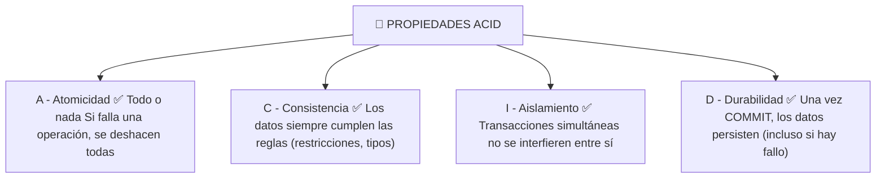

| Propiedad | Significado | Ejemplo |
|---|---|---|
| **A**tomicidad | La transacción es indivisible: se ejecuta completa o no se ejecuta | Transferencia: si falla el crédito, se deshace el débito |
| **C**onsistencia | Las reglas de la BD (PK, FK, CHECK) siempre se cumplen | No se puede insertar un pedido sin cliente |
| **I**solamiento | Las transacciones concurrentes no se ven entre sí hasta el COMMIT | Dos transferencias simultáneas no se mezclan |
| **D**urabilidad | Una vez COMMIT, los datos están seguros en disco | Si se corta la luz después del COMMIT, los datos persisten |

### Ejemplo ACID en acción

```sql
-- Transferencia bancaria: ACID completo
START TRANSACTION;

-- Atomicidad: ambas actualizaciones son una unidad
UPDATE cuentas SET saldo = saldo - 1000 WHERE id = 1;

-- Consistencia: CHECK saldo >= 0 se aplica (si existe)
-- Si saldo queda negativo, el motor rechaza y se debe hacer ROLLBACK

-- Aislamiento: otra transacción no ve el saldo reducido hasta COMMIT
UPDATE cuentas SET saldo = saldo + 1000 WHERE id = 2;

COMMIT;
-- Durabilidad: en este punto, los cambios están en disco
```

---

## Niveles de aislamiento de transacciones

Controlan cómo las transacciones concurrentes interactúan entre sí.

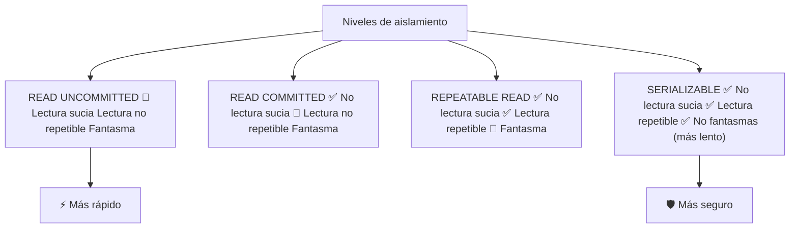

### Problemas que resuelven los niveles de aislamiento

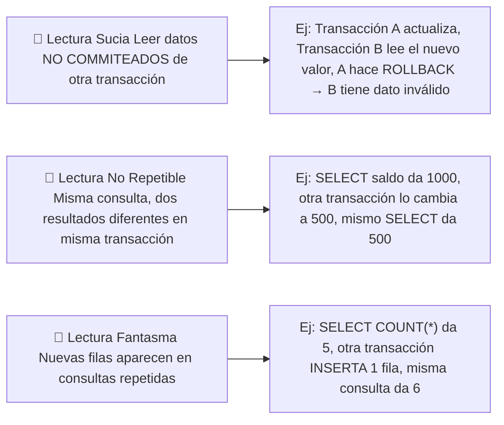

### 1. READ UNCOMMITTED

Nivel más bajo: una transacción puede leer datos **no commiteados** de otra.

```sql
SET TRANSACTION ISOLATION LEVEL READ UNCOMMITTED;
-- En SQL Server
-- En MySQL: InnoDB usa REPEATABLE READ por defecto
-- En PostgreSQL: no permite READ UNCOMMITTED (lo trata como READ COMMITTED)
```

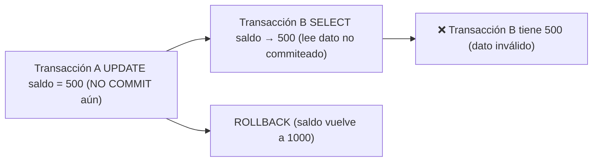

> ⚠️ **Riesgo alto:** Lectura sucia garantizada. Solo útil para estimaciones aproximadas.

### 2. READ COMMITTED (default en PostgreSQL, SQL Server, Oracle)

Cada consulta ve solo datos **commiteados**. Previene lectura sucia, pero permite lectura no repetible.

```sql
SET TRANSACTION ISOLATION LEVEL READ COMMITTED;
```

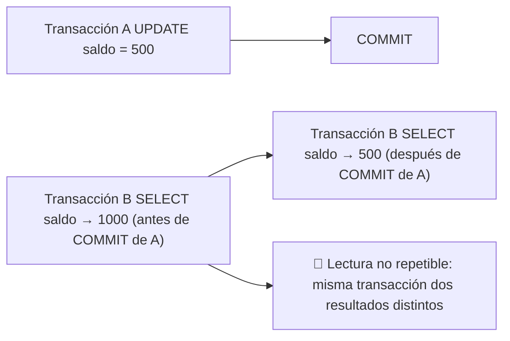

### 3. REPEATABLE READ (default en MySQL/InnoDB)

Garantiza que si lees un dato, **siempre verás el mismo valor** dentro de la transacción. Previene lectura sucia y no repetible, pero permite lecturas fantasma.

```sql
SET TRANSACTION ISOLATION LEVEL REPEATABLE READ;
```

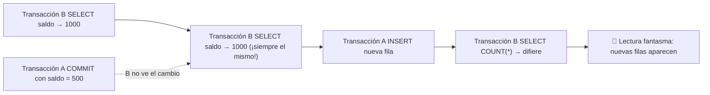

### 4. SERIALIZABLE

Máximo aislamiento: las transacciones se ejecutan como si fueran **secuenciales**. Previene todos los problemas.

```sql
SET TRANSACTION ISOLATION LEVEL SERIALIZABLE;
```

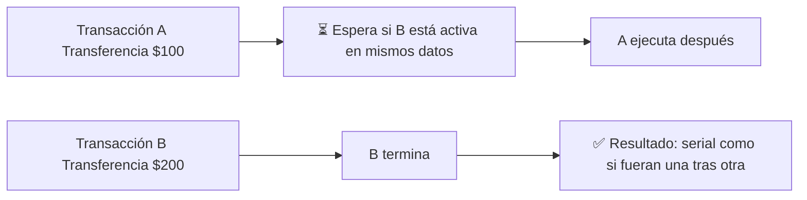

### Tabla comparativa

| Nivel | Lectura sucia | Lectura no repetible | Fantasmas | Rendimiento |
|---|---|---|---|---|
| **READ UNCOMMITTED** | ❌ Puede ocurrir | ❌ Puede ocurrir | ❌ Puede ocurrir | ⚡ Más rápido |
| **READ COMMITTED** | ✅ No | ❌ Puede ocurrir | ❌ Puede ocurrir | ⚡ Rápido |
| **REPEATABLE READ** | ✅ No | ✅ No | ❌ Puede ocurrir | 🐢 Más lento |
| **SERIALIZABLE** | ✅ No | ✅ No | ✅ No | 🐢 Más lento |

### Configurar el nivel de aislamiento

```sql
-- A nivel de sesión (solo para esta conexión)
SET SESSION TRANSACTION ISOLATION LEVEL READ COMMITTED;

-- A nivel global (para todas las nuevas conexiones)
SET GLOBAL TRANSACTION ISOLATION LEVEL READ COMMITTED;

-- Para una transacción específica
START TRANSACTION ISOLATION LEVEL SERIALIZABLE;
```

### ¿Qué nivel deberías usar?

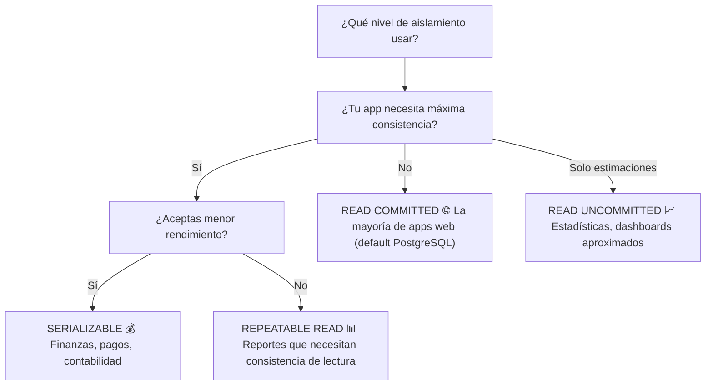

---

## Resumen visual

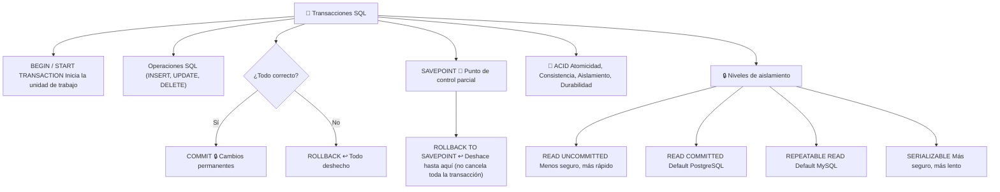

### Guía rápida

| Comando | ¿Qué hace? |
|---|---|
| `START TRANSACTION` | Inicia una transacción explícita |
| `COMMIT` | Guarda permanentemente los cambios |
| `ROLLBACK` | Deshace todos los cambios de la transacción |
| `SAVEPOINT nombre` | Crea un punto de control dentro de la transacción |
| `ROLLBACK TO nombre` | Deshace hasta el savepoint |
| `RELEASE SAVEPOINT nombre` | Elimina un savepoint |
| `SET TRANSACTION ISOLATION LEVEL ...` | Cambia el nivel de aislamiento |
## Relacionados:
- [[indices-sql]] #anterior 
- [[integridad-y-seguridad-de-los-datos-sql]] #siguiente 