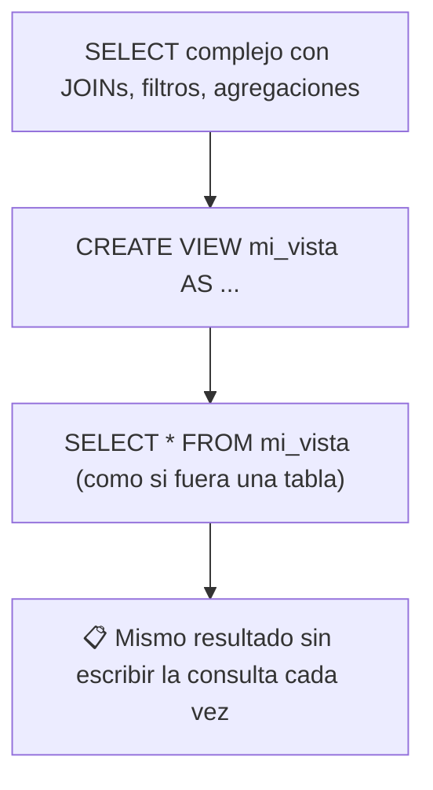
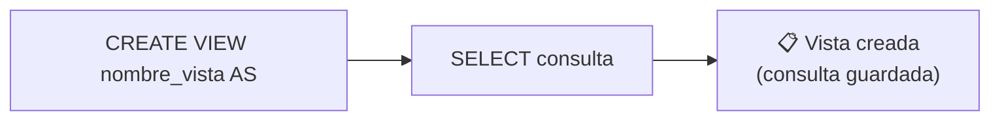
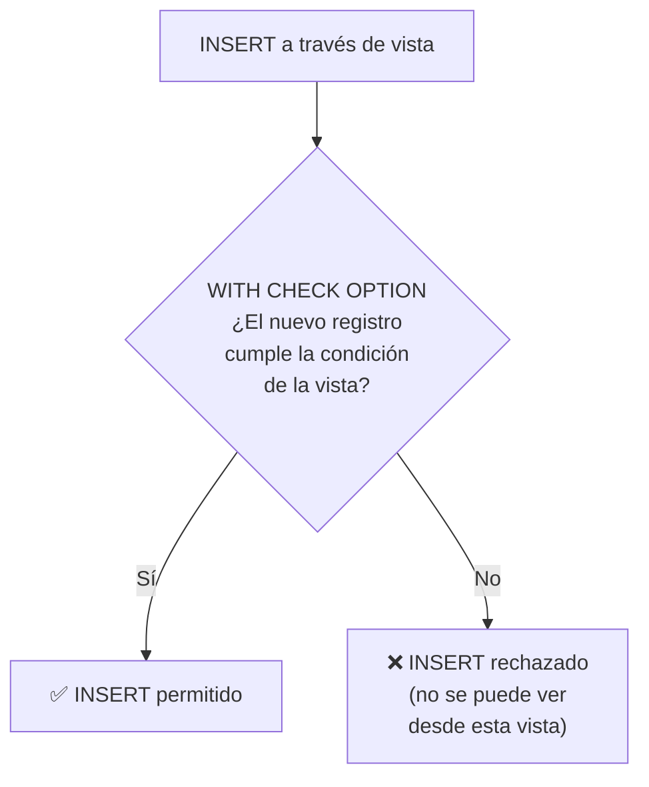
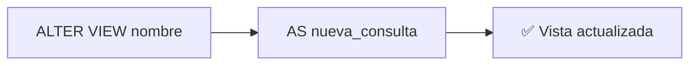
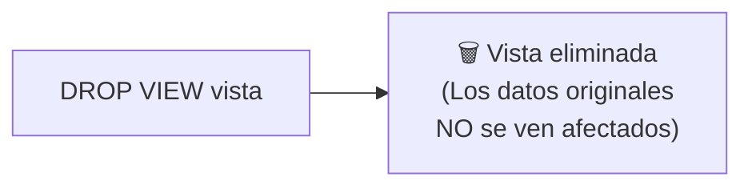
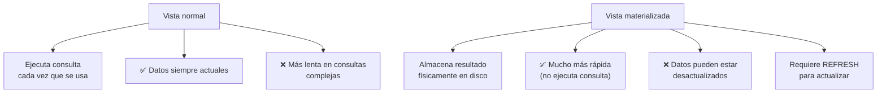
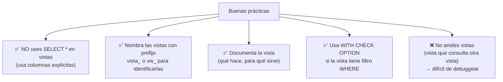
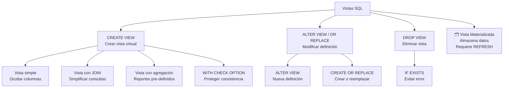

# Vistas

Una **vista (VIEW)** es una tabla virtual basada en el resultado de una consulta `SELECT`. No almacena datos físicamente, sino que es una **consulta guardada** que se comporta como una tabla.



### ¿Para qué sirven?

| Beneficio | Explicación |
|---|---|
| **Simplificar consultas** | Envuelve JOINs complejos en una vista simple |
| **Seguridad** | Muestra solo columnas específicas, oculta datos sensibles |
| **Reutilización** | Una vez creada, cualquier usuario/consulta puede usarla |
| **Abstracción** | Los usuarios no necesitan conocer la estructura real |
| **Consistencia** | Todos usan la misma lógica de negocio |

> ⚠️ Las vistas **no almacenan datos** (excepto las vistas materializadas). Cada vez que consultas una vista, se ejecuta la consulta subyacente.

---

## Creando vistas



### Sintaxis básica

```sql
CREATE VIEW nombre_vista AS
SELECT columnas
FROM tablas
WHERE condiciones;
```

### Datos de ejemplo

```sql
CREATE TABLE empleados (
    id INT PRIMARY KEY,
    nombre VARCHAR(50),
    salario DECIMAL(10,2),
    departamento_id INT,
    email VARCHAR(100)
);

CREATE TABLE departamentos (
    id INT PRIMARY KEY,
    nombre VARCHAR(50),
    presupuesto DECIMAL(12,2)
);

INSERT INTO departamentos VALUES
    (1, 'Ventas', 500000),
    (2, 'TI', 800000),
    (3, 'RH', 300000);

INSERT INTO empleados VALUES
    (1, 'Ana',    50000, 1, 'ana@empresa.com'),
    (2, 'Carlos', 45000, 1, 'carlos@empresa.com'),
    (3, 'María',  80000, 2, 'maria@empresa.com'),
    (4, 'Luis',   75000, 2, 'luis@empresa.com'),
    (5, 'Sofía',  40000, 3, 'sofia@empresa.com');
```

### Vista simple: ocultar columnas sensibles

```sql
-- Los usuarios de RH ven empleados pero NO los salarios
CREATE VIEW vista_empleados_publica AS
SELECT id, nombre, email, departamento_id
FROM empleados;

-- Uso:
SELECT * FROM vista_empleados_publica;
-- Solo ve: id, nombre, email, departamento_id
-- No ve: salario
```

### Vista con JOIN: simplificar consultas complejas

```sql
-- Crear una vista que unifique empleados con su departamento
CREATE VIEW vista_empleados_deptos AS
SELECT
    e.id,
    e.nombre AS empleado,
    e.salario,
    d.nombre AS departamento,
    d.presupuesto
FROM empleados e
JOIN departamentos d ON e.departamento_id = d.id;

-- Ahora consultar es trivial:
SELECT empleado, salario, departamento
FROM vista_empleados_deptos
WHERE salario > 50000;
```

| empleado | salario | departamento |
|---|---|---|
| María | 80000 | TI |
| Luis | 75000 | TI |

### Vista con agregación: reportes pre-definidos

```sql
-- Vista de resumen por departamento
CREATE VIEW vista_resumen_deptos AS
SELECT
    d.nombre AS departamento,
    COUNT(e.id) AS total_empleados,
    AVG(e.salario) AS salario_promedio,
    SUM(e.salario) AS gasto_total,
    d.presupuesto,
    ROUND(SUM(e.salario) / d.presupuesto * 100, 1) AS porcentaje_presupuesto
FROM departamentos d
LEFT JOIN empleados e ON e.departamento_id = d.id
GROUP BY d.id, d.nombre, d.presupuesto;

-- Uso:
SELECT * FROM vista_resumen_deptos
WHERE porcentaje_presupuesto > 10;
```

| departamento | total_empleados | salario_promedio | gasto_total | presupuesto | porcentaje |
|---|---|---|---|---|---|
| Ventas | 2 | 47500.00 | 95000 | 500000 | 19.0 |
| TI | 2 | 77500.00 | 155000 | 800000 | 19.4 |

### Vista con filtro: tabla virtual especializada

```sql
-- Vista solo para empleados de TI
CREATE VIEW vista_ti AS
SELECT e.*, d.nombre AS departamento
FROM empleados e
JOIN departamentos d ON e.departamento_id = d.id
WHERE d.nombre = 'TI';

SELECT * FROM vista_ti;
-- Solo empleados del departamento TI
```

### OR REPLACE: crear o reemplazar

```sql
-- Si la vista ya existe, la reemplaza (evita error)
CREATE OR REPLACE VIEW vista_empleados_publica AS
SELECT id, nombre, email
FROM empleados;
-- Ahora tiene menos columnas que la definición original
```

### CHECK OPTION: evitar inconsistencias

```sql
-- Crea una vista de empleados con salario > 50000
CREATE VIEW vista_salarios_altos AS
SELECT * FROM empleados
WHERE salario > 50000
WITH CHECK OPTION;

-- ✅ Insert permitido: salario > 50000
INSERT INTO vista_salarios_altos (id, nombre, salario, departamento_id)
VALUES (6, 'Pedro', 60000, 2);

-- ❌ Insert RECHAZADO por CHECK OPTION: salario < 50000
INSERT INTO vista_salarios_altos (id, nombre, salario, departamento_id)
VALUES (7, 'Laura', 30000, 1);
-- Error: CHECK OPTION failed
```



> 💡 `WITH CHECK OPTION` garantiza que cualquier modificación a través de la vista resulte en filas que la vista pueda "ver". Sin esto, podrías insertar un registro que luego no aparecería en la vista (fila fantasma).

---

## Modificando vistas



### ALTER VIEW

```sql
-- Modificar la definición de una vista existente
ALTER VIEW vista_empleados_publica AS
SELECT id, nombre, email, departamento_id
FROM empleados
WHERE activo = TRUE;

-- En algunos motores es equivalente a:
CREATE OR REPLACE VIEW vista_empleados_publica AS ...
```

### Limitaciones al modificar vistas

```sql
-- ❌ No puedes cambiar el nombre de la vista (DROP + CREATE)
-- ❌ No puedes eliminar columnas específicas sin redefinir toda la vista
-- ❌ Dependencias: si una tabla subyacente cambia, la vista puede romperse

-- ✅ Siempre puedes reemplazar con CREATE OR REPLACE
CREATE OR REPLACE VIEW vista_empleados_publica AS
SELECT id, nombre, email
FROM empleados;
```

### Renombrar vistas

```sql
-- MySQL / PostgreSQL
RENAME TABLE vista_vieja TO vista_nueva;
-- o
ALTER TABLE vista_vieja RENAME TO vista_nueva;

-- PostgreSQL (más específico)
ALTER VIEW vista_vieja RENAME TO vista_nueva;
```

### Modificar la tabla fuente

Si modificas la estructura de una tabla que usa una vista:

```sql
-- Añadir columna a la tabla
ALTER TABLE empleados ADD COLUMN telefono VARCHAR(15);

-- La vista existente NO se actualiza automáticamente
-- Depende del motor:
-- MySQL: la vista incluye la nueva columna si usó SELECT *
-- PostgreSQL: la vista mantiene las columnas originales

-- Recomendación: usa columnas explícitas en la vista, no SELECT *
```

---

## Descartando vistas

Elimina la definición de la vista. No afecta las tablas subyacentes ni los datos.



### Sintaxis

```sql
-- Eliminar una vista
DROP VIEW vista_empleados_publica;

-- Eliminar si existe (evita error)
DROP VIEW IF EXISTS vista_empleados_publica;

-- Eliminar múltiples vistas
DROP VIEW vista_1, vista_2, vista_3;

-- Con CASCADE (PostgreSQL): elimina también objetos que dependen de ella
DROP VIEW vista_resumen_deptos CASCADE;
```

### Ejemplo completo del ciclo de vida

```sql
-- 1. CREAR
CREATE VIEW vista_empleados_activos AS
SELECT id, nombre, salario
FROM empleados
WHERE activo = TRUE;

-- 2. USAR
SELECT * FROM vista_empleados_activos;

-- 3. MODIFICAR
CREATE OR REPLACE VIEW vista_empleados_activos AS
SELECT id, nombre, salario, email
FROM empleados
WHERE activo = TRUE;

-- 4. ELIMINAR
DROP VIEW IF EXISTS vista_empleados_activos;
```

---

## Vistas materializadas

A diferencia de las vistas normales, las **vistas materializadas** almacenan físicamente los resultados.



| Característica | Vista normal | Vista materializada |
|---|---|---|
| Almacena datos | ❌ No (es solo la consulta) | ✅ Sí (como una tabla) |
| Velocidad de consulta | Depende de la consulta | ✅ Muy rápida |
| Datos siempre actuales | ✅ Sí | ❌ No (hasta el próximo REFRESH) |
| Espacio en disco | ❌ No ocupa | ✅ Ocupa espacio |
| REFRESH | No aplica | Necesario para actualizar |

```sql
-- PostgreSQL
CREATE MATERIALIZED VIEW vista_resumen_ventas AS
SELECT
    producto_id,
    COUNT(*) AS total_ventas,
    SUM(total) AS ingresos
FROM pedidos
GROUP BY producto_id;

-- Actualizar los datos de la vista materializada
REFRESH MATERIALIZED VIEW vista_resumen_ventas;

-- Oracle / SQL Server
CREATE MATERIALIZED VIEW vista_resumen_ventas
REFRESH COMPLETE ON DEMAND AS
SELECT ...;
```

---

## Información de metadatos

```sql
-- MySQL: ver definición de vistas
SHOW FULL TABLES WHERE TABLE_TYPE = 'VIEW';
SHOW CREATE VIEW vista_empleados_deptos;

-- PostgreSQL
SELECT * FROM information_schema.views
WHERE table_schema = 'public';
```

### Consultar la definición de una vista

```sql
-- MySQL
SHOW CREATE VIEW vista_empleados_deptos \G

-- PostgreSQL
SELECT definition FROM pg_views
WHERE viewname = 'vista_empleados_deptos';

-- SQL Server
EXEC sp_helptext 'vista_empleados_deptos';
```

---

## Buenas prácticas



### Ejemplo de buenas prácticas

```sql
-- ✅ Prefijo claro
CREATE VIEW vw_empleados_info AS
SELECT e.id, e.nombre, d.nombre AS departamento
FROM empleados e
JOIN departamentos d ON e.departamento_id = d.id;

-- ✅ Columnas explícitas (no SELECT *)
CREATE VIEW vw_ventas_recientes AS
SELECT id, cliente_id, total, fecha
FROM pedidos
WHERE fecha >= CURRENT_DATE - INTERVAL 30 DAY;

-- ✅ Con CHECK OPTION si aplica
CREATE VIEW vw_empleados_activos AS
SELECT * FROM empleados WHERE activo = TRUE
WITH CHECK OPTION;
```

---

## Resumen visual



### ¿Cuándo usar vistas?

| Situación | ¿Usar vista? |
|---|---|
| Consulta compleja que usas seguido | ✅ Sí |
| Ocultar columnas sensibles (salarios, contraseñas) | ✅ Sí |
| Estandarizar lógica de negocio | ✅ Sí |
| Necesitas rendimiento en datos grandes | ❌ Usa vista materializada o tabla |
| Los datos cambian constantemente y necesitas inmediatez | ✅ Vista normal (siempre actual) |
| Los datos cambian poco y necesitas velocidad | ✅ Vista materializada |
## Relacionados:
- [[funciones-avanzadas-sql]] #anterior 
- [[indices-sql]] #siguiente 