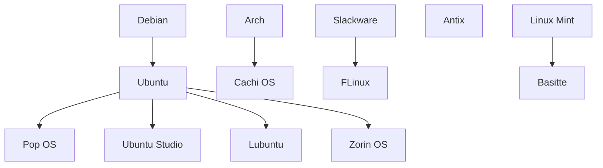

# Linux

Su nombre proviene del kernel basado en Unix creado por Linus Torvals, pero comúnmente se entiende como un sistema operativo que es la suma del kernel y un conjunto de aplicaciones hechas por la organización GNU, de ahí la referencia de sistemas operativos basados en GNU Linux.

Como tal no existe un sistema operativo Linux, lo que hay es un montón de distribuciones personalizadas por la comunidad, pero algunas distribuciones derivan e otras.

>[!Nota]
>Para probar distribuciones sin necesidad de instalarlas, visita esta página:
>- https://distrosea.com/es/
>- https://www.onworks.net/

## Relacionados
- [[componentes-de-sistema-linux]]
- [[web-comandos-linux]]

